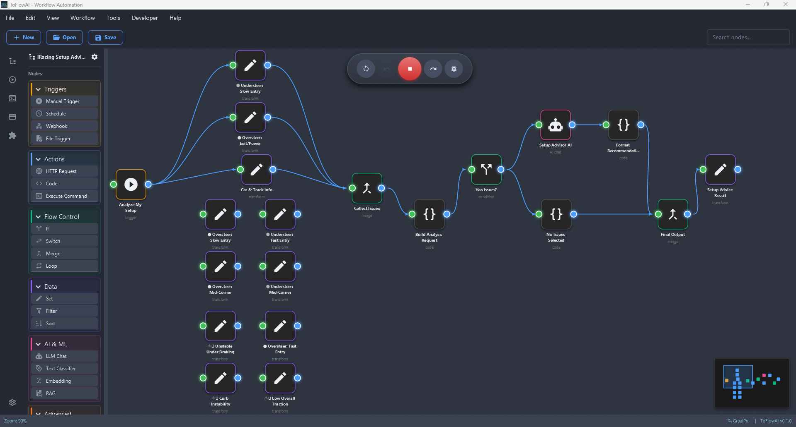
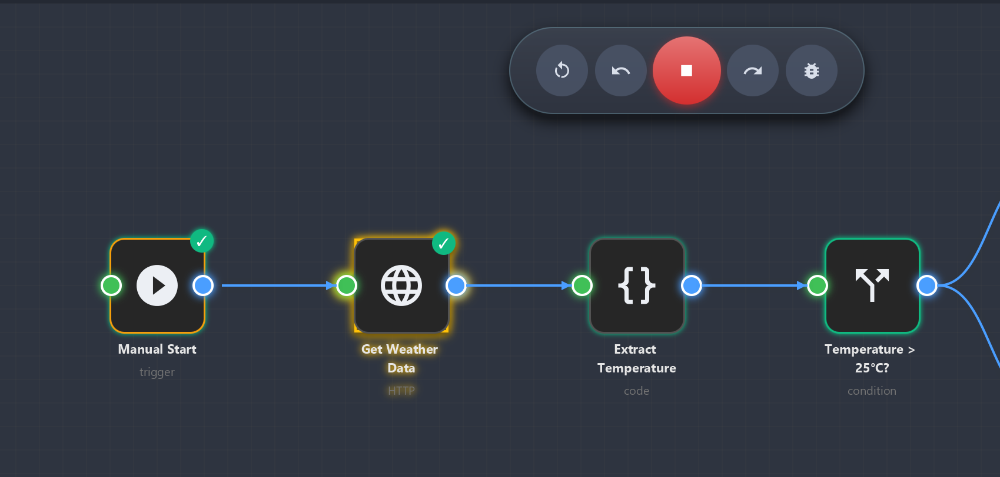
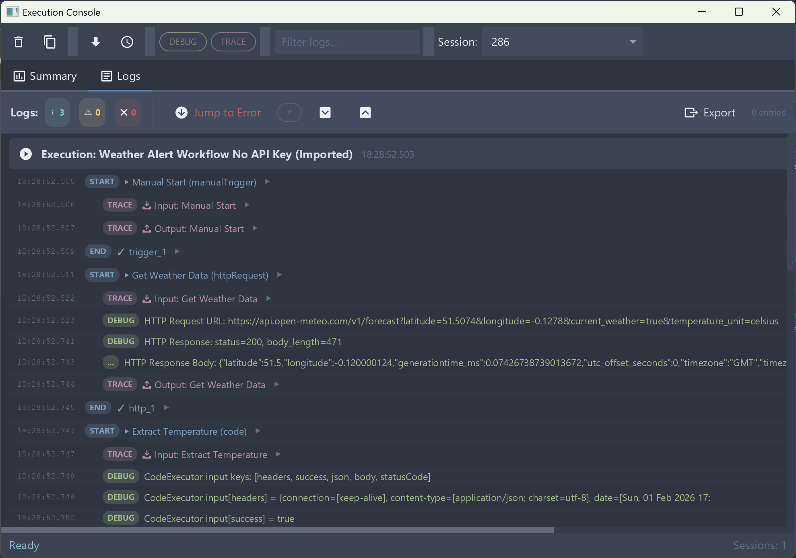
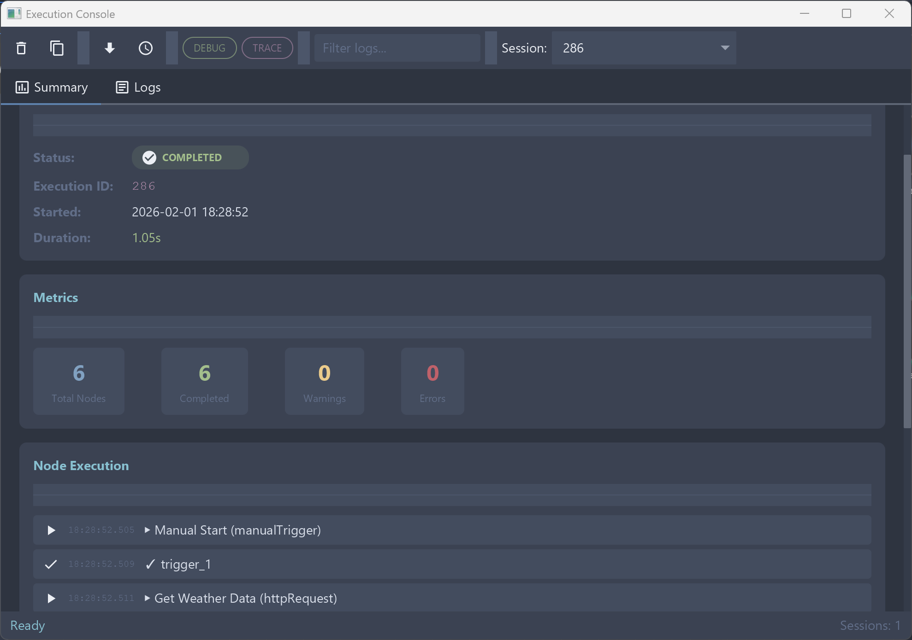
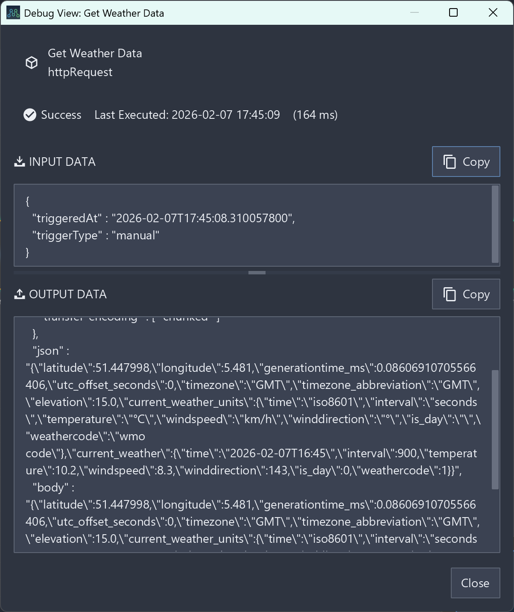
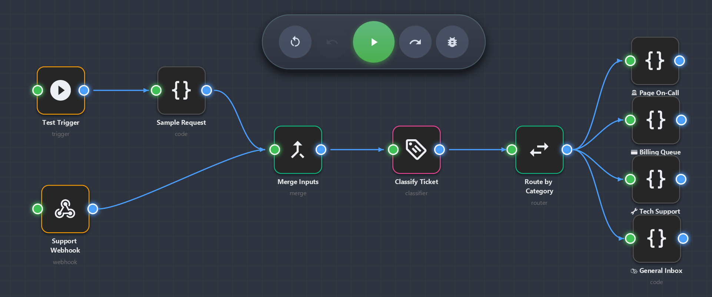
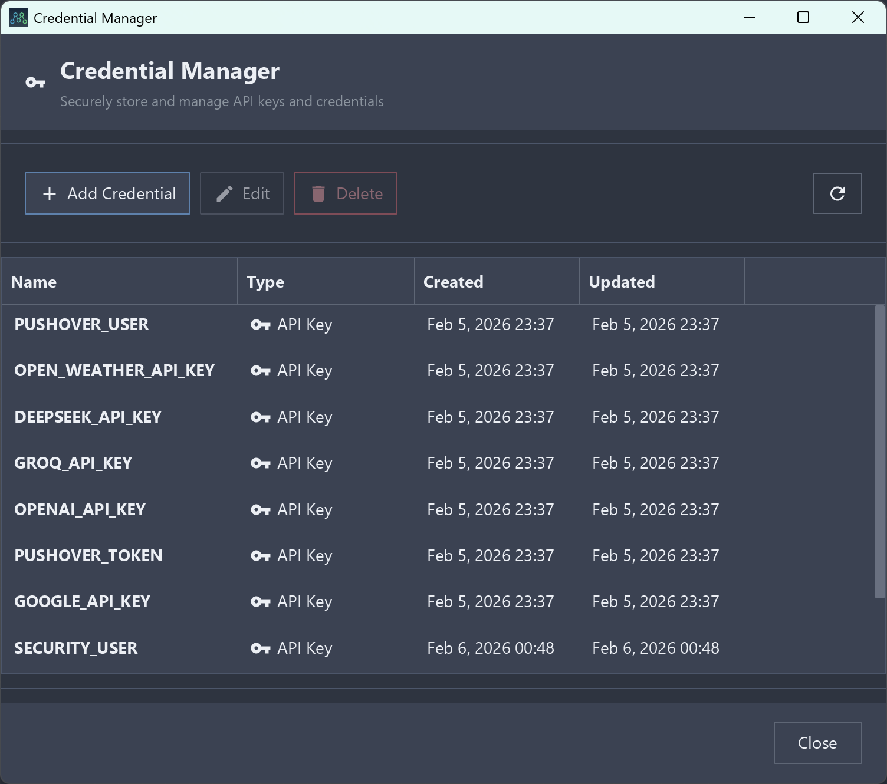

# NerveMind

<p align="center">
  
</p>

<p align="center">
  <a href="https://www.nervemind.ai" target="_blank">🌐 www.nervemind.ai</a>
</p>

<p align="center">
  <strong>Visual Workflow Automation for Everyone</strong>
</p>

<p align="center">
  <a href="#features">Features</a> •
  <a href="#todos--known-limitations">TODOs & Limitations</a> •
  <a href="#screenshots">Screenshots</a> •
  <a href="#getting-started">Getting Started</a> •
  <a href="#documentation">Documentation</a> •
  <a href="#contributing">Contributing</a>
</p>

<p align="center">
  
  
  
  
  
  
  <a href="https://buymeacoffee.com/tlgylmz"></a>
</p>

---

## What is NerveMind?

NerveMind is a **visual workflow automation application** designed as a **simpler, local-first alternative** that runs entirely on your machine—no cloud deployment, no infrastructure hassles. Just **install and use**.

### Understanding Workflows & Agentic AI

**What are Workflows?**
Workflows are automated sequences of tasks that transform data and perform actions. Instead of manually executing repetitive processes, you create a visual "flow" where each step (called a "node") handles a specific function. Data flows from one node to the next, creating powerful automation chains.

**Why Visual Workflow Automation?**
- **No-Code/Low-Code**: Build complex automations without programming skills
- **Visual Debugging**: See exactly how data flows through your processes
- **Modular Design**: Reuse and combine building blocks for different scenarios
- **Real-time Feedback**: Watch your workflows execute step-by-step

**Agentic AI Connection:**
NerveMind helps you understand and build **agentic AI systems** - AI that can autonomously plan, execute, and adapt. By creating workflows, you learn:
- How AI agents break down complex tasks into steps
- How different tools/APIs can be orchestrated together
- How decision-making and conditional logic work in automation
- How to design systems that can handle errors and adapt

**NerveMind's Unique Value:**
- **Educational Focus**: Perfect for learning agentic AI concepts
- **Local-First**: Your data never leaves your machine
- **Open Source**: Study, modify, and contribute to the codebase
- **Java-Based**: Learn enterprise-grade development practices
- **Spring Boot Integration**: Understand full-stack application architecture

### Perfect For:
- **AI Enthusiasts** learning about agentic systems
- **Developers** studying workflow automation patterns
- **Privacy-Conscious Users** who want local control
- **Educators** teaching automation and AI concepts
- **Experimenters** building custom automation solutions

Create automated workflows by connecting "nodes" (building blocks) together visually, with your data staying completely local.

Built with **Java 25**, **Spring Boot 4.0.2**, and **JavaFX 21**, NerveMind runs as a native desktop application with a modern dark theme powered by [AtlantaFX](https://github.com/mkpaz/atlantafx).

---

## ✨ Features

### Visual Workflow Designer
- Drag-and-drop node placement with snap-to-grid
- Visual connection system with smooth Bezier curves
- Connection selection and deletion (click to select, Delete to remove)
- Real-time execution preview with visual status indicators
- Pan, zoom, and mini-map navigation
- Undo/Redo with command pattern
- Multi-selection support (Ctrl+Click)
- Auto-layout for connected nodes
- Custom node icons with icon picker dialog

### 🔧 Node Types
| Category | Nodes |
|----------|-------|
| **Triggers** | Manual Trigger, Schedule Trigger, Webhook Trigger |
| **Data Flow** | Set, Filter, Sort, Merge, Switch, If, Loop |
| **Actions** | HTTP Request, Code (JavaScript), Execute Command |
| **AI/LLM** | LLM Chat (OpenAI, Anthropic, Ollama, Azure, Gemini), Text Classifier, Embedding, RAG |
| **Advanced** | Subworkflow, Parallel, Try/Catch, Retry, Rate Limit |

### Execution Engine
- Real-time step-by-step execution/debug with visual feedback
- Expression interpolation (`{{ variable }}` syntax)
- Error handling with Try/Catch and Retry patterns
- Parallel execution with virtual threads (Java 25)
- Execution history with full data logging
- Debug view for inspecting node input/output data

### AI Provider Support
| Provider | Features |
|----------|----------|
| **OpenAI** | GPT-4o, GPT-4, GPT-3.5-turbo |
| **Anthropic** | Claude 3.5 Sonnet, Claude 3 Opus/Haiku |
| **Ollama** | Local models (Llama 3.2, Mistral, etc.) |
| **Azure OpenAI** | Enterprise deployment support |
| **Google Gemini** | Gemini 1.5 Pro, 1.5 Flash, 1.0 Pro |

### Samples Browser
- Built-in sample workflows with step-by-step guides
- Search and filter samples by category
- One-click import to canvas
- Interactive tutorials with node highlighting

### Data Management
- H2 embedded database
- Flyway database migrations
- Workflow import/export (JSON)
- Clipboard copy/paste for nodes
- 19 sample workflows included

---

## 🚧 TODOs & Known Limitations

### Current Limitations
These features are **not yet implemented** and should not be expected:

- **Cloud Deployment**: No web-based version or cloud hosting for privacy
- **Multi-User Collaboration**: No shared workspaces or team features
- **Advanced Scheduling**: Limited cron-like scheduling (basic only)

### Planned Improvements

#### **Short Term**
- [ ] Enhanced error handling and recovery
- [ ] Workflow execution statistics and analytics
- [ ] Improved node property validation
- [ ] Comprehensive keyboard shortcuts and accessibility improvements
- [ ] Dark/light theme toggle
- [ ] Enhanced workflow debugging and logging tools
- [ ] Extended plugin architecture for supporting more customization
- [ ] More Samples and tests

#### **Medium Term**
- [ ] Advanced workflow scheduling (cron expressions)
- [ ] Node execution timeout controls
- [ ] Bulk operations on multiple workflows
- [ ] Performance optimizations for large workflows
- [ ] Workflow templates library
- [ ] Mac and Linux installation support
- [ ] Running workflows in the background

#### **Long Term**
- [ ] Integration with external services (webhooks, APIs)
- [ ] Workflow plugin marketplace/community sharing
- [ ] Relatively more LLM agnostic-expandable architecture

### 🛠️ Development Priorities
- **Stability First**: Bug fixes and performance improvements
- **Quality Assurence**: Provide tested, documented, and reliable, consistentcode
- **User Experience**: Polish the core workflow creation experience
- **Extensibility**: Improve plugin system for community contributions
- **Documentation**: Comprehensive user and developer guides

### 🤝 Contributing
Want to help with any of these? Check our [Contributing Guide](CONTRIBUTING.md) and join the development!

---

## 📸 Screenshots

### Main Application Window
<p align="center">
  
  <br />
  <em>Main application interface with workflow canvas, node palette, and mini-map</em>
</p>

### Visual Node Editing
<p align="center">
  
  <br />
  <em>Drag-and-drop node editing with property panels and connection curves</em>
</p>

### Node by Node Debugging
<p align="center">
  
  <br />
  <em>Interactive workflow canvas with drag-and-drop nodes and connection management</em>
</p>

### Real-time Execution
<p align="center">
  
  <br />
  <em>Live execution monitoring with visual node status indicators</em>
</p>

### Execution Console
<p align="center">
  
  <br />
  <em>Detailed execution logs with timestamps and data flow</em>
</p>

<p align="center">
  
  <br />
  <em>Execution summary with success/failure status per node</em>
</p>

### Node Debug View
<p align="center">
  
  <br />
  <em>Inspect node input/output data, execution status, and errors</em>
</p>

### Simple Canvas Area
<p align="center">
  
  <br />
  <em>Inspect node input/output data, execution status, and errors</em>
</p>

### AI Settings Configuration
<p align="center">
  
  <br />
  <em>Configure AI providers: OpenAI, Anthropic, Ollama, Azure, Gemini</em>
</p>

### Credential Management
<p align="center">
  
  <br />
  <em>Secure credential storage with AES-256 encryption</em>
</p>

### Workflow Import
<p align="center">
  
  <br />
  <em>Import workflows from JSON files or samples browser</em>
</p>

---

## 🏁 Getting Started

### Option 1: One-Line Install (Windows)
Run this in PowerShell to automatically download and install the latest version:
```powershell
iwr -useb https://raw.githubusercontent.com/tolgayilmaz86/NerveMind/main/scripts/install.ps1 | iex
```

To install the **Portable version** (unzipped to `~/NerveMind`):
```powershell
$s = iwr -useb https://raw.githubusercontent.com/tolgayilmaz86/NerveMind/main/scripts/install.ps1; &$s -Portable
```

To install a **Specific Version** (e.g., v0.1.9):
```powershell
$s = iwr -useb https://raw.githubusercontent.com/tolgayilmaz86/NerveMind/main/scripts/install.ps1; &$s -Version "v0.1.9"
```

### Option 2: Download & Run (Manual)
Download the latest Windows installer (`.msi`) or portable zip from **[Releases](https://github.com/tolgayilmaz86/NerveMind/releases)**. No Java/Python installation required!

### Option 3: Build from Source
Requirements: **JDK 25** (e.g., [Microsoft OpenJDK](https://learn.microsoft.com/en-us/java/openjdk/download))

```bash
git clone https://github.com/tolgayilmaz86/NerveMind.git
cd NerveMind

# Build and Run
./gradlew :app:bootRun
```

That's it! The application will launch.

## Database Access

When the application is running, you can access the H2 database console for development and debugging:

### Quick Access Scripts
- **PowerShell**: Run `.\scripts\open-h2-console.ps1` to automatically open the H2 console in your browser
- **Command Prompt**: Run `.\scripts\open-h2-console.bat` for the same functionality

### Manual Access
1. Open http://localhost:8080/h2-console in your browser
2. Use these connection details:
   - **JDBC URL**: `jdbc:h2:file:./data/nervemind;MODE=PostgreSQL;DB_CLOSE_ON_EXIT=FALSE;AUTO_RECONNECT=TRUE`
   - **Username**: `sa`
   - **Password**: *(leave blank)*

The database file is stored at `./data/nervemind.mv.db` relative to the application root.

---

<details>
<summary><b> 🛠️ Technology Stack</b></summary>

| Layer | Technology | Version |
|-------|------------|---------|
| **Language** | Java | 25 |
| **Backend** | Spring Boot | 4.0.2 |
| **Frontend** | JavaFX | 21.0.5 |
| **UI Theme** | AtlantaFX (NordDark) | 2.0.1 |
| **Database** | H2 (embedded) | - |
| **Migrations** | Flyway | 11.7.2 |
| **Build** | Gradle | 9.2.0 |
| **JavaScript** | GraalVM JS | 25.0.1 |
| **Packaging** | jpackage, jlink | - |
| **Installer** | WiX Toolset | 3.14 (auto-downloaded) |
| **Code Quality** | SonarQube | 7.2.2 |
| **Testing** | JUnit 5, TestFX, ArchUnit | - |

</details>

---

<details>
<summary><b>📚 Third-Party Libraries & Licenses</b></summary>
NerveMind is built using the following open-source libraries, frameworks, and tools:

### Core Frameworks

| Library | Version | License | Description | Link |
|---------|---------|---------|-------------|------|
| **Spring Boot** | 4.0.2 | Apache 2.0 | Application framework | [spring.io](https://spring.io/projects/spring-boot) |
| **JavaFX** | 21.0.5 | GPL v2 + Classpath | Desktop UI framework | [openjfx.io](https://openjfx.io/) |
| **GraalVM Polyglot** | 25.0.1 | UPL 1.0 | Multi-language runtime (JS/Python) | [graalvm.org](https://www.graalvm.org/) |
| **H2 Database** | 2.x | MPL 2.0 / EPL 1.0 | Embedded SQL database | [h2database.com](https://www.h2database.com/) |

### UI & Theming

| Library | Version | License | Description | Link |
|---------|---------|---------|-------------|------|
| **AtlantaFX** | 2.0.1 | MIT | JavaFX theme (Nord Dark) | [GitHub](https://github.com/mkpaz/atlantafx) |
| **Ikonli** | 12.3.1 | Apache 2.0 | Icon packs for JavaFX | [kordamp.org](https://kordamp.org/ikonli/) |
| **JavaFX Weaver** | 2.0.1 | Apache 2.0 | Spring-JavaFX integration | [GitHub](https://github.com/rgielen/javafx-weaver) |

### Data & Serialization

| Library | Version | License | Description | Link |
|---------|---------|---------|-------------|------|
| **Jackson** | 2.19.0 | Apache 2.0 | JSON processing | [GitHub](https://github.com/FasterXML/jackson) |
| **Flyway** | 11.7.2 | Apache 2.0 | Database migrations | [flywaydb.org](https://flywaydb.org/) |

### Security & Encryption

| Library | Version | License | Description | Link |
|---------|---------|---------|-------------|------|
| **Bouncy Castle** | 1.83 | MIT | Cryptography APIs (AES-256) | [bouncycastle.org](https://www.bouncycastle.org/) |
| **Spring Security** | 6.x | Apache 2.0 | Security framework | [spring.io](https://spring.io/projects/spring-security) |

### Utilities

| Library | Version | License | Description | Link |
|---------|---------|---------|-------------|------|
| **Apache Commons Lang** | 3.20.0 | Apache 2.0 | String/Object utilities | [commons.apache.org](https://commons.apache.org/proper/commons-lang/) |
| **Apache Commons Collections** | 4.5.0 | Apache 2.0 | Collection utilities | [commons.apache.org](https://commons.apache.org/proper/commons-collections/) |
| **Apache Commons IO** | 2.17.0 | Apache 2.0 | I/O utilities | [commons.apache.org](https://commons.apache.org/proper/commons-io/) |
| **JNA** | 5.18.1 | Apache 2.0 / LGPL 2.1 | Native access library | [GitHub](https://github.com/java-native-access/jna) |
| **Jsoup** | 1.22.1 | MIT | HTML parsing | [jsoup.org](https://jsoup.org/) |

### API Documentation

| Library | Version | License | Description | Link |
|---------|---------|---------|-------------|------|
| **SpringDoc OpenAPI** | 2.8.0 | Apache 2.0 | OpenAPI/Swagger UI | [springdoc.org](https://springdoc.org/) |

### Testing

| Library | Version | License | Description | Link |
|---------|---------|---------|-------------|------|
| **JUnit 5** | 6.0.1 | EPL 2.0 | Testing framework | [junit.org](https://junit.org/junit5/) |
| **TestFX** | 4.0.18 | EUPL 1.1 | JavaFX testing | [GitHub](https://github.com/TestFX/TestFX) |
| **ArchUnit** | 1.4.1 | Apache 2.0 | Architecture testing | [archunit.org](https://www.archunit.org/) |
| **WireMock** | 3.13.0 | Apache 2.0 | HTTP mocking | [wiremock.org](https://wiremock.org/) |

### Build & Quality Tools

| Tool | Version | License | Description | Link |
|------|---------|---------|-------------|------|
| **Gradle** | 9.2.0 | Apache 2.0 | Build automation | [gradle.org](https://gradle.org/) |
| **SonarQube** | 7.2.2 | LGPL 3.0 | Code quality analysis | [sonarqube.org](https://www.sonarsource.com/products/sonarqube/) |
| **Checkstyle** | 10.12.4 | LGPL 2.1 | Code style checker | [checkstyle.org](https://checkstyle.org/) |
| **PMD** | 7.21.0 | BSD-style | Static code analyzer | [pmd.github.io](https://pmd.github.io/) |
| **JaCoCo** | - | EPL 2.0 | Code coverage | [jacoco.org](https://www.jacoco.org/) |

### Packaging & Distribution

| Tool | Version | License | Description | Link |
|------|---------|---------|-------------|------|
| **jpackage** | JDK 25 | GPL v2 | Native installer creator | [Oracle Docs](https://docs.oracle.com/en/java/javase/21/docs/specs/man/jpackage.html) |
| **WiX Toolset** | 3.14 | MS-RL | Windows MSI builder | [wixtoolset.org](https://wixtoolset.org/) |
| **jpackage Plugin** | 1.7.6 | BSD 2-Clause | Gradle jpackage integration | [GitHub](https://github.com/pvanasse/gradle-jpackage-plugin) |
| **JavaFX Plugin** | 0.1.0 | Apache 2.0 | Gradle JavaFX support | [GitHub](https://github.com/openjfx/javafx-gradle-plugin) |

### License Summary

| License | Libraries Count | Commercial Use |
|---------|----------------|----------------|
| **Apache 2.0** | 15+ | ✅ Yes |
| **MIT** | 3 | ✅ Yes |
| **EPL 2.0** | 2 | ✅ Yes |
| **GPL v2 + Classpath** | 1 (JavaFX) | ✅ Yes (with Classpath exception) |
| **UPL 1.0** | 1 (GraalVM) | ✅ Yes |
| **LGPL** | 2 | ✅ Yes (with conditions) |

> **Note:** All libraries used are compatible with commercial and open-source use. The NerveMind application is licensed under the **Apache License 2.0**.

</details>

---

## 📦 Building Installers

NerveMind can be packaged as a standalone installer with an embedded GraalVM runtime. Users don't need Java installed.

### Windows MSI Installer

To build the installer (requires PowerShell):
```powershell
# Build standard MSI installer
.\scripts\build-installer.ps1

# Build version 1.0.0
.\scripts\build-installer.ps1 -Version "1.0.0"

# Force rebuild (skip checks)
.\scripts\build-installer.ps1 -SkipClean
```

To build a portable version (ZIP file, no admin rights needed):
```powershell
.\scripts\build-installer.ps1 -Portable

# Portable version without downloading GraalVM (if you have it)
.\scripts\build-installer.ps1 -Portable -SkipDownload
```

### Build Outputs

| Type | File | Size | Description |
|------|------|------|-------------|
| **MSI Installer** | `NerveMind-{version}.msi` | ~160 MB | Windows installer with Start Menu shortcuts |
| **Portable ZIP** | `NerveMind/` directory | ~251 MB | Standalone executable, no installation needed |

### What's Included

- ✅ NerveMind application
- ✅ Embedded GraalVM runtime (~92 MB uncompressed)
- ✅ All dependencies bundled
- ✅ Windows Start Menu shortcuts (MSI only)
- ✅ No Java installation required
- ✅ Auto-downloads WiX Toolset for MSI builds

---

## 🔍 Code Quality & Analysis

### SonarQube Integration

NerveMind uses SonarQube for static code analysis, code coverage, and quality gates.

```bash
# Run local analysis (requires SonarQube server)
./gradlew sonar -Dsonar.host.url=http://localhost:9000 -Dsonar.token=YOUR_TOKEN

# With Docker
docker run -d --name sonarqube -p 9000:9000 sonarqube:community
# Wait for startup, create project, then run analysis
```

### Coverage Reports

```bash
# Generate JaCoCo coverage reports
./gradlew test jacocoTestReport

# Reports at: app/build/reports/jacoco/test/html/index.html
```

---

## 🔄 CI/CD Pipeline

NerveMind uses GitHub Actions for automated building, testing, and packaging:

- **Build & Test**: Runs on every push/PR
- **SonarQube Analysis**: Code quality and security scanning
- **Windows Installer**: Auto-builds MSI installer with embedded runtime
- **Artifact Storage**: Uploads installers to GitHub Releases

See: [`.github/workflows/build.yml`](.github/workflows/build.yml)

---

## 📖 Documentation

- **[Architecture Guide](docs/ARCHITECTURE.md)** - Comprehensive guide for developers
- **[Javadoc Reference](https://tolgayilmaz86.github.io/NerveMind/)** - API documentation for developers
- **[Sample Workflows](samples/README.md)** - Ready-to-import workflow examples
- **[API Reference](docs/API.md)** - REST API documentation *(coming soon)*

---

## 🧪 Sample Workflows

Access via: **Help** → **Sample Workflows...** or **File** → **Import Workflow**

see [docs/SAMPLES_GUIDE.md](docs/SAMPLES_GUIDE.md) for more information.

---

## 🤝 Contributing

Contributions are welcome! Please read our contributing guidelines before submitting a PR.

### Development Setup

1. Fork the repository
2. Create a feature branch: `git checkout -b feature/amazing-feature`
3. Make your changes
4. Run tests: `./gradlew test`
5. Commit: `git commit -m 'Add amazing feature'`
6. Push: `git push origin feature/amazing-feature`
7. Open a Pull Request

---

## 📄 License

This project is licensed under the Apache License 2.0 - see the [LICENSE](LICENSE) file for details.

---

## � Support

If you find NerveMind helpful and would like to support its development, consider these options:

- **[Buy me a coffee](https://buymeacoffee.com/tlgylmz)** - One-time donations via Buy Me a Coffee
- **[GitHub Sponsors](https://github.com/sponsors/tolgayilmaz86)** - Monthly sponsorships through GitHub (coming soon)

Your support helps maintain and improve this open-source project!

---

## �🙏 Acknowledgments

- [n8n](https://n8n.io) - Inspiration for workflow automation concepts
- [Sim.ai](https://sim.ai) - Inspiration for local-first workflow design
- [AtlantaFX](https://github.com/mkpaz/atlantafx) - Beautiful JavaFX themes
- [Ikonli](https://kordamp.org/ikonli/) - Icon packs for JavaFX
- [GraalVM](https://www.graalvm.org/) - JavaScript execution engine
- [WiX Toolset](https://wixtoolset.org/) - Windows installer creation

---

<p align="center">
  Made with ❤️ by the Tolga Yilmaz
</p>
