# NerveMind Architecture Guide

> **A Comprehensive Guide for Development**  
> **Version:** 2.0  
> **Last Updated:** February 2, 2026

---

## Table of Contents

1. [Introduction](#1-introduction)
2. [For .NET Developers](#2-for-net-developers)
   2.1. [Key Concepts](#21-key-concepts)
3. [What is Workflow Automation?](#3-what-is-workflow-automation)
4. [Project Overview](#4-project-overview)
5. [Technology Stack](#5-technology-stack)
6. [Module Architecture](#6-module-architecture)
7. [Core Concepts](#7-core-concepts)
8. [UML Diagrams (Mermaid)](#8-uml-diagrams)
   8.7. [Component Diagram](#87-component-diagram)
   8.8. [MVVM Architecture Class Diagram](#88-mvvm-architecture-class-diagram)
9. [Backend Architecture (Spring Boot)](#9-backend-architecture-spring-boot)
10. [Frontend Architecture (JavaFX)](#10-frontend-architecture-javafx)
    10.1. [MVVM Architecture Overview](#101-mvvm-architecture-overview)
    10.2. [JavaFX Basics](#102-javafx-basics)
    10.3. [MVVM Components in Detail](#103-mvvm-components-in-detail)
    10.4. [DialogFactory - Creating FXML Dialogs](#104-dialogfactory---creating-fxml-dialogs)
    10.5. [DialogService - Centralized Dialog Access](#105-dialogservice---centralized-dialog-access)
    10.6. [Main Application Structure](#106-main-application-structure)
    10.7. [CSS Organization](#107-css-organization)
    10.8. [WorkflowCanvas - The Visual Editor](#108-workflowcanvas---the-visual-editor)
    10.9. [UI Testing Strategy](#109-ui-testing-strategy)
11. [Data Flow](#11-data-flow)
    11.4. [Credential Security Architecture](#114-credential-security-architecture)
12. [Sample Workflows](#12-sample-workflows)
13. [Adding New Features](#13-adding-new-features)
14. [Recent Changes & Integrations](#14-recent-changes--integrations)
    14.5. [Plugin System Architecture](#145-plugin-system-architecture)
15. [Best Practices](#15-best-practices)
16. [Troubleshooting](#16-troubleshooting)
17. [Glossary](#17-glossary)
18. [Quick Reference Card](#18-quick-reference-card)

---

## 1. Introduction

### Welcome, Developer! 👋

NerveMind is a **visual workflow automation application** similar to n8n, Zapier, or Make.com. It's also inspired by [Sim.ai](https://sim.ai) but designed as a **simpler, local-first alternative** that runs entirely on your machine—no cloud deployment, no infrastructure hassles. Just **install and use**.

Create automated workflows by connecting "nodes" (building blocks) together visually, with your data staying completely local.

**This guide will help you:**
- Understand how workflow automation works
- Navigate the codebase confidently
- Add new features and node types
- Follow best practices

---

## 2. For .NET Developers

If you're coming from C#/.NET, here's a quick translation guide:

### Terminology Mapping

| .NET / C# | Java / Spring | Notes |
|-----------|---------------|-------|
| `class MyService` | `@Service class MyService` | Spring annotation marks it as injectable |
| `IMyService` (interface) | `MyServiceInterface` | Convention: `*Interface` suffix |
| `[ApiController]` | `@RestController` | REST API controller |
| `DbContext` | `JpaRepository<Entity, ID>` | Database access layer |
| `appsettings.json` | `application.properties` | Configuration file |
| `Program.cs` / `Startup.cs` | `@SpringBootApplication` | App entry point |
| `IServiceCollection.AddScoped()` | `@Service` / `@Component` | DI registration |
| `IConfiguration` | `@Value` / `Environment` | Config injection |
| `async/await Task<T>` | `CompletableFuture<T>` | Async operations |
| NuGet | Maven/Gradle | Package manager |
| `.csproj` | `build.gradle` | Build configuration |
| `record` (C# 9+) | `record` (Java 16+) | Immutable data class |
| `var` | `var` (Java 10+) | Type inference |
| LINQ `.Where().Select()` | Streams `.filter().map()` | Collection operations |

### Code Comparison

```csharp
// C# / .NET
public interface IWorkflowService {
    Task<List<WorkflowDto>> GetAllAsync();
    Task<WorkflowDto?> GetByIdAsync(long id);
    Task<WorkflowDto> SaveAsync(WorkflowDto workflow);
}

[Service] // In .NET this would be registered in DI container
public class WorkflowService : IWorkflowService {
    private readonly IWorkflowRepository _repository;
    
    public WorkflowService(IWorkflowRepository repository) {
        _repository = repository;
    }
}
```

```java
// Java / Spring (equivalent)
public interface WorkflowServiceInterface {
    List<WorkflowDTO> findAll();
    Optional<WorkflowDTO> findById(Long id);
    WorkflowDTO save(WorkflowDTO workflow);
}

@Service  // Automatically registered in Spring DI container
public class WorkflowService implements WorkflowServiceInterface {
    private final WorkflowRepository repository;
    
    public WorkflowService(WorkflowRepository repository) {  // Constructor injection
        this.repository = repository;
    }
}
```

### Key Differences to Remember

| Aspect | .NET | Spring/Java |
|--------|------|-------------|
| **Null handling** | `nullable?`, `??` | `Optional<T>`, `.orElse()` |
| **DI Lifetime** | `Scoped`, `Singleton`, `Transient` | Default is Singleton, use `@Scope` for others |
| **Async** | `async/await` everywhere | Virtual threads (Java 21+) - blocking is OK! |
| **Properties** | `get; set;` | Explicit getters/setters or `record` |
| **Naming** | PascalCase methods | camelCase methods |

---

## 2.1 Key Concepts

If you're new to Java/Spring development, here are the essential concepts you'll encounter in NerveMind, explained with simple examples.

### 2.1.1 DTO (Data Transfer Object)

**What it is:** A simple container that carries data between different parts of your application.

**Why we use it:** Keeps your database entities separate from what you send to the UI or API.

**Example:**
```java
// ❌ BAD: Sending database entity directly to UI
@Entity
public class WorkflowEntity {
    private Long id;
    private String name;
    private Instant createdAt;
    // Database-specific fields that UI doesn't need
    private String internalNotes;
    private byte[] binaryData;
}

// ✅ GOOD: Using a DTO for UI/API
public record WorkflowDTO(
    Long id,
    String name,
    Instant createdAt
) {
    // Only the fields the UI needs
}
```

**Real NerveMind Example:**
```java
// In common/dto/WorkflowDTO.java
public record WorkflowDTO(
    Long id,
    String name,
    String description,
    Instant createdAt,
    Instant updatedAt
) {
    // Helper method
    public static WorkflowDTO create(String name) {
        return new WorkflowDTO(null, name, "", Instant.now(), Instant.now());
    }
}
```

### 2.1.2 Service

**What it is:** A class that contains business logic - the "brains" of your application.

**Why we use it:** Keeps business rules separate from data access and UI code.

**Example:**
```java
// Service handles the business logic
@Service
public class WorkflowService {
    
    private final WorkflowRepository repository;
    
    public WorkflowDTO createWorkflow(String name) {
        // Business rule: Name cannot be empty
        if (name == null || name.trim().isEmpty()) {
            throw new IllegalArgumentException("Workflow name cannot be empty");
        }
        
        // Business rule: Name must be unique
        if (repository.existsByName(name)) {
            throw new IllegalArgumentException("Workflow name already exists");
        }
        
        // Create and save
        var entity = new WorkflowEntity();
        entity.setName(name);
        entity = repository.save(entity);
        
        return toDTO(entity);
    }
}
```

**Real NerveMind Example:**
```java
@Service
public class ExecutionService implements ExecutionServiceInterface {
    
    public ExecutionResult executeWorkflow(WorkflowDTO workflow) {
        // Complex business logic for running workflows
        // Handles node execution order, error handling, etc.
    }
}
```

### 2.1.3 Entity

**What it is:** A class that represents a database table.

**Why we use it:** Maps database rows to Java objects automatically.

**Example:**
```java
@Entity  // This tells JPA this class maps to a database table
@Table(name = "workflows")  // Table name in database
public class WorkflowEntity {
    
    @Id  // Primary key
    @GeneratedValue(strategy = GenerationType.IDENTITY)
    private Long id;
    
    @Column(nullable = false)  // Database column
    private String name;
    
    @Column(name = "created_at")  // Different column name
    private Instant createdAt;
    
    // Getters and setters (or use @Data from Lombok)
    public Long getId() { return id; }
    public void setId(Long id) { this.id = id; }
    // ... more getters/setters
}
```

### 2.1.4 Repository

**What it is:** An interface that handles database operations.

**Why we use it:** Provides a clean API for data access without writing SQL.

**Example:**
```java
@Repository
public interface WorkflowRepository extends JpaRepository<WorkflowEntity, Long> {
    
    // Spring generates the implementation automatically!
    
    // Find by name
    Optional<WorkflowEntity> findByName(String name);
    
    // Check if exists
    boolean existsByName(String name);
    
    // Custom query
    @Query("SELECT w FROM WorkflowEntity w WHERE w.createdAt > :date")
    List<WorkflowEntity> findCreatedAfter(@Param("date") Instant date);
}
```

### 2.1.5 Controller

**What it is:** A class that handles HTTP requests and responses.

**Why we use it:** Defines your API endpoints.

**Example:**
```java
@RestController
@RequestMapping("/api/workflows")
public class WorkflowController {
    
    private final WorkflowService service;
    
    @GetMapping  // GET /api/workflows
    public List<WorkflowDTO> getAllWorkflows() {
        return service.findAll();
    }
    
    @PostMapping  // POST /api/workflows
    public WorkflowDTO createWorkflow(@RequestBody CreateWorkflowRequest request) {
        return service.createWorkflow(request.name());
    }
    
    @GetMapping("/{id}")  // GET /api/workflows/123
    public WorkflowDTO getWorkflow(@PathVariable Long id) {
        return service.findById(id)
            .orElseThrow(() -> new ResponseStatusException(NOT_FOUND));
    }
}
```

### 2.1.6 Bean

**What it is:** Any object managed by the Spring container.

**Why we use it:** Spring handles creating and wiring these objects automatically.

**Example:**
```java
// All of these are Spring beans:
@Service
public class WorkflowService { ... }

@Repository  
public class WorkflowRepository { ... }

@Configuration
public class AppConfig {
    @Bean
    public ObjectMapper objectMapper() {
        return new ObjectMapper();
    }
}
```

### 2.1.7 Dependency Injection (DI)

**What it is:** Spring automatically provides objects with the other objects they need.

**Why we use it:** Makes code testable and loosely coupled.

**Example:**
```java
// ❌ BAD: Manual dependency management
public class ExecutionService {
    private WorkflowService workflowService = new WorkflowService(); // Tight coupling!
}

// ✅ GOOD: Dependency injection
@Service
public class ExecutionService {
    private final WorkflowService workflowService;
    
    // Spring injects this automatically
    public ExecutionService(WorkflowService workflowService) {
        this.workflowService = workflowService;
    }
}
```

### 2.1.8 Interface vs Implementation

**What it is:** Interfaces define contracts, implementations provide the actual code.

**Why we use it:** Allows swapping implementations and makes testing easier.

**Example:**
```java
// Interface (contract)
public interface WorkflowServiceInterface {
    List<WorkflowDTO> findAll();
    WorkflowDTO save(WorkflowDTO workflow);
}

// Implementation (actual code)
@Service
public class WorkflowService implements WorkflowServiceInterface {
    // Must implement all methods from the interface
    @Override
    public List<WorkflowDTO> findAll() {
        // Actual implementation here
    }
}
```

### 2.1.9 Record

**What it is:** A special kind of class for immutable data (Java 16+ feature).

**Why we use it:** Less boilerplate code for simple data classes.

**Example:**
```java
// Traditional class (lots of code!)
public class Position {
    private final double x;
    private final double y;
    
    public Position(double x, double y) {
        this.x = x;
        this.y = y;
    }
    
    public double x() { return x; }
    public double y() { return y; }
    
    @Override
    public boolean equals(Object o) { /* ... */ }
    @Override
    public int hashCode() { /* ... */ }
    @Override
    public String toString() { /* ... */ }
}

// Record version (much simpler!)
public record Position(double x, double y) {
    // All methods generated automatically!
}
```

### 2.1.10 Annotation

**What it is:** Special markers that tell Spring how to handle classes/methods.

**Why we use it:** Configuration through code instead of XML.

**Common Annotations:**
```java
@Service           // This is a business service
@Repository        // This handles data access
@RestController    // This handles HTTP requests
@RequestMapping    // Maps URL to method
@GetMapping        // HTTP GET endpoint
@PostMapping       // HTTP POST endpoint
@Transactional     // Wraps method in database transaction
@Component         // Generic Spring bean
@Configuration     // Configuration class
@Bean              // Method that creates a bean
```

### 2.1.11 Transaction

**What it is:** A database operation that either succeeds completely or fails completely.

**Why we use it:** Ensures data consistency.

**Example:**
```java
@Service
public class WorkflowService {
    
    @Transactional  // Everything in this method succeeds or fails together
    public void updateWorkflowWithNodes(Long workflowId, List<Node> nodes) {
        // Update workflow
        workflowRepository.save(workflow);
        
        // Delete old nodes
        nodeRepository.deleteByWorkflowId(workflowId);
        
        // Save new nodes
        for (Node node : nodes) {
            nodeRepository.save(node);
        }
        
        // If anything fails, everything rolls back
    }
}
```

### 2.1.12 Migration

**What it is:** A script that changes your database schema over time.

**Why we use it:** Keeps database schema in sync with code changes.

**Example Flyway Migration:**
```sql
-- V001__Initial_Schema.sql
CREATE TABLE workflows (
    id BIGINT AUTO_INCREMENT PRIMARY KEY,
    name VARCHAR(255) NOT NULL,
    description TEXT,
    created_at TIMESTAMP NOT NULL,
    updated_at TIMESTAMP NOT NULL
);

-- V002__Add_Status_Column.sql  
ALTER TABLE workflows ADD COLUMN status VARCHAR(50) DEFAULT 'ACTIVE';
```

### 2.1.13 Putting It All Together

Here's how all these concepts work together in NerveMind:

```java
// 1. DTO - Data sent to/from UI
public record WorkflowDTO(Long id, String name, Instant createdAt) {}

// 2. Entity - Database representation
@Entity
public class WorkflowEntity {
    @Id private Long id;
    private String name;
    private Instant createdAt;
}

// 3. Repository - Data access
@Repository
public interface WorkflowRepository extends JpaRepository<WorkflowEntity, Long> {
    Optional<WorkflowEntity> findByName(String name);
}

// 4. Service - Business logic
@Service
@Transactional
public class WorkflowService implements WorkflowServiceInterface {
    
    private final WorkflowRepository repository;
    
    // Constructor injection
    public WorkflowService(WorkflowRepository repository) {
        this.repository = repository;
    }
    
    @Override
    public WorkflowDTO createWorkflow(String name) {
        // Business logic here
        if (repository.findByName(name).isPresent()) {
            throw new IllegalArgumentException("Name already exists");
        }
        
        var entity = new WorkflowEntity();
        entity.setName(name);
        entity.setCreatedAt(Instant.now());
        
        entity = repository.save(entity);
        return toDTO(entity);
    }
    
    private WorkflowDTO toDTO(WorkflowEntity entity) {
        return new WorkflowDTO(entity.getId(), entity.getName(), entity.getCreatedAt());
    }
}

// 5. Controller - HTTP API
@RestController
@RequestMapping("/api/workflows")
public class WorkflowController {
    
    private final WorkflowServiceInterface service;
    
    public WorkflowController(WorkflowServiceInterface service) {
        this.service = service;
    }
    
    @PostMapping
    public WorkflowDTO createWorkflow(@RequestBody Map<String, String> request) {
        return service.createWorkflow(request.get("name"));
    }
}
```

---

## 3. What is Workflow Automation?

### 3.1 The Big Picture

Imagine you want to:
1. Monitor a folder for new files
2. When a file arrives, extract text from it
3. Send the text to an AI for analysis
4. Email the results to your team

**Without automation:** You do this manually, every time.  
**With NerveMind:** You build it once, it runs forever.

### 3.2 Core Terminology

| Term | Definition | Example |
|------|------------|---------|
| **Workflow** | A complete automation blueprint | "Process customer emails" |
| **Node** | A single action/step in the workflow | "Send HTTP request", "Run code" |
| **Connection** | Link between nodes showing data flow | Output of node A → Input of node B |
| **Trigger** | Special node that starts the workflow | "Every Monday at 9 AM", "On webhook" |
| **Executor** | Backend code that runs a node | `HttpRequestExecutor`, `CodeExecutor` |
| **Execution** | One complete run of a workflow | Started at 10:30, took 5 seconds |

### 3.3 Sample Workflow

```mermaid
flowchart LR
    A[🔔 Webhook Trigger] --> B[🌐 HTTP Request]
    B --> C[💻 Code Node]
    C --> D[📧 Email Node]
    
    subgraph "Data Flow"
        A -- "webhook_data" --> B
        B -- "api_response" --> C
        C -- "formatted_data" --> D
    end
```



---

## 4. Project Overview

### 4.1 High-Level Architecture

```mermaid
graph TB
    subgraph UI["🖥️ UI Module (JavaFX)"]
        Canvas[WorkflowCanvas]
        Dialogs[Settings Dialog]
        Editors[Property Editors]
    end
    
    subgraph Common["📦 Common Module (Shared)"]
        DTOs[DTOs]
        Enums[Enums]
        Interfaces[Service Interfaces]
        Domain[Domain Objects]
    end
    
    subgraph App["⚙️ App Module (Spring Boot)"]
        Services[Services]
        Executors[Node Executors]
        Repos[Repositories]
    end
    
    subgraph DB["💾 Database"]
        H2[(H2 Database)]
    end
    
    UI --> Common
    App --> Common
    UI -.->|"uses interfaces"| App
    App --> DB
```



### 4.2 Directory Structure

```
NerveMind/
├── 📁 app/                          # Spring Boot backend
│   ├── 📁 plugins/                  # 🔌 External plugin JARs (runtime)
│   │   └── *.jar                    # Deployed plugin files
│   └── src/main/java/ai/nervemind/app/
│       ├── 📁 api/                  # REST controllers (future)
│       ├── 📁 config/               # Spring configuration
│       ├── 📁 database/             # JPA entities & repositories
│       │   ├── model/               # Database entities
│       │   └── repository/          # Spring Data JPA repos
│       ├── 📁 entity/               # Additional entities
│       ├── 📁 executor/             # 🌟 NODE EXECUTORS (key!)
│       │   ├── HttpRequestExecutor.java
│       │   ├── CodeExecutor.java
│       │   ├── LlmChatExecutor.java
│       │   └── ... (22+ executors)
│       ├── 📁 plugin/               # 🔌 PLUGIN SYSTEM
│       │   ├── PluginLoader.java    # JAR loading & ServiceLoader
│       │   └── PluginService.java   # Plugin management service
│       └── 📁 service/              # Business logic services
│           ├── ExecutionService.java
│           ├── WorkflowService.java
│           ├── SettingsService.java
│           ├── NodeExecutor.java    # Interface
│           └── NodeExecutorRegistry.java
│
├── 📁 common/                       # Shared code (no dependencies)
│   └── src/main/java/ai/nervemind/common/
│       ├── 📁 domain/               # Core domain objects
│       │   ├── Node.java            # Node record
│       │   ├── Connection.java      # Connection record
│       │   └── Execution.java       # Execution record
│       ├── 📁 dto/                  # Data Transfer Objects
│       │   ├── WorkflowDTO.java
│       │   ├── ExecutionDTO.java
│       │   └── SettingDTO.java
│       ├── 📁 enums/                # Enumerations
│       │   ├── ExecutionStatus.java
│       │   ├── SettingCategory.java
│       │   └── SettingType.java
│       ├── 📁 expression/           # Expression evaluation
│       └── 📁 service/              # Service interfaces
│           ├── WorkflowServiceInterface.java
│           ├── ExecutionServiceInterface.java
│           └── SettingsServiceInterface.java
│
├── 📁 plugin-api/                   # 🔌 Plugin API module
│   └── src/main/java/ai/nervemind/plugin/api/
│       ├── TriggerProvider.java     # Interface for trigger plugins
│       ├── ActionProvider.java      # Interface for action plugins
│       ├── NodeExecutor.java        # Interface for node execution
│       ├── NodeDefinition.java      # Node metadata record
│       ├── NodeParameter.java       # Parameter definition record
│       ├── ExecutionContext.java    # Runtime context interface
│       └── ExecutionResult.java     # Execution result record
│
├── 📁 plugins/                      # 🔌 Plugin implementations
│   └── 📁 file-watcher/             # Example: File Watcher plugin
│       ├── build.gradle             # Plugin build config
│       └── src/main/
│           ├── java/.../            # Plugin source code
│           └── resources/META-INF/services/
│               └── ai.nervemind.plugin.api.TriggerProvider
│
├── 📁 ui/                           # JavaFX desktop UI (MVVM architecture)
│   └── src/main/java/ai/nervemind/ui/
│       ├── NerveMindUI.java          # Application entry point
│       │
│       ├── 📁 viewmodel/            # 🎯 ViewModels (testable business logic)
│       │   ├── BaseViewModel.java   # Common ViewModel base class
│       │   ├── MainViewModel.java   # Main application state
│       │   ├── BaseDialogViewModel.java  # Base for dialog ViewModels
│       │   ├── BaseListViewModel.java    # Base for list-based ViewModels
│       │   ├── canvas/
│       │   │   ├── WorkflowCanvasViewModel.java
│       │   │   ├── NodeViewModel.java
│       │   │   ├── NodePaletteViewModel.java
│       │   │   ├── NodePropertiesViewModel.java
│       │   │   ├── ExecutionHistoryViewModel.java
│       │   │   └── ConnectionViewModel.java
│       │   ├── console/
│       │   │   └── ExecutionConsoleViewModel.java
│       │   ├── dialog/
│       │   │   ├── AboutDialogViewModel.java
│       │   │   ├── SettingsDialogViewModel.java
│       │   │   ├── VariableManagerViewModel.java
│       │   │   ├── CredentialManagerViewModel.java
│       │   │   ├── SamplesBrowserViewModel.java
│       │   │   ├── GuideViewViewModel.java
│       │   │   ├── IconPickerViewModel.java
│       │   │   ├── NodeDebugViewModel.java
│       │   │   ├── PluginManagerViewModel.java
│       │   │   └── WorkflowListDialogViewModel.java
│       │   └── editor/
│       │       └── ExpressionEditorViewModel.java
│       │
│       ├── 📁 view/                 # 🎨 View Controllers (thin FXML adapters)
│       │   ├── MainViewController.java
│       │   ├── canvas/
│       │   │   ├── NodePaletteComponent.java
│       │   │   └── NodePropertiesComponent.java
│       │   ├── console/
│       │   │   └── ExecutionConsoleController.java
│       │   └── dialog/
│       │       ├── DialogFactory.java      # FXML dialog creation
│       │       ├── AboutDialogController.java
│       │       ├── SettingsDialogController.java
│       │       ├── VariableManagerController.java
│       │       ├── CredentialManagerController.java
│       │       ├── SamplesBrowserController.java
│       │       ├── GuideViewController.java
│       │       ├── IconPickerController.java
│       │       ├── NodeDebugController.java
│       │       ├── PluginManagerController.java
│       │       ├── KeyboardShortcutsController.java
│       │       └── WorkflowListDialogController.java
│       │
│       ├── 📁 canvas/               # Workflow editor canvas
│       │   ├── WorkflowCanvas.java  # Main canvas component
│       │   ├── NodeView.java        # Visual node representation
│       │   ├── ConnectionLine.java  # Visual connection
│       │   └── CanvasMinimap.java   # Canvas overview minimap
│       │
│       ├── 📁 console/              # Execution console
│       │   └── ExecutionConsoleService.java
│       │
│       ├── 📁 component/            # Reusable UI components
│       │   ├── ExpressionEditorComponent.java
│       │   └── ExecutionHistoryComponent.java
│       │
│       ├── 📁 service/              # UI-specific services
│       │   ├── DialogService.java          # Dialog service interface
│       │   ├── DefaultDialogService.java   # Dialog creation via DialogFactory
│       │   ├── ThemeService.java           # Theme management interface
│       │   ├── DefaultThemeService.java    # CSS/theme handling
│       │   ├── CanvasInteractionService.java
│       │   ├── CanvasZoomService.java
│       │   ├── GridService.java
│       │   └── NodeSelectionService.java
│       │
│       └── 📁 util/                 # UI utilities
│           ├── BindingUtils.java
│           └── FxmlUtils.java
│
│   └── src/main/resources/ai/nervemind/ui/
│       ├── 📁 controller/           # Main application FXML
│       │   └── Main.fxml
│       │
│       ├── 📁 view/                 # Component FXML views
│       │   ├── canvas/
│       │   │   ├── NodePalette.fxml
│       │   │   └── NodePropertiesPanel.fxml
│       │   ├── console/
│       │   │   └── ExecutionConsole.fxml
│       │   ├── dialog/
│       │   │   ├── AboutDialog.fxml
│       │   │   ├── SettingsDialog.fxml
│       │   │   ├── VariableManagerDialog.fxml
│       │   │   ├── CredentialManagerDialog.fxml
│       │   │   └── WorkflowListDialog.fxml
│       │   └── editor/
│       │       └── ExpressionEditor.fxml
│       │
│       └── 📁 styles/               # CSS stylesheets
│           ├── main.css             # Global styles
│           ├── console.css          # Console styles
│           ├── dialog.css           # Dialog styles
│           ├── canvas.css           # Canvas styles
│           └── palette.css          # Node palette styles
│
├── 📄 build.gradle                  # Root build configuration
├── 📄 settings.gradle               # Multi-module settings
└── 📄 gradlew.bat                   # Gradle wrapper (Windows)
```

### 4.3 Why This Structure?

| Module | Responsibility | Depends On |
|--------|----------------|------------|
| **common** | Shared types (DTOs, enums, interfaces) | Nothing |
| **plugin-api** | Plugin interfaces and contracts | Nothing |
| **app** | Business logic, database, execution, plugin loading | common, plugin-api |
| **ui** | User interface, visual editor | common |
| **plugins/*** | External plugin implementations | plugin-api |

**Benefits:**
- ✅ Clear separation of concerns
- ✅ UI can be replaced without touching business logic
- ✅ Common types ensure consistency
- ✅ Each module can be tested independently
- ✅ **Plugin-api** enables third-party plugin development
- ✅ **Plugins** can be developed and distributed independently

---

## 5. Technology Stack

### 5.1 Overview


| Layer | Technology | Version | Purpose |
|-------|------------|---------|---------|
| **Language** | Java | 25 | Core programming language with virtual threads |
| **Frontend** | JavaFX | 21.0.5 | Desktop GUI framework for rich user interfaces |
| **Theme** | AtlantaFX | 2.0.1 | Modern dark theme (Nord Dark) for JavaFX applications |
| **Icons** | Ikonli | 12.3.1 | Icon library providing Material Design and other icon packs |
| **Backend** | Spring Boot | 4.0.1 | Application framework with dependency injection and embedded server |
| **Database** | Spring Data JPA | - | Object-relational mapping and database access layer |
| **Database** | H2 | - | Embedded SQL database for local data storage |
| **Migrations** | Flyway | 11.7.2 | Database schema version control and migrations |
| **Security** | Spring Security | - | Authentication and authorization framework |
| **Web** | Spring Web | - | REST API and web request handling |
| **WebFlux** | Spring WebFlux | - | Reactive web framework for non-blocking operations |
| **WebSocket** | Spring WebSocket | - | Real-time bidirectional communication |
| **Validation** | Bean Validation | - | Input validation and constraint checking |
| **Scripting** | GraalVM Polyglot | 25.0.1 | Multi-language scripting engine (JavaScript, Python, etc.) |
| **Scripting** | GraalVM JS | 25.0.1 | JavaScript engine for workflow code execution |
| **Encryption** | BouncyCastle | 1.83 | Cryptographic operations and secure credential storage |
| **Utilities** | Apache Commons Lang3 | 3.20.0 | String manipulation, validation, and utility functions |
| **Collections** | Apache Commons Collections4 | 4.5.0 | Enhanced collection data structures and utilities |
| **JSON** | Jackson | 2.19.0 | JSON serialization/deserialization for data transfer |
| **Native Access** | JNA | 5.18.1 | Java Native Access for platform-specific operations |
| **Documentation** | SpringDoc OpenAPI | 2.8.0 | Automatic API documentation generation |
| **Build** | Gradle | 9.2.0 | Build automation and dependency management |
| **Packaging** | jpackage | 1.7.6 | Native application packaging and installer creation |
| **Testing** | JUnit | 6.0.1 | Unit testing framework |
| **Architecture Tests** | ArchUnit | 1.4.1 | Architecture and code structure validation |
| **UI Testing** | TestFX | 4.0.18 | JavaFX UI testing framework |

### 5.2 Why These Technologies?

#### Java 25 with Virtual Threads

```java
// OLD WAY: Platform threads (expensive, limited)
ExecutorService executor = Executors.newFixedThreadPool(10);

// NEW WAY: Virtual threads (cheap, unlimited)
ExecutorService executor = Executors.newVirtualThreadPerTaskExecutor();
```

**Virtual Threads Benefits:**
- Each node execution can have its own thread
- No thread pool exhaustion
- Blocking I/O doesn't block other work
- Perfect for workflow automation (many concurrent operations)

#### Spring Boot 4.0.2

Spring Boot provides:
- **Dependency Injection** - Components are wired automatically
- **Transaction Management** - Database operations are atomic
- **Configuration** - `application.properties` for settings
- **Testing** - Built-in test support

```java
// Spring creates and wires this automatically
@Service
public class ExecutionService {
    private final WorkflowService workflowService;  // Injected!
    private final NodeExecutorRegistry registry;    // Injected!
    
    public ExecutionService(WorkflowService ws, NodeExecutorRegistry nr) {
        this.workflowService = ws;
        this.registry = nr;
    }
}
```

#### GraalVM Polyglot & JavaScript Engine

GraalVM enables multi-language scripting within the JVM:

```java
// Execute JavaScript code in workflows
try (Context context = Context.newBuilder("js")
        .allowAllAccess(true)
        .build()) {
    
    // Bind workflow variables
    context.getBindings("js").putMember("inputData", nodeInput);
    
    // Execute user code
    Value result = context.eval("js", userScript);
    
    return result.asString();
}
```

**Why GraalVM?**
- **Multi-language support** - JavaScript, Python, Ruby, R, etc.
- **High performance** - JIT compilation for fast execution
- **Security** - Sandboxed execution environment
- **Workflow flexibility** - Users can write custom code nodes

#### BouncyCastle Cryptography

Provides enterprise-grade cryptographic operations:

```java
// Encrypt sensitive credential data
public String encrypt(String plaintext) {
    Cipher cipher = Cipher.getInstance("AES/GCM/NoPadding", "BC");
    // ... encryption logic
}
```

**Why BouncyCastle?**
- **Strong encryption** - AES, RSA, ECC algorithms
- **Credential security** - Secure storage of API keys and passwords
- **Compliance** - FIPS 140-2 compliant cryptography

#### Apache Commons Libraries

Utility libraries that extend Java's standard library:

```java
// String utilities
StringUtils.isNotBlank(input);  // Better than manual null checks
StringUtils.capitalize(name);   // Consistent capitalization

// Collection utilities
CollectionUtils.isNotEmpty(list);  // Null-safe collection checks
MapUtils.getString(map, "key", "default");  // Safe map access
```

**Why Apache Commons?**
- **Reliability** - Battle-tested utility functions
- **Consistency** - Standardized approaches to common problems
- **Performance** - Optimized implementations

#### Jackson JSON Processing

Industry-standard JSON serialization/deserialization:

```java
// Convert objects to/from JSON
ObjectMapper mapper = new ObjectMapper();
String json = mapper.writeValueAsString(workflowDTO);
WorkflowDTO restored = mapper.readValue(json, WorkflowDTO.class);
```

**Why Jackson?**
- **Performance** - Fastest JSON library for Java
- **Flexibility** - Extensive customization options
- **Integration** - Built into Spring Boot

#### JNA (Java Native Access)

Access native platform libraries from Java:

```java
// Access Windows/macOS/Linux native functions
Native.load("user32", User32.class);  // Windows API
// ... call native functions directly
```

**Why JNA?**
- **Platform integration** - Access OS-specific features
- **No JNI complexity** - Pure Java interface to native code
- **Cross-platform** - Same API works on all platforms

#### Testing Stack

- **JUnit 6.0.1** - Modern testing framework
- **ArchUnit 1.4.1** - Architectural rule enforcement
- **TestFX 4.0.18** - JavaFX UI testing
- **JaCoCo** - Code coverage reporting

> **See [TESTING_INFRASTRUCTURE.md](TESTING_INFRASTRUCTURE.md) for complete testing documentation, examples, and integration test guides.**

```java
// Modern dark theme UI
Application.setUserAgentStylesheet(new NordDark().getUserAgentStylesheet());
```

**Why JavaFX?**
- Native desktop performance
- Rich visual components
- Canvas for workflow editor
- Cross-platform (Windows, Mac, Linux)

### 4.3 Running the Application

```bash
# Set Java 25 (Not needed if it is already your default JDK)
$env:JAVA_HOME = "C:\Program Files\Microsoft\jdk-25.0.0.36-hotspot"

# Build the project
.\gradlew.bat clean build -x test

# Run the application
.\gradlew.bat :app:bootRun
```

---

## 6. Module Architecture

### 6.1 Module Dependency Diagram


**Module Dependency Rules:**
| Rule | Description |
|------|-------------|
| **common** → nothing | Knows nothing about app or ui |
| **app** → common | Implements interfaces defined in common |
| **ui** → common | Uses interfaces, not implementations |
| **ui** ⟷ **app** | Connected via Spring's dependency injection |

### 6.2 Interface Pattern

The `common` module defines interfaces. The `app` module implements them. The `ui` module uses them.

```java
// In COMMON module - just the interface
public interface WorkflowServiceInterface {
    List<WorkflowDTO> findAll();
    Optional<WorkflowDTO> findById(Long id);
    WorkflowDTO save(WorkflowDTO workflow);
}

// In APP module - the implementation
@Service
public class WorkflowService implements WorkflowServiceInterface {
    private final WorkflowRepository repository;
    
    @Override
    public List<WorkflowDTO> findAll() {
        return repository.findAll().stream()
            .map(this::toDTO)
            .toList();
    }
    // ... more methods
}

// In UI module - uses the interface
public class WorkflowCanvas {
    private final WorkflowServiceInterface workflowService;  // Interface!
    
    public void saveWorkflow() {
        workflowService.save(this.workflow);
    }
}
```

**Why This Pattern?**
- UI doesn't depend on Spring
- We could swap `WorkflowService` for a mock in tests
- Clear contract between modules

---

## 7. Core Concepts

### 7.1 Node

A **Node** is a single step in a workflow.

```java
// In common/domain/Node.java
public record Node(
    String id,           // Unique ID (UUID)
    String type,         // "httpRequest", "code", "if", etc.
    String name,         // User's display name
    Position position,   // Canvas position (x, y)
    Map<String, Object> parameters,  // Configuration
    Long credentialId,   // Optional credential reference
    boolean disabled,    // Skip this node?
    String notes         // User's notes
) {
    public record Position(double x, double y) {}
}
```

**Example Node (HTTP Request):**
```json
{
    "id": "node_abc123",
    "type": "httpRequest",
    "name": "Call Weather API",
    "position": { "x": 300, "y": 200 },
    "parameters": {
        "url": "https://api.weather.com/v1/forecast",
        "method": "GET",
        "headers": {
            "Accept": "application/json"
        }
    },
    "credentialId": 42,
    "disabled": false
}
```

### 7.2 Connection

A **Connection** links two nodes together.

```java
// In common/domain/Connection.java
public record Connection(
    String id,              // Unique ID
    String sourceNodeId,    // Output from this node
    String targetNodeId,    // Input to this node
    String sourceHandle,    // Which output port ("main", "true", "false")
    String targetHandle     // Which input port ("main")
) {}
```

**Visual Representation:**

```mermaid
flowchart LR
    subgraph IF["IF Node"]
        TRUE[TRUE ●]
        FALSE[FALSE ●]
    end
    
    subgraph EMAIL["Email Node"]
        MAIN[● main]
    end
    
    TRUE --> MAIN
    
    style TRUE fill:#4caf50,stroke:#2e7d32
    style FALSE fill:#f44336,stroke:#c62828
```


```json
{
    "sourceNodeId": "if_node_1",
    "targetNodeId": "email_node_1", 
    "sourceHandle": "true",
    "targetHandle": "main"
}
```

### 7.3 Workflow

A **Workflow** is a collection of nodes and connections.

```java
// In common/dto/WorkflowDTO.java
public record WorkflowDTO(
    Long id,
    String name,
    String description,
    List<Node> nodes,           // All nodes
    List<Connection> connections, // All connections
    Map<String, Object> settings, // Workflow settings
    boolean active,              // Is it runnable?
    Instant createdAt,
    Instant updatedAt
) {
    // Helper method
    public List<Node> getTriggerNodes() {
        return nodes.stream()
            .filter(n -> n.type().endsWith("Trigger"))
            .toList();
    }
}
```

### 7.4 Execution

An **Execution** is one run of a workflow.

```java
// Execution lifecycle
public enum ExecutionStatus {
    PENDING,    // Waiting to start
    RUNNING,    // Currently executing
    SUCCESS,    // Completed successfully
    FAILED,     // Encountered an error
    CANCELLED   // Stopped by user
}
```

### 7.5 NodeExecutor

A **NodeExecutor** is the code that actually runs a node.

```java
// Interface every executor must implement
public interface NodeExecutor {
    
    // Run the node with input data
    Map<String, Object> execute(
        Node node,                        // Node configuration
        Map<String, Object> input,        // Data from previous node
        ExecutionService.ExecutionContext context  // Execution state
    );
    
    // What node type does this handle?
    String getNodeType();
}
```

---

## 8. UML Diagrams

### 8.1 Class Diagram - Core Domain


### 8.2 Class Diagram - Node Executor Pattern
Here design pattern for node executors is illustrated. We have used the strategy pattern to allow for different node types to be executed by their respective executors. NodeExecutorRegistry manages the mapping between node types and their executors. And the execution is handled by the ExecutionService which utilizes the registry to find the appropriate executor for each node during workflow execution.


### 8.3 Class Diagram - Service Layer


### 8.4 Sequence Diagram - Workflow Execution


### 8.5 Sequence Diagram - Node Execution Detail


### 8.6 Use Case Diagrams

#### 8.6.1 Workflow Management Use Cases


#### 8.6.2 Workflow Editing Use Cases


#### 8.6.3 Workflow Execution Use Cases


#### 8.6.4 Settings & Credentials Use Cases


#### 8.6.5 Automated Triggers Use Cases


### 8.7 Component Diagram


### 8.8 MVVM Architecture Class Diagram


---

## 9. Backend Architecture (Spring Boot)

### 9.1 Spring Boot Basics for Beginners

#### What is Spring Boot?

Spring Boot is a framework that makes it easy to create Java applications. It handles:
- **Dependency Injection** - Objects are created and wired together automatically
- **Configuration** - Settings via `application.properties`
- **Database Access** - JPA/Hibernate integration
- **Web Server** - Embedded Tomcat

#### Key Annotations

```java
// This class is a Spring-managed service
@Service
public class WorkflowService { ... }

// This class is a Spring-managed view controller
@Component
@FxmlView("/ai/nervemind/ui/controller/Main.fxml")
public class MainViewController { ... }

// This class handles database access
@Repository
public interface WorkflowRepository extends JpaRepository<WorkflowEntity, Long> { ... }

// This method runs after the bean is created
@PostConstruct
public void initialize() { ... }

// This method runs in a database transaction
@Transactional
public void saveWorkflow(WorkflowDTO workflow) { ... }
```

#### Dependency Injection Explained

```java
// ❌ BAD: Creating dependencies manually
public class ExecutionService {
    private WorkflowService workflowService = new WorkflowService(); // Tightly coupled!
}

// ✅ GOOD: Let Spring inject dependencies
@Service
public class ExecutionService {
    private final WorkflowService workflowService;
    
    // Spring automatically provides WorkflowService here
    public ExecutionService(WorkflowService workflowService) {
        this.workflowService = workflowService;
    }
}
```

### 9.2 Service Layer Deep Dive

#### ExecutionService - The Heart of Workflow Execution

```java
@Service
@Transactional
public class ExecutionService implements ExecutionServiceInterface {
    
    // Dependencies injected by Spring
    private final WorkflowService workflowService;
    private final CredentialService credentialService;
    private final NodeExecutorRegistry nodeExecutorRegistry;
    
    /**
     * Main execution method
     */
    public ExecutionDTO execute(Long workflowId, Map<String, Object> input) {
        // 1. Load the workflow from database
        WorkflowDTO workflow = workflowService.findById(workflowId)
            .orElseThrow(() -> new IllegalArgumentException("Not found"));
        
        // 2. Create execution record
        ExecutionEntity execution = new ExecutionEntity(workflowId, TriggerType.MANUAL);
        execution.setStatus(ExecutionStatus.RUNNING);
        execution = executionRepository.save(execution);
        
        // 3. Build execution context (holds state during execution)
        ExecutionContext context = new ExecutionContext(
            execution.getId(),
            workflow,
            input,
            credentialService
        );
        
        // 4. Find trigger nodes and start execution
        try {
            List<Node> triggerNodes = workflow.getTriggerNodes();
            for (Node trigger : triggerNodes) {
                executeNode(trigger, workflow, context, input);
            }
            execution.setStatus(ExecutionStatus.SUCCESS);
        } catch (Exception e) {
            execution.setStatus(ExecutionStatus.FAILED);
            execution.setErrorMessage(e.getMessage());
        }
        
        // 5. Save final state
        return toDTO(executionRepository.save(execution));
    }
}
```

#### NodeExecutorRegistry - Finding the Right Executor

```java
@Component
public class NodeExecutorRegistry {
    
    private final Map<String, NodeExecutor> executors = new HashMap<>();
    
    // Spring automatically finds all NodeExecutor implementations
    // and passes them to this constructor!
    public NodeExecutorRegistry(List<NodeExecutor> allExecutors) {
        for (NodeExecutor executor : allExecutors) {
            // Key: "httpRequest", "code", "if", etc.
            // Value: HttpRequestExecutor, CodeExecutor, IfExecutor, etc.
            executors.put(executor.getNodeType(), executor);
        }
    }
    
    public NodeExecutor getExecutor(String nodeType) {
        NodeExecutor executor = executors.get(nodeType);
        if (executor == null) {
            throw new IllegalArgumentException("Unknown node type: " + nodeType);
        }
        return executor;
    }
}
```

### 9.3 Database Layer

#### Entity Example

```java
@Entity
@Table(name = "workflows")
public class WorkflowEntity {
    
    @Id
    @GeneratedValue(strategy = GenerationType.IDENTITY)
    private Long id;
    
    @Column(nullable = false)
    private String name;
    
    private String description;
    
    @Lob  // Large Object - stored as CLOB
    @Column(name = "nodes_json")
    private String nodesJson;  // JSON string of nodes
    
    @Lob
    @Column(name = "connections_json")
    private String connectionsJson;  // JSON string of connections
    
    private boolean active = true;
    
    @Column(name = "created_at")
    private Instant createdAt;
    
    // Getters and setters...
}
```

#### Repository Example

```java
public interface WorkflowRepository extends JpaRepository<WorkflowEntity, Long> {
    
    // Spring Data JPA generates SQL from method name!
    List<WorkflowEntity> findByActiveTrue();
    
    // Custom query
    @Query("SELECT w FROM WorkflowEntity w WHERE w.name LIKE %:query%")
    List<WorkflowEntity> search(@Param("query") String query);
    
    // Count active workflows
    long countByActiveTrue();
}
```

#### Flyway Migrations

Database schema is managed by Flyway. Each migration is a SQL file:

```sql
-- V001__Initial_Schema.sql
CREATE TABLE workflows (
    id BIGINT AUTO_INCREMENT PRIMARY KEY,
    name VARCHAR(255) NOT NULL,
    description TEXT,
    nodes_json CLOB,
    connections_json CLOB,
    active BOOLEAN DEFAULT TRUE,
    created_at TIMESTAMP
);

-- V002__Variables_Table.sql
CREATE TABLE variables (
    id BIGINT AUTO_INCREMENT PRIMARY KEY,
    name VARCHAR(255) NOT NULL,
    value TEXT,
    scope VARCHAR(50)
);
```

### 9.4 Logging Architecture

NerveMind features a sophisticated structured logging system that provides real-time execution monitoring both in console output and the UI console. The logging system is designed to work independently - console logs appear even when the UI console window is closed.

#### Core Components

The logging system consists of five main components:

| Component | Location | Purpose |
|-----------|----------|---------|
| **ExecutionLogHandler** | `common/service/` | Interface defining log handler contract |
| **ExecutionLogger** | `app/service/` | Central logging service that creates log entries |
| **ConsoleLogHandler** | `app/service/` | Outputs structured logs to SLF4J/console |
| **UILogHandler** | `ui/console/` | Forwards logs to the UI ExecutionConsole |
| **ExecutionConsole** | `ui/console/` | JavaFX UI component displaying logs |

#### Class Diagram - Logging System


#### Sequence Diagram - Log Entry Creation


#### Data Flow - Complete Logging Pipeline


#### Log Entry Format Examples

**Console Output (structured):**
```
[14:30:15.123] 🚀 [exec_abc123] EXECUTION_START: Workflow execution started | {"workflowId":"wf_456","workflowName":"Weather Alert"}
[14:30:15.245] ▶️ [exec_abc123] NODE_START: Node execution started | {"nodeId":"node_1","nodeType":"httpRequest","nodeName":"Get Weather"}
[14:30:16.789] ✅ [exec_abc123] NODE_END: Node execution completed | {"nodeId":"node_1","nodeType":"httpRequest","durationMs":1544,"success":true}
[14:30:17.001] ❌ [exec_abc123] ERROR: Error in node execution | {"nodeId":"node_2","errorType":"java.net.ConnectException","errorMessage":"Connection refused","stackTrace":"..."}
```

**UI Console Display:**
- Hierarchical view with indentation
- Color-coded by log level (INFO=blue, ERROR=red, etc.)
- Timestamps and execution IDs
- Expandable error details with stack traces
- Real-time updates during execution

#### Configuration via Settings

The logging system integrates with the settings service for configurable verbosity:

```java
// In ExecutionService.configureLogHandlers()
ConsoleLogHandler consoleHandler = new ConsoleLogHandler();
LogLevel logLevel = LogLevel.valueOf(
    settingsService.get(EXECUTION_LOG_LEVEL, "DEBUG")
);
consoleHandler.setMinLevel(logLevel);
consoleHandler.setEnabled(true);
executionLogger.addHandler(consoleHandler);
```

**Available Settings:**
- `EXECUTION_LOG_LEVEL`: TRACE, DEBUG, INFO, WARN, ERROR, FATAL
- `EXECUTION_LOG_INCLUDE_CONTEXT`: true/false (include JSON context)
- `EXECUTION_CONSOLE_ENABLED`: true/false (enable console logging)

#### Key Benefits

| Benefit | Description |
|---------|-------------|
| **Independent Operation** | Console logging works without UI console open |
| **Structured Data** | JSON context provides rich debugging information |
| **Configurable Verbosity** | Settings control log level and detail |
| **Thread-Safe UI Updates** | Platform.runLater() ensures JavaFX thread safety |
| **Multiple Outputs** | Same log data sent to console and UI simultaneously |
| **Performance Aware** | Configurable to reduce overhead in production |

---

## 10. Frontend Architecture (JavaFX)

### 10.1 MVVM Architecture Overview

The UI module follows the **MVVM (Model-View-ViewModel)** pattern, which provides clear separation between UI presentation and business logic. This architecture makes the codebase testable, maintainable, and follows SOLID principles.

```
┌─────────────────────────────────────────────────────────────┐
│                      VIEW (FXML)                            │
│  - UI structure and layout defined in XML                   │
│  - CSS style class assignments                              │
│  - Binding expressions to ViewModel properties              │
│  - Event handler method references                          │
└─────────────────────────────┬───────────────────────────────┘
                              │ fx:controller
                              ▼
┌─────────────────────────────────────────────────────────────┐
│                   VIEW CONTROLLER                           │
│  - Thin adapter between FXML and ViewModel                  │
│  - Injects ViewModel via Spring DI                          │
│  - Binds @FXML fields to ViewModel properties               │
│  - Delegates all actions to ViewModel methods               │
└─────────────────────────────┬───────────────────────────────┘
                              │ composition
                              ▼
┌─────────────────────────────────────────────────────────────┐
│                      VIEW MODEL                             │
│  - Observable properties for UI state                       │
│  - Commands/actions as methods                              │
│  - Validation logic                                         │
│  - Coordinates with Services                                │
│  - NO JavaFX UI imports (only javafx.beans.*)               │
└─────────────────────────────┬───────────────────────────────┘
                              │ uses
                              ▼
┌─────────────────────────────────────────────────────────────┐
│                         MODEL                               │
│  - Domain entities (DTOs, domain objects)                   │
│  - Service interfaces from 'common' module                  │
└─────────────────────────────────────────────────────────────┘
```

**Why MVVM for JavaFX?**

1. **Native Property Binding**: JavaFX properties (`StringProperty`, `BooleanProperty`) naturally support two-way binding
2. **Testable ViewModels**: Business logic in ViewModels can be unit tested without JavaFX runtime
3. **Clean Separation**: Views (FXML) handle layout, ViewModels handle state and logic
4. **Designer-Friendly**: FXML can be edited with Scene Builder visually
5. **Maintainable CSS**: All styling centralized in CSS files

### 10.2 JavaFX Basics

#### What is JavaFX?

JavaFX is a GUI toolkit for building desktop applications in Java. Key concepts:

| Concept | Description | Example |
|---------|-------------|---------|
| **Stage** | The window | Main application window |
| **Scene** | Content container | What's displayed in the window |
| **Node** | UI element | Button, Label, Pane |
| **Pane** | Layout container | VBox, HBox, BorderPane |
| **FXML** | XML-based UI definition | Main.fxml, SettingsDialog.fxml |
| **Controller** | Java class handling events | MainViewController.java |
| **ViewModel** | Testable UI state/logic | MainViewModel.java |

#### Layout Containers

```
┌────────────────────────────────────────────────────────────────┐
│                          BorderPane                             │
│  ┌─────────────────────────────────────────────────────────┐   │
│  │                         TOP                             │   │
│  │                    (Menu, Toolbar)                      │   │
│  └─────────────────────────────────────────────────────────┘   │
│  ┌──────────┐  ┌───────────────────────────┐  ┌───────────┐    │
│  │   LEFT   │  │          CENTER           │  │   RIGHT   │    │
│  │ (Sidebar)│  │      (Main Content)       │  │(Properties)    │
│  │          │  │                           │  │           │    │
│  └──────────┘  └───────────────────────────┘  └───────────┘    │
│  ┌─────────────────────────────────────────────────────────┐   │
│  │                        BOTTOM                           │   │
│  │                      (Status Bar)                       │   │
│  └─────────────────────────────────────────────────────────┘   │
└────────────────────────────────────────────────────────────────┘

VBox (Vertical):     HBox (Horizontal):     StackPane:
┌───────────┐        ┌───┬───┬───┬───┐      ┌───────────┐
│  Item 1   │        │ 1 │ 2 │ 3 │ 4 │      │ Stacked   │
├───────────┤        └───┴───┴───┴───┘      │ on top    │
│  Item 2   │                               │ of each   │
├───────────┤                               │ other     │
│  Item 3   │                               └───────────┘
└───────────┘
```

### 10.3 MVVM Components in Detail

#### ViewModel Example (SettingsDialogViewModel)

ViewModels contain observable properties and business logic, with **no JavaFX UI imports**:

```java
// ViewModels are NOT Spring beans - they are created by DialogFactory
public class SettingsDialogViewModel extends BaseViewModel {
    
    // Observable properties for UI binding
    private final ObservableList<CategoryItem> categories = FXCollections.observableArrayList();
    private final ObjectProperty<CategoryItem> selectedCategory = new SimpleObjectProperty<>();
    private final ObservableList<SettingDTO> currentSettings = FXCollections.observableArrayList();
    private final ObservableMap<String, String> pendingChanges = FXCollections.observableHashMap();
    private final BooleanProperty hasChanges = new SimpleBooleanProperty(false);
    
    // Service dependency (passed via constructor)
    private final SettingsServiceInterface settingsService;
    
    public SettingsDialogViewModel(SettingsServiceInterface settingsService) {
        this.settingsService = settingsService;
        initializeCategories();
    }
    
    // Actions invoked by Controller
    public void loadSettingsForCategory(SettingCategory category) {
        setLoading(true);  // Inherited from BaseViewModel
        try {
            List<SettingDTO> settings = settingsService.findByCategory(category);
            currentSettings.setAll(settings.stream()
                .filter(SettingDTO::visible).toList());
            clearError();  // Inherited from BaseViewModel
        } catch (Exception e) {
            setErrorMessage("Failed to load settings: " + e.getMessage());
        } finally {
            setLoading(false);
        }
    }
    
    public void recordChange(String key, String value) {
        pendingChanges.put(key, value);
    }
    
    // Property accessors for binding
    public ObservableList<SettingDTO> getCurrentSettings() { return currentSettings; }
    public BooleanProperty hasChangesProperty() { return hasChanges; }
}
```

#### View Controller Example (SettingsDialogController)

Controllers are **thin adapters** that connect FXML to ViewModel:

```java
public class SettingsDialogController {
    
    private SettingsDialogViewModel viewModel;
    private Stage dialogStage;
    
    // FXML-injected UI elements
    @FXML private ListView<CategoryItem> categoryList;
    @FXML private VBox settingsContainer;
    @FXML private Button applyButton;
    @FXML private Button cancelButton;
    
    /**
     * Initialize with ViewModel (called by DialogFactory)
     */
    public void initialize(SettingsDialogViewModel viewModel, Stage dialogStage) {
        this.viewModel = viewModel;
        this.dialogStage = dialogStage;
        
        // Bind UI to ViewModel
        applyButton.disableProperty().bind(viewModel.hasChangesProperty().not());
        
        // Category selection triggers loading
        categoryList.getSelectionModel().selectedItemProperty().addListener(
            (obs, old, newVal) -> viewModel.loadCategory(newVal.category())
        );
    }
    
    @FXML
    private void onApply() {
        viewModel.saveChanges();  // Delegate to ViewModel
    }
    
    @FXML
    private void onCancel() {
        dialogStage.close();
    }
}
```

#### FXML View Example (SettingsDialog.fxml)

FXML defines the visual structure with CSS classes (not inline styles):

```xml
<?xml version="1.0" encoding="UTF-8"?>
<BorderPane xmlns="http://javafx.com/javafx"
            xmlns:fx="http://javafx.com/fxml"
            fx:controller="ai.nervemind.ui.view.dialog.SettingsDialogController"
            styleClass="settings-dialog">
    
    <!-- Left: Category sidebar -->
    <left>
        <ListView fx:id="categoryList" styleClass="settings-dialog__category-list"/>
    </left>
    
    <!-- Center: Settings content -->
    <center>
        <VBox fx:id="settingsContainer" styleClass="settings-dialog__content"/>
    </center>
    
    <!-- Bottom: Action buttons -->
    <bottom>
        <HBox styleClass="settings-dialog__footer">
            <Button fx:id="applyButton" text="Apply" onAction="#onApply"
                    styleClass="button--primary"/>
            <Button fx:id="cancelButton" text="Cancel" onAction="#onCancel"/>
        </HBox>
    </bottom>
</BorderPane>
```

### 10.4 DialogFactory - Creating FXML Dialogs

The `DialogFactory` centralizes dialog creation, loading FXML and wiring ViewModels:

```java
public final class DialogFactory {
    
    private static final String FXML_PATH = "/ai/nervemind/ui/view/dialog/";
    
    /**
     * Show the Settings dialog using FXML/ViewModel pattern.
     */
    public static void showSettingsDialog(Window owner, SettingsServiceInterface settingsService) {
        try {
            // 1. Load FXML
            FXMLLoader loader = new FXMLLoader(
                DialogFactory.class.getResource(FXML_PATH + "SettingsDialog.fxml"));
            Parent root = loader.load();
            
            // 2. Create dialog stage
            Stage dialogStage = createDialogStage("Settings", owner, true);
            dialogStage.setScene(new Scene(root));
            
            // 3. Wire ViewModel to Controller
            SettingsDialogController controller = loader.getController();
            SettingsDialogViewModel viewModel = new SettingsDialogViewModel(settingsService);
            controller.initialize(viewModel, dialogStage);
            
            // 4. Show modal dialog
            dialogStage.showAndWait();
        } catch (IOException e) {
            LOGGER.log(Level.SEVERE, "Failed to load SettingsDialog.fxml", e);
        }
    }
    
    /**
     * Show the About dialog.
     */
    public static void showAboutDialog(Window owner) {
        // Similar pattern...
    }
    
    /**
     * Show Variable Manager dialog.
     */
    public static void showVariableManager(Window owner, VariableServiceInterface variableService, Long workflowId) {
        // Similar pattern...
    }
}
```

### 10.5 DialogService - Centralized Dialog Access

The `DialogService` interface abstracts dialog creation for easy testing:

```java
public interface DialogService {
    void showInfo(String title, String message);
    void showWarning(String title, String message);
    void showError(String title, String message);
    boolean confirm(String title, String message);
    
    // FXML-based dialogs (via DialogFactory)
    void showSettingsDialog();
    void showVariableManager(Long workflowId);
    void showCredentialManager();
    void showAboutDialog();
    Optional<Long> showWorkflowListDialog();
}

@Service
public class DefaultDialogService implements DialogService {
    
    private final SettingsServiceInterface settingsService;
    private final VariableServiceInterface variableService;
    // ... other services
    
    private Window owner;
    
    @Override
    public void showSettingsDialog() {
        DialogFactory.showSettingsDialog(owner, settingsService);
    }
    
    @Override
    public void showAboutDialog() {
        DialogFactory.showAboutDialog(owner);
    }
    
    // ... other dialog methods
}
```

### 10.6 Main Application Structure

#### MainViewController

The main controller coordinates all major UI areas:

```java
@Component
@FxmlView("/ai/nervemind/ui/controller/Main.fxml")
public class MainViewController implements Initializable {
    
    // Services injected by Spring
    private final DialogService dialogService;
    private final WorkflowServiceInterface workflowService;
    private final ExecutionServiceInterface executionService;
    
    // ViewModel for main application state
    private final MainViewModel viewModel;
    
    // FXML-injected UI elements
    @FXML private StackPane contentArea;
    @FXML private Label statusLabel;
    @FXML private VBox sidebarNav;
    
    // Child components
    private WorkflowCanvas workflowCanvas;
    
    public MainViewController(
            MainViewModel viewModel,
            DialogService dialogService,
            WorkflowServiceInterface workflowService,
            ExecutionServiceInterface executionService) {
        this.viewModel = viewModel;
        this.dialogService = dialogService;
        this.workflowService = workflowService;
        this.executionService = executionService;
    }
    
    @Override
    public void initialize(URL location, ResourceBundle resources) {
        // Bind status bar to ViewModel
        statusLabel.textProperty().bind(viewModel.statusMessageProperty());
        
        // Setup navigation
        setupNavigation();
        
        // Show default view
        showWorkflowsView();
    }
    
    // Event handlers delegate to ViewModel or services
    @FXML
    private void onNewWorkflow() {
        workflowCanvas.newWorkflow();
        viewModel.updateStatus("New workflow created");
    }
    
    @FXML
    private void onSettings() {
        dialogService.showSettingsDialog();  // Uses DialogFactory
    }
}
```

#### MainViewModel

Manages application-wide state:

```java
public class MainViewModel extends BaseViewModel {
    
    // Navigation state
    public enum NavigationView { 
        WORKFLOWS, EXECUTIONS, EXECUTION_CONSOLE, 
        CREDENTIALS, PLUGINS, SETTINGS 
    }
    
    private final ObjectProperty<NavigationView> currentView = 
        new SimpleObjectProperty<>(NavigationView.WORKFLOWS);
    
    // Status bar
    private final StringProperty statusMessage = new SimpleStringProperty("Ready");
    
    // Active workflow
    private final ObjectProperty<WorkflowDTO> activeWorkflow = new SimpleObjectProperty<>();
    private final BooleanProperty workflowDirty = new SimpleBooleanProperty(false);
    
    // Canvas settings
    private final BooleanProperty showGrid = new SimpleBooleanProperty(true);
    private final ObjectProperty<Double> zoomLevel = new SimpleObjectProperty<>(1.0);
    
    // Methods
    public void navigateTo(NavigationView view) {
        currentView.set(view);
    }
    
    public void updateStatus(String message) {
        statusMessage.set(message);
    }
    
    // Property accessors for binding
    public ObjectProperty<NavigationView> currentViewProperty() { return currentView; }
    public StringProperty statusMessageProperty() { return statusMessage; }
    public BooleanProperty workflowDirtyProperty() { return workflowDirty; }
}
```

### 10.7 CSS Organization

All styling is in CSS files, following BEM-like naming:

```css
/* dialog.css */
.settings-dialog {
    -fx-background-color: -nervemind-bg-primary;
}

.settings-dialog__category-list {
    -fx-pref-width: 200px;
    -fx-background-color: -nervemind-bg-secondary;
}

.settings-dialog__content {
    -fx-padding: 20px;
}

.settings-dialog__footer {
    -fx-padding: 10px;
    -fx-spacing: 10px;
    -fx-alignment: CENTER_RIGHT;
}

/* Buttons */
.button--primary {
    -fx-background-color: -nervemind-accent-blue;
    -fx-text-fill: white;
}

.button--primary:hover {
    -fx-background-color: derive(-nervemind-accent-blue, 10%);
}
```

CSS Variables centralize theme colors:

```css
/* main.css - root variables */
.root {
    -nervemind-bg-primary: #2e3440;
    -nervemind-bg-secondary: #3b4252;
    -nervemind-bg-tertiary: #434c5e;
    -nervemind-text-primary: #eceff4;
    -nervemind-text-muted: #8b949e;
    -nervemind-accent-blue: #5e81ac;
    -nervemind-accent-green: #a3be8c;
    -nervemind-accent-red: #bf616a;
}
```

### 10.8 WorkflowCanvas - The Visual Editor

The `WorkflowCanvas` is the heart of the UI - where users build workflows visually.
It uses a ViewModel for state management:

```java
public class WorkflowCanvas extends BorderPane {
    
    // ViewModel for canvas state
    private final WorkflowCanvasViewModel viewModel;
    
    // Visual layers (from back to front)
    private final Pane gridLayer;        // Grid background
    private final Pane connectionLayer;  // Connection lines
    private final Pane nodeLayer;        // Node rectangles
    
    // Visual representations
    private final Map<String, NodeView> nodeViews = new HashMap<>();
    private final Map<String, ConnectionLine> connectionLines = new HashMap<>();
    
    public WorkflowCanvas(WorkflowCanvasViewModel viewModel) {
        this.viewModel = viewModel;
        
        // Bind to ViewModel properties
        viewModel.zoomLevelProperty().addListener((obs, old, zoom) -> 
            applyZoom(zoom.doubleValue()));
        
        viewModel.gridVisibleProperty().addListener((obs, old, visible) ->
            gridLayer.setVisible(visible));
    }
    
    /**
     * Add a new node to the canvas
     */
    public void addNode(String nodeType, double x, double y) {
        // Delegate to ViewModel
        Node node = viewModel.addNode(nodeType, x, y);
        
        // Create visual representation
        NodeView nodeView = new NodeView(node, this);
        nodeLayer.getChildren().add(nodeView);
        nodeViews.put(node.id(), nodeView);
    }
}
```

### 10.9 UI Testing Strategy

The MVVM architecture enables comprehensive testing:

| Layer | Testability | Framework |
|-------|-------------|------------|
| **Model** | Full | JUnit + Mockito |
| **ViewModel** | Full (no JavaFX) | JUnit + Mockito |
| **View** | Requires UI | TestFX |

ViewModels contain pure business logic testable without JavaFX runtime. Integration tests use TestFX for full UI verification.

> **See [TESTING_INFRASTRUCTURE.md](TESTING_INFRASTRUCTURE.md) for detailed examples and testing patterns.**

---

## 11. Data Flow

### 11.1 Complete Data Flow Diagram

```mermaid
flowchart TB
    subgraph Step1["1️⃣ USER INTERACTION"]
        USER[User clicks 'Run Workflow']
    end
    
    subgraph Step2["2️⃣ UI LAYER"]
        WC[WorkflowCanvas.runWorkflow]
        WC --> |"Serialize workflow state"| CALL
        CALL["executionService.execute(workflowId, {})"]
    end
    
    subgraph Step3["3️⃣ SERVICE LAYER"]
        ES[ExecutionService.execute]
        ES --> LOAD["Load workflow from DB"]
        ES --> CREATE["Create ExecutionEntity (RUNNING)"]
        ES --> CTX["Build ExecutionContext"]
        ES --> FIND["Find trigger nodes"]
    end
    
    subgraph Step4["4️⃣ NODE EXECUTION LOOP"]
        direction LR
        LOOP["FOR EACH NODE (BFS)"]
        GET["registry.getExecutor(type)"]
        EXEC["executor.execute(node, input)"]
        LOG["logger.logNodeComplete()"]
        NEXT["Find next nodes via connections"]
        
        LOOP --> GET --> EXEC --> LOG --> NEXT
        NEXT -.-> LOOP
    end
    
    subgraph Step5["5️⃣ INDIVIDUAL EXECUTOR"]
        HTTP[HttpRequestExecutor.execute]
        HTTP --> PARAMS["Extract parameters"]
        HTTP --> INTERP["Interpolate {{ variables }}"]
        HTTP --> CRED["Get credential if needed"]
        HTTP --> REQ["Make HTTP request"]
        HTTP --> OUT["Build output map"]
    end
    
    subgraph Step6["6️⃣ DATA PERSISTENCE"]
        SAVE["Save execution to DB"]
        SAVE --> STATUS["Save status (SUCCESS/FAILED)"]
        SAVE --> DATA["Save output data as JSON"]
    end
    
    subgraph Step7["7️⃣ UI UPDATE"]
        UPDATE[Update UI]
        UPDATE --> LOGS["Show logs in console"]
        UPDATE --> COLORS["Update node colors"]
        UPDATE --> RESULT["Display execution result"]
    end
    
    USER --> WC
    CALL --> ES
    FIND --> LOOP
    EXEC --> HTTP
    OUT --> SAVE
    SAVE --> UPDATE
    
    style Step1 fill:#e3f2fd,stroke:#1565c0
    style Step2 fill:#e8f5e9,stroke:#2e7d32
    style Step3 fill:#fff3e0,stroke:#ef6c00
    style Step4 fill:#f3e5f5,stroke:#7b1fa2
    style Step5 fill:#fce4ec,stroke:#c2185b
    style Step6 fill:#e0f2f1,stroke:#00695c
    style Step7 fill:#fff8e1,stroke:#f9a825
```

### 11.2 Data Flow Between Nodes

```
┌────────────────────────────────────────────────────────────────────────────────┐
│                    DATA FLOW BETWEEN NODES                                     │
├────────────────────────────────────────────────────────────────────────────────┤
│                                                                                │
│  ┌──────────────────────────────────────────────────────────────────────────┐  │
│  │                           TRIGGER NODE                                   │  │
│  │  ManualTrigger                                                           │  │
│  │                                                                          │  │
│  │  Input: {}  (empty for manual trigger)                                   │  │
│  │  Output: { "timestamp": "2026-01-29T10:30:00Z", "trigger": "manual" }    │  │
│  └────────────────────────────────┬─────────────────────────────────────────┘  │
│                                   │                                            │
│                                   │  output becomes input                      │
│                                   ▼                                            │
│  ┌──────────────────────────────────────────────────────────────────────────┐  │
│  │                          HTTP REQUEST NODE                               │  │
│  │  Call Weather API                                                        │  │
│  │                                                                          │  │
│  │  Parameters:                                                             │  │
│  │    url: "https://api.weather.com/v1/forecast?ts={{timestamp}}"           │  │
│  │                                                                          │  │
│  │  Input: { "timestamp": "2026-01-29T10:30:00Z", "trigger": "manual" }     │  │
│  │  Output: {                                                               │  │
│  │    "statusCode": 200,                                                    │  │
│  │    "body": "{\"temp\": 22, \"condition\": \"sunny\"}",                   │  │
│  │    "json": { "temp": 22, "condition": "sunny" }                          │  │
│  │  }                                                                       │  │
│  └────────────────────────────────┬─────────────────────────────────────────┘  │
│                                   │                                            │
│                                   │  output becomes input                      │
│                                   ▼                                            │
│  ┌──────────────────────────────────────────────────────────────────────────┐  │
│  │                             IF NODE                                      │  │
│  │  Check if hot                                                            │  │
│  │                                                                          │  │
│  │  Parameters:                                                             │  │
│  │    condition: "{{ json.temp }} > 25"                                     │  │
│  │                                                                          │  │
│  │  Input: { "statusCode": 200, "json": { "temp": 22 } }                    │  │
│  │  Evaluation: 22 > 25 = FALSE                                             │  │
│  │                                                                          │  │
│  │  Output (on FALSE branch): { "condition": false, "json": {...} }         │  │
│  └─────────────────────────────────┬────────────────────────────────────────┘  │
│                          TRUE │    │ FALSE                                     │
│                               ▼    ▼                                           │
│                         ┌─────────────────┐                                    │
│                         │  Next nodes...  │                                    │
│                         └─────────────────┘                                    │
│                                                                                │
└────────────────────────────────────────────────────────────────────────────────┘
```

```mermaid
flowchart LR
    subgraph TRIGGER["🔵 TRIGGER NODE"]
        T[ManualTrigger]
        T_IN["Input: {}"]
        T_OUT["Output: {timestamp, trigger}"]
    end
    
    subgraph HTTP["🟢 HTTP REQUEST NODE"]
        H[Call Weather API]
        H_PARAM["url: api.weather.com?ts={{timestamp}}"]
        H_OUT["Output: {statusCode, body, json}"]
    end
    
    subgraph IF["🟡 IF NODE"]
        I[Check if hot]
        I_COND["condition: {{ json.temp }} > 25"]
        I_EVAL["Evaluation: 22 > 25 = FALSE"]
    end
    
    subgraph NEXT["🔴 NEXT NODES"]
        TRUE[True branch]
        FALSE[False branch]
    end
    
    T_OUT -->|"output becomes input"| H
    H_OUT -->|"output becomes input"| I
    I_EVAL -->|TRUE| TRUE
    I_EVAL -->|FALSE| FALSE
    
    style TRIGGER fill:#e3f2fd,stroke:#1565c0
    style HTTP fill:#e8f5e9,stroke:#2e7d32
    style IF fill:#fff3e0,stroke:#ef6c00
    style TRUE fill:#c8e6c9,stroke:#2e7d32
    style FALSE fill:#ffcdd2,stroke:#c62828
```

### 11.3 Expression Interpolation

The `{{ }}` syntax is used to reference data from previous nodes:

```java
// In HttpRequestExecutor
private String interpolate(String template, Map<String, Object> data) {
    // Template: "Hello, {{ name }}! Today is {{ weather.condition }}."
    // Data: { "name": "Alice", "weather": { "condition": "sunny" } }
    // Result: "Hello, Alice! Today is sunny."
    
    Pattern pattern = Pattern.compile("\\{\\{\\s*([^}]+)\\s*\\}\\}");
    Matcher matcher = pattern.matcher(template);
    
    StringBuffer result = new StringBuffer();
    while (matcher.find()) {
        String path = matcher.group(1).trim();  // "name" or "weather.condition"
        Object value = resolvePath(data, path);  // Navigate nested objects
        matcher.appendReplacement(result, value.toString());
    }
    matcher.appendTail(result);
    
    return result.toString();
}
```

### 11.4 Credential Security Architecture

This section explains how NerveMind securely manages sensitive credentials like API keys, passwords, and tokens, and how they are injected into workflows at runtime.

#### 11.4.1 Overview: Why Credentials Are Never in Workflows

**Key Principle:** Credentials (API keys, passwords, tokens) are **NEVER** stored in workflow JSON files. This ensures:
- Workflows can be shared/exported without leaking secrets
- Credentials are encrypted at rest
- Access to credentials is controlled and auditable

```
┌────────────────────────────────────────────────────────────────────────────┐
│                    CREDENTIAL SECURITY ARCHITECTURE                        │
├────────────────────────────────────────────────────────────────────────────┤
│                                                                            │
│  ┌─────────────────┐                                                       │
│  │  Workflow JSON  │  ← Contains NO secrets, only references               │
│  │  {              │     • node.credentialId = 3                           │
│  │    nodes: [...] │     • {{OPENAI_API_KEY}} (name reference)             │
│  │  }              │                                                       │
│  └────────┬────────┘                                                       │
│           │                                                                │
│           │ At runtime                                                     │
│           ▼                                                                │
│  ┌─────────────────┐      ┌─────────────────┐      ┌─────────────────┐     │
│  │ ExecutionService│─────▶│CredentialService│─────▶│    Database    │     │
│  │                 │      │   (decrypt)     │      │  (encrypted)    │     │
│  └─────────────────┘      └─────────────────┘      └─────────────────┘     │
│           │                                                                │
│           ▼                                                                │
│  ┌─────────────────┐                                                       │
│  │  Node Executor  │ ← Receives decrypted key in memory only               │
│  │  (HTTP, LLM)    │                                                       │
│  └─────────────────┘                                                       │
│                                                                            │
└────────────────────────────────────────────────────────────────────────────┘
```

#### 11.4.2 Encryption Implementation

Credentials are encrypted using **AES-256-GCM** (Galois/Counter Mode), which provides both confidentiality and integrity:

| Component | Description |
|-----------|-------------|
| **Algorithm** | AES/GCM/NoPadding |
| **Key Size** | 256 bits (32 bytes) |
| **IV Size** | 96 bits (12 bytes) |
| **Auth Tag** | 128 bits |
| **Key Storage** | `./data/encryption.key` (Base64 encoded) |

```java
// Encryption flow (simplified from CredentialService.java)
public String encrypt(String plaintext) {
    // 1. Generate random IV for each encryption
    byte[] iv = new byte[12];
    secureRandom.nextBytes(iv);
    
    // 2. Encrypt with AES-GCM
    Cipher cipher = Cipher.getInstance("AES/GCM/NoPadding");
    cipher.init(Cipher.ENCRYPT_MODE, encryptionKey, new GCMParameterSpec(128, iv));
    byte[] encrypted = cipher.doFinal(plaintext.getBytes(UTF_8));
    
    // 3. Prepend IV to ciphertext (IV + encrypted)
    byte[] result = new byte[iv.length + encrypted.length];
    System.arraycopy(iv, 0, result, 0, iv.length);
    System.arraycopy(encrypted, 0, result, iv.length, encrypted.length);
    
    // 4. Base64 encode for storage
    return Base64.getEncoder().encodeToString(result);
}
```

**Key File Management:**
- On first startup, a random 256-bit key is generated
- Key is saved to `./data/encryption.key` 
- If you delete this file, existing credentials become unreadable
- **Backup this file** if you backup your database

#### 11.4.3 Two Ways to Reference Credentials

NerveMind supports two mechanisms for nodes to access credentials:

##### Method 1: Node Assignment (Recommended)

When you assign a credential to a node in the Properties panel, the node stores only the credential ID:

```json
{
  "id": "http-node-1",
  "type": "httpRequest",
  "credentialId": 3,  ← Only the ID, not the secret
  "parameters": {
    "url": "https://api.openai.com/v1/chat/completions",
    "method": "POST"
  }
}
```

At runtime, the `HttpRequestExecutor` retrieves and uses the credential:

```java
// In HttpRequestExecutor.execute()
if (node.credentialId() != null) {
    // Calls CredentialService.getDecryptedData(3)
    String apiKey = context.getDecryptedCredential(node.credentialId());
    requestBuilder.header("Authorization", "Bearer " + apiKey);
}
```

##### Method 2: Template Interpolation (Flexible)

You can reference credentials by name in any text field using `{{credentialName}}` syntax:

```
URL: https://api.example.com?key={{MY_API_KEY}}
Header: X-Custom-Auth: {{SERVICE_TOKEN}}
```

At runtime, the interpolation engine resolves these references:

```java
// In HttpRequestExecutor.interpolate()
Pattern pattern = Pattern.compile("\\{\\{([^}]+)\\}\\}");
Matcher matcher = pattern.matcher(template);

while (matcher.find()) {
    String varName = matcher.group(1);
    
    // First, try to find a credential with this name
    String credentialValue = context.getDecryptedCredentialByName(varName);
    
    if (credentialValue != null) {
        matcher.appendReplacement(sb, credentialValue);
    } else {
        // Fall back to data variables
        Object dataValue = data.get(varName);
        // ...
    }
}
```

#### 11.4.4 Complete Credential Flow Diagram

```mermaid
sequenceDiagram
    participant User
    participant UI as Settings UI
    participant CS as CredentialService
    participant DB as Database (H2)
    participant WF as Workflow Execution
    participant EX as HttpRequestExecutor
    participant API as External API

    Note over User,DB: Phase 1: Credential Creation
    User->>UI: Enter API key "sk-abc..."
    User->>UI: Name it "OPENAI_API_KEY"
    UI->>CS: create(CredentialDTO, "sk-abc...")
    CS->>CS: encrypt("sk-abc...") → "ZW5jcnlwdGVk..."
    CS->>DB: INSERT (name, type, encrypted_data)
    DB-->>CS: Saved (id=3)
    CS-->>UI: CredentialDTO(id=3, name="OPENAI_API_KEY")

    Note over User,API: Phase 2: Workflow Configuration
    User->>UI: Create HTTP Request node
    User->>UI: Assign "OPENAI_API_KEY" credential
    UI->>UI: Store node.credentialId = 3

    Note over WF,API: Phase 3: Workflow Execution
    WF->>EX: execute(node, input, context)
    EX->>EX: Check node.credentialId (= 3)
    EX->>CS: context.getDecryptedCredential(3)
    CS->>DB: SELECT encrypted_data WHERE id=3
    DB-->>CS: "ZW5jcnlwdGVk..."
    CS->>CS: decrypt("ZW5jcnlwdGVk...") → "sk-abc..."
    CS-->>EX: "sk-abc..."
    EX->>EX: Add header: Authorization: Bearer sk-abc...
    EX->>API: HTTP POST with API key
    API-->>EX: Response
    EX-->>WF: Output map
```

#### 11.4.5 Credential Types and Their Usage

| Type | Example | How It's Used |
|------|---------|---------------|
| `API_KEY` | OpenAI, Anthropic | Added as `Authorization: Bearer {key}` header |
| `HTTP_BASIC` | username:password | Base64 encoded as `Authorization: Basic {encoded}` |
| `HTTP_BEARER` | OAuth token | Added as `Authorization: Bearer {token}` header |
| `OAUTH2` | OAuth2 access tokens | Refreshed automatically, added as Bearer |
| `CUSTOM_HEADER` | X-API-Key: value | Added as custom header specified by user |

#### 11.4.6 Example: Using OPENAI_API_KEY

**Step 1: Create the Credential**
1. Open Settings → Credentials (or use Credential Manager)
2. Click "Add Credential"
3. Name: `OPENAI_API_KEY`
4. Type: `API_KEY`
5. Value: `sk-proj-abc123...` (paste your real key)
6. Save

**Step 2: Use in a Node (Option A - Assignment)**
1. Add an "LLM Chat" node to your workflow
2. In Properties panel, find "Credential" dropdown
3. Select "OPENAI_API_KEY"
4. The node now stores `credentialId: <id>` 

**Step 3: Use in a Node (Option B - Template)**
1. Add an "HTTP Request" node
2. In Headers, add: `Authorization: Bearer {{OPENAI_API_KEY}}`
3. At runtime, `{{OPENAI_API_KEY}}` is replaced with the decrypted value

**What Happens at Runtime:**
```
1. ExecutionService starts workflow
2. Reaches HTTP Request node with credentialId=3
3. Calls credentialService.getDecryptedData(3)
4. Credential is decrypted IN MEMORY ONLY
5. Decrypted value passed to HttpClient
6. HTTP request sent with Authorization header
7. After request, decrypted value is garbage collected
```

#### 11.4.7 Security Best Practices

| Practice | Why |
|----------|-----|
| **Never log credentials** | Decrypted values should never appear in logs |
| **Use credential assignment** | Preferred over template syntax for audit trail |
| **Backup encryption.key** | Required to decrypt credentials after restore |
| **Don't export encryption.key** | Keep it separate from database backups |
| **Use unique credentials** | One credential per service for easy rotation |
| **Rotate regularly** | Update API keys periodically |

#### 11.4.8 Code Reference

| Class | Purpose |
|-------|---------|
| `CredentialService` | Encrypt/decrypt/CRUD for credentials |
| `CredentialEntity` | Database entity with encrypted data |
| `ExecutionContext` | Provides `getDecryptedCredential()` to executors |
| `HttpRequestExecutor` | Uses credentials for HTTP auth |
| `LlmChatExecutor` | Uses credentials for AI provider APIs |

---

## 12. Sample Workflows

NerveMind includes sample workflows in the `samples/` directory that demonstrate various features. These can be imported for testing and as reference for building your own workflows.

### 12.1 Available Samples

| # | Sample | Category | Difficulty | Key Features |
|---|--------|----------|------------|--------------|
| 00 | Weather Alert (No API Key) | API Integration | Beginner | HTTP Request, Code, IF |
| 01 | Weather Alert | API Integration | Beginner | HTTP Request, Code, IF, Set |
| 02 | AI Content Generator | AI/ML | Intermediate | LLM Chat, Code, Validation |
| 03 | Data Processing Pipeline | Data Processing | Advanced | Loop, Merge, Filter, Aggregation |
| 04 | Multi-API Integration | API Integration | Intermediate | HTTP Chain, LLM |
| 05 | Error Handling Demo | Reliability | Advanced | Try/Catch, Retry, Loop |
| 06 | File Watcher Workflow | Automation | Intermediate | File Trigger, Filter |
| 07 | iRacing Setup Advisor | Interactive | Intermediate | Merge (exclusive), LLM Chat |
| 08 | Gemini AI Assistant | AI/ML | Beginner | LLM Chat (Google Gemini) |
| 09 | Local Knowledge Base (RAG) | AI/ML | Intermediate | Embedding, RAG |
| 10 | Support Ticket Router | Business Automation | Intermediate | Webhook, Text Classifier, Switch |
| 11 | System Health Monitor | DevOps | Advanced | Schedule, Parallel, Execute Command, Filter |
| 12 | Resilient Data Scraper | Data Processing | Advanced | Retry, Rate Limit, Try/Catch, Sort, Loop |
| 13 | Python Data Transform | Data Processing | Beginner | Code (Python), Merge |
| 14 | Python Text Analyzer | Data Processing | Intermediate | Code (Python), Parallel |
| 15 | Security Incident Responder | Enterprise | Advanced | Webhook, HTTP, LLM, Switch |
| 16 | Invoice Processing & ERP | Enterprise | Intermediate | File Trigger, Filter, LLM, IF |
| 17 | Assignment Auto-Grader | Education | Intermediate | File Trigger, Execute Command, LLM |
| 18 | Research Paper Summarizer | Education | Advanced | Parallel, Merge, LLM |

---

### 12.2 Sample: Weather Alert System (01)

Demonstrates the fundamental pattern: API → Parse → Decide → Output.

#### Workflow Diagram

```mermaid
flowchart LR
    A[🔔 Manual Trigger] --> B[🌐 Get Weather]
    B --> C[💻 Parse Data]
    C --> D{🔀 Temp > 25°C?}
    D -->|Yes| E[🔥 Hot Alert]
    D -->|No| F[✅ Normal Status]
    E --> G[📋 Final Output]
    F --> G
    
    style A fill:#e3f2fd,stroke:#1565c0
    style B fill:#fff3e0,stroke:#ef6c00
    style C fill:#f3e5f5,stroke:#7b1fa2
    style D fill:#fff9c4,stroke:#f9a825
    style E fill:#ffcdd2,stroke:#c62828
    style F fill:#c8e6c9,stroke:#2e7d32
    style G fill:#e0f2f1,stroke:#00695c
```

#### Code: Extract Temperature (JavaScript)

```javascript
// ============================================================
// Node: Extract Temperature
// Purpose: Parse weather API response and extract relevant fields
// Input: HTTP response from OpenWeatherMap API
// Output: Structured weather data with threshold for comparison
// ============================================================

// Parse the raw JSON response body
const weatherData = JSON.parse(input.body);

// Extract the fields we need from the nested response
const temperature = weatherData.main.temp;      // Current temp in Celsius
const city = weatherData.name;                   // City name
const condition = weatherData.weather[0].description;  // Weather description

// Return structured data for downstream nodes
// The 'threshold' value is used by the IF node condition
return {
    temperature: temperature,    // e.g., 28.5
    city: city,                  // e.g., "London"
    condition: condition,        // e.g., "clear sky"
    timestamp: new Date().toISOString(),
    threshold: 25               // Temperature threshold in Celsius
};
```

#### Code: Format Hot Alert (JavaScript)

```javascript
// ============================================================
// Node: Format Hot Alert
// Purpose: Create a warning message when temperature exceeds threshold
// Input: Weather data with temperature, city, condition
// Output: Formatted alert message with severity level
// ============================================================

return {
    alertType: 'HOT_WEATHER',
    message: `🔥 Hot Weather Alert!

City: ${input.city}
Temperature: ${input.temperature}°C
Condition: ${input.condition}

Stay hydrated and avoid direct sunlight!`,
    severity: 'warning',
    timestamp: input.timestamp
};
```

#### Node Type Reference: IF Node

The IF node evaluates a condition and routes data to TRUE or FALSE branches.

```javascript
// Condition syntax using template expressions:
// {{ variableName }} references values from input data

// Example condition:
{{ temperature }} > {{ threshold }}

// At runtime, this becomes:
// 28.5 > 25  →  evaluates to TRUE
// 22.0 > 25  →  evaluates to FALSE

// Supported operators:
// Comparison: >, <, >=, <=, ==, !=
// Logical: &&, ||, !
// String: .includes(), .startsWith()
```

---

### 12.3 Sample: AI Content Generator (02)

Demonstrates the **Chain of Thought** pattern where AI outputs feed into subsequent AI calls.

#### Workflow Diagram

```mermaid
flowchart LR
    A[🔔 Start] --> B[📝 Set Topic]
    B --> C[🤖 Generate Outline]
    C --> D[🤖 Write Content]
    D --> E[✅ Format & Validate]
    E --> F{Valid?}
    F -->|Yes| G[📄 Success Output]
    F -->|No| H[❌ Validation Error]
    
    style C fill:#e8f5e9,stroke:#2e7d32
    style D fill:#e8f5e9,stroke:#2e7d32
```

#### Code: Format & Validate (JavaScript)

```javascript
// ============================================================
// Node: Format & Validate
// Purpose: Validate AI-generated content meets quality criteria
// Input: LLM response with generated article content
// Output: Formatted article with metadata and validation status
// ============================================================

const content = input.response;

// Calculate reading metrics
const wordCount = content.split(/\s+/).length;
const readingTime = Math.ceil(wordCount / 200);  // 200 WPM average

// Basic content quality validation
const hasIntro = content.length > 100;           // Minimum length check
const hasParagraphs = content.includes('\n\n')   // Has paragraph breaks
                   || content.includes('. ');     // Or sentence structure

return {
    title: input.topic,
    content: content,
    metadata: {
        wordCount: wordCount,
        readingTimeMinutes: readingTime,
        style: input.style,
        generatedAt: new Date().toISOString()
    },
    validation: {
        isValid: hasIntro && hasParagraphs,
        hasIntro: hasIntro,
        hasParagraphs: hasParagraphs
    }
};
```

#### Node Type Reference: LLM Chat Node

```javascript
// LLM Chat node configuration:
{
    "provider": "openai",        // openai, anthropic, ollama, gemini, azure
    "model": "gpt-4",            // Model name varies by provider
    "systemPrompt": "You are a professional content strategist.",
    "userPrompt": "Create an outline for: {{ topic }}",  // Template syntax
    "temperature": 0.7,          // 0.0 = deterministic, 1.0 = creative
    "maxTokens": 500             // Maximum response length
}

// Template syntax in prompts:
// {{ variableName }} - inserts value from input data
// {{ response }} - inserts previous LLM response (for chaining)
```

---

### 12.4 Sample: Data Processing Pipeline (03)

Demonstrates batch processing with loops, filtering, and aggregation.

#### Workflow Diagram

```mermaid
flowchart LR
    A[🔔 Start] --> B[📦 Sample Data]
    B --> C[🔄 Loop Products]
    C --> D{In Stock?}
    D -->|Yes| E{Price > $50?}
    D -->|No| F[Mark Skipped]
    E -->|Yes| G[Apply Discount]
    E -->|No| F
    G --> H[Collect Results]
    F --> H
    H --> I[📊 Aggregate]
    
    style C fill:#e3f2fd,stroke:#1565c0
    style I fill:#e8f5e9,stroke:#2e7d32
```

#### Code: Apply Discount (JavaScript)

```javascript
// ============================================================
// Node: Apply Discount
// Purpose: Calculate discounted price for eligible products
// Input: Product item with price, discount percentage from parent context
// Output: Product with original price, discount amount, and final price
// ============================================================

const item = input.item;                    // Current product in loop
const discountPercent = input.discountPercent;  // e.g., 10

// Calculate discount
const originalPrice = item.price;
const discountAmount = originalPrice * (discountPercent / 100);
const finalPrice = originalPrice - discountAmount;

// Return enriched product with pricing details
// Using spread operator to keep all original properties
return {
    ...item,                                    // Keep id, name, category, etc.
    originalPrice: originalPrice,               // e.g., 999.99
    discountPercent: discountPercent,           // e.g., 10
    discountAmount: Math.round(discountAmount * 100) / 100,  // e.g., 100.00
    finalPrice: Math.round(finalPrice * 100) / 100,          // e.g., 899.99
    processed: true,
    processedAt: new Date().toISOString()
};
```

#### Code: Aggregate Results (JavaScript)

```javascript
// ============================================================
// Node: Aggregate Results
// Purpose: Calculate totals and group results after loop completes
// Input: Array of all processed items (processed + skipped)
// Output: Summary with totals, grouped data, and statistics
// ============================================================

// Ensure we have an array (handle single item case)
const items = Array.isArray(input) ? input : [input];

// Separate processed and skipped items
const processed = items.filter(i => i.processed);
const skipped = items.filter(i => i.skipped);

// Calculate financial totals using reduce
const totalOriginal = processed.reduce((sum, i) => sum + i.originalPrice, 0);
const totalFinal = processed.reduce((sum, i) => sum + i.finalPrice, 0);
const totalSavings = totalOriginal - totalFinal;

// Group products by category
const byCategory = processed.reduce((acc, item) => {
    const cat = item.category;
    acc[cat] = acc[cat] || [];    // Initialize array if needed
    acc[cat].push(item);
    return acc;
}, {});

return {
    summary: {
        totalProducts: items.length,
        processedCount: processed.length,
        skippedCount: skipped.length,
        totalOriginalPrice: Math.round(totalOriginal * 100) / 100,
        totalFinalPrice: Math.round(totalFinal * 100) / 100,
        totalSavings: Math.round(totalSavings * 100) / 100
    },
    processedItems: processed,
    skippedItems: skipped,
    byCategory: byCategory,
    completedAt: new Date().toISOString()
};
```

#### Node Type Reference: Loop Node

```javascript
// Loop node iterates over arrays
{
    "items": "{{ products }}",   // Array to iterate
    "batchSize": 1               // Items per iteration (1 = sequential)
}

// Inside the loop, access current item:
// {{ item }} - the current array element
// {{ item.price }} - nested property access
// {{ index }} - current iteration index (0-based)

// Loop behavior:
// 1. Splits array into batches
// 2. Passes each item to connected nodes
// 3. Collects all outputs into array
// 4. Triggers 'done' output when complete
```

---

### 12.5 Sample: Local Knowledge Base RAG (09)

Demonstrates **Retrieval-Augmented Generation** for document Q&A without external databases.

#### Code: Load Knowledge Base (JavaScript)

```javascript
// ============================================================
// Node: Load Knowledge Base
// Purpose: Define the knowledge base content for RAG retrieval
// Input: Question from trigger
// Output: Question + array of document chunks for embedding
// ============================================================

// Simulated knowledge base - replace with your own content!
// In production, you might load from:
// - Text files (read file node)
// - Database query
// - API response
// - Markdown/HTML parsing

const knowledgeBase = [
    // Each entry should be a self-contained, searchable chunk
    "PASSWORD RESET: To reset your password, navigate to Settings > Security > " +
    "Reset Password. You'll receive an email with a reset link that expires in 24 hours.",
    
    "ACCOUNT RECOVERY: If you've lost access to your email, contact " +
    "support@example.com with your username and the last 4 digits of your payment method.",
    
    "SUPPORT HOURS: Our support team is available Monday through Friday, " +
    "9 AM to 5 PM Eastern Time. Response time is typically within 4 hours.",
    
    "BILLING INQUIRIES: For billing questions, refunds, or subscription changes, " +
    "email billing@example.com or call 1-800-555-0123.",
    
    "TWO-FACTOR AUTH: Enable 2FA in Settings > Security > Two-Factor Authentication. " +
    "We support authenticator apps and SMS verification.",
    
    "DATA EXPORT: You can export your data anytime from Settings > Privacy > " +
    "Export My Data. The download will be ready within 24 hours."
];

// Get question from input (or use default for testing)
const question = input.question || 'How do I reset my password?';

return {
    question: question,
    documents: knowledgeBase,
    timestamp: new Date().toISOString()
};
```

#### Node Type Reference: RAG Node

```javascript
// RAG (Retrieval-Augmented Generation) node configuration:
{
    "question": "{{ question }}",    // User's question
    "topK": 3,                       // Number of relevant docs to retrieve
    "prompt": "Answer based ONLY on the provided context...",
    "temperature": 0.3,              // Low temp for factual answers
    "maxTokens": 500
}

// RAG internally:
// 1. RETRIEVE: Finds most similar documents using vector similarity
// 2. AUGMENT: Adds retrieved context to the LLM prompt
// 3. GENERATE: LLM answers using only the provided context

// Output includes:
// - answer: The generated response
// - retrievedDocuments: Which docs were used as context
// - similarity scores: How relevant each doc was
```

---

### 12.6 Sample: Python Data Transform (13)

Demonstrates Python scripting for data processing with the Code node.

#### Code: Clean & Normalize (Python)

```python
# ============================================================
# Node: Clean & Normalize
# Purpose: Clean and normalize product data using Python
# Input: Raw product list with inconsistent formatting
# Output: Cleaned products with standardized fields
# ============================================================

# Get input data - use .get() for safe access with default
products = input.get('products', [])

cleaned = []
for product in products:
    # Normalize each product with consistent formatting
    cleaned.append({
        'name': product['name'].strip().upper(),      # Uppercase, trim whitespace
        'price': round(float(product['price']), 2),   # Ensure float, 2 decimals
        'category': product['category'].strip().lower(),  # Lowercase category
        'in_stock': bool(product.get('inStock', False))   # Convert to boolean
    })

# Return results - always return a dict
return {
    'cleaned_products': cleaned,
    'original_count': len(products)
}
```

#### Code: Calculate Statistics (Python)

```python
# ============================================================
# Node: Calculate Statistics
# Purpose: Compute aggregate statistics from cleaned data
# Input: Cleaned product list
# Output: Statistical summary with groupings
# ============================================================

products = input.get('cleaned_products', [])

# Extract all prices into a list
prices = [p['price'] for p in products]

# Group products by category using a dictionary
categories = {}
for p in products:
    cat = p['category']
    if cat not in categories:
        categories[cat] = []
    categories[cat].append(p['name'])

# Calculate comprehensive statistics
stats = {
    'total_products': len(products),
    'total_value': round(sum(prices), 2),
    'average_price': round(sum(prices) / len(prices), 2) if prices else 0,
    'min_price': min(prices) if prices else 0,
    'max_price': max(prices) if prices else 0,
    'categories': categories,
    'category_count': len(categories)
}

return {'statistics': stats}
```

#### Code: Filter & Sort (Python)

```python
# ============================================================
# Node: Filter & Sort
# Purpose: Filter expensive in-stock items and sort by price
# Input: Cleaned product list
# Output: Filtered and sorted premium products
# ============================================================

products = input.get('cleaned_products', [])

# Configuration
MIN_PRICE = 50.0  # Only products above this price

# Filter: List comprehension with multiple conditions
# - Must be in stock
# - Must be above minimum price
filtered = [p for p in products if p['in_stock'] and p['price'] > MIN_PRICE]

# Sort: Using sorted() with lambda key function
# reverse=True for highest price first
sorted_products = sorted(
    filtered,
    key=lambda x: x['price'],
    reverse=True
)

# Create human-readable summary
summary = [
    f"{p['name']}: ${p['price']:.2f}"  # Format as currency
    for p in sorted_products
]

return {
    'premium_products': sorted_products,
    'premium_count': len(sorted_products),
    'premium_summary': summary
}
```

---

### 12.7 Sample: Python Text Analyzer (14)

Demonstrates parallel text analysis with Python for word frequency, sentiment, and statistics.

#### Code: Word Frequency (Python)

```python
# ============================================================
# Node: Word Frequency Analysis
# Purpose: Count word occurrences, filter stop words
# Input: Text content to analyze
# Output: Top 10 most frequent meaningful words
# ============================================================

import re
from collections import Counter

# Get input text
text = input.get('text', '')

# Extract words: lowercase, letters only
# \b word boundary ensures we get complete words
words = re.findall(r'\b[a-zA-Z]+\b', text.lower())

# Common stop words to filter out
# These add noise and don't convey meaning
STOP_WORDS = {
    'the', 'a', 'an', 'is', 'it', 'to', 'and', 'of',
    'for', 'in', 'on', 'this', 'that', 'was', 'i', 'be'
}

# Filter: remove stop words and very short words
filtered_words = [
    w for w in words
    if w not in STOP_WORDS and len(w) > 2
]

# Count frequencies using Counter (very efficient)
word_counts = Counter(filtered_words)

# Get top 10 most common
top_10 = word_counts.most_common(10)

return {
    'word_frequency': dict(top_10),      # Convert to dict for JSON
    'unique_words': len(set(filtered_words)),
    'total_words': len(filtered_words)
}
```

#### Code: Sentiment Analysis (Python)

```python
# ============================================================
# Node: Sentiment Analysis
# Purpose: Simple rule-based sentiment detection
# Input: Text content to analyze
# Output: Sentiment label, scores, and matched words
# Note: For production, use an LLM Chat node for better accuracy!
# ============================================================

import re

text = input.get('text', '').lower()

# Define sentiment word lists
# Expand these for better coverage
POSITIVE_WORDS = [
    'love', 'great', 'amazing', 'excellent', 'good', 'best', 'perfect',
    'wonderful', 'fantastic', 'awesome', 'helpful', 'recommend', 'reliable'
]
NEGATIVE_WORDS = [
    'hate', 'bad', 'terrible', 'awful', 'poor', 'worst', 'horrible',
    'disappointing', 'useless', 'broken', 'issue', 'problem'
]

# Extract all words
words = re.findall(r'\b[a-zA-Z]+\b', text)

# Find matches
positive_found = [w for w in words if w in POSITIVE_WORDS]
negative_found = [w for w in words if w in NEGATIVE_WORDS]

pos_count = len(positive_found)
neg_count = len(negative_found)

# Determine overall sentiment with thresholds
if pos_count > neg_count * 2:
    sentiment = 'very_positive'
elif pos_count > neg_count:
    sentiment = 'positive'
elif neg_count > pos_count * 2:
    sentiment = 'very_negative'
elif neg_count > pos_count:
    sentiment = 'negative'
else:
    sentiment = 'neutral'

# Calculate confidence (0-1 scale)
total_sentiment_words = pos_count + neg_count
confidence = min(total_sentiment_words / 10, 1.0) if total_sentiment_words > 0 else 0

return {
    'sentiment': {
        'label': sentiment,
        'positive_score': pos_count,
        'negative_score': neg_count,
        'confidence': round(confidence, 2),
        'positive_words': positive_found,
        'negative_words': negative_found
    }
}
```

#### Code: Text Statistics (Python)

```python
# ============================================================
# Node: Text Statistics
# Purpose: Calculate comprehensive text metrics
# Input: Text content to analyze
# Output: Character, word, sentence counts and reading time
# ============================================================

import re

text = input.get('text', '')

# Basic counts
char_count = len(text)
char_no_space = len(text.replace(' ', ''))
word_count = len(text.split())

# Sentence detection using regex split
# Splits on . ! ? followed by space or end
sentences = re.split(r'[.!?]+', text)
sentences = [s.strip() for s in sentences if s.strip()]
sentence_count = len(sentences)

# Calculate averages (with zero-division protection)
avg_word_length = char_no_space / word_count if word_count > 0 else 0
avg_sentence_length = word_count / sentence_count if sentence_count > 0 else 0

# Reading time calculation
# Average adult reads ~200 words per minute
reading_time_seconds = (word_count / 200) * 60

return {
    'statistics': {
        'character_count': char_count,
        'character_count_no_spaces': char_no_space,
        'word_count': word_count,
        'sentence_count': sentence_count,
        'paragraph_count': text.count('\n\n') + 1,
        'avg_word_length': round(avg_word_length, 1),
        'avg_sentence_length': round(avg_sentence_length, 1),
        'reading_time_seconds': round(reading_time_seconds),
        'reading_time_display': f"{int(reading_time_seconds // 60)}m {int(reading_time_seconds % 60)}s"
    }
}
```

---

### 12.8 Sample: Resilient Data Scraper (12)

Demonstrates enterprise reliability patterns: Retry, Rate Limit, Try/Catch.

#### Workflow Diagram

```mermaid
flowchart LR
    A[🔔 Start] --> B[📝 Define URLs]
    B --> C[🔄 Loop URLs]
    C --> D[🛡️ Try/Catch]
    D -->|Try| E[🔁 Retry]
    D -->|Catch| F[Handle Error]
    E --> G[⏱️ Rate Limit]
    G --> H[🌐 HTTP Fetch]
    H --> I[Process Response]
    I --> J[Merge Results]
    F --> J
    J --> K[📊 Sort]
    K --> L[📋 Summary]
    
    style E fill:#e3f2fd,stroke:#1565c0
    style G fill:#fff9c4,stroke:#f9a825
    style D fill:#ffcdd2,stroke:#c62828
```

#### Code: Define URLs (JavaScript)

```javascript
// ============================================================
// Node: Define URLs
// Purpose: Set up the list of URLs to fetch
// Input: Trigger data
// Output: Array of URL objects for the Loop node
// Note: Uses httpstat.us to simulate various API behaviors
// ============================================================

const urls = [
    { id: 1, url: 'https://httpstat.us/200', name: 'Success 1' },
    { id: 2, url: 'https://httpstat.us/200?sleep=500', name: 'Slow Response' },
    { id: 3, url: 'https://httpstat.us/200', name: 'Success 2' },
    { id: 4, url: 'https://httpstat.us/503?sleep=100', name: 'May Fail (503)' },
    { id: 5, url: 'https://httpstat.us/200', name: 'Success 3' }
];

return {
    urls: urls,
    startTime: new Date().toISOString(),
    totalUrls: urls.length
};
```

#### Code: Generate Summary (JavaScript)

```javascript
// ============================================================
// Node: Generate Summary
// Purpose: Create final report with success/failure statistics
// Input: Array of all results (sorted)
// Output: Comprehensive summary with metrics
// ============================================================

const results = Array.isArray(input) ? input : [input];

// Separate successes and failures
const successful = results.filter(r => r.success);
const failed = results.filter(r => !r.success);

// Log summary to console (visible in execution log)
console.log('\n========== SCRAPE SUMMARY ==========');
console.log(`Total URLs: ${results.length}`);
console.log(`Successful: ${successful.length}`);
console.log(`Failed: ${failed.length}`);
console.log(`Success Rate: ${((successful.length / results.length) * 100).toFixed(1)}%`);
console.log('=====================================\n');

return {
    summary: {
        totalUrls: results.length,
        successful: successful.length,
        failed: failed.length,
        successRate: `${((successful.length / results.length) * 100).toFixed(1)}%`
    },
    results: results,
    completedAt: new Date().toISOString()
};
```

#### Node Type Reference: Retry Node

```javascript
// Retry node wraps operations that might fail temporarily
{
    "maxAttempts": 3,           // Maximum retry count
    "delayMs": 1000,            // Initial delay between retries
    "backoffMultiplier": 2,     // Exponential backoff factor
    "retryOn": ["5xx", "timeout", "network"]  // Error types to retry
}

// Retry timing with exponential backoff:
// Attempt 1: Immediate
// Attempt 2: Wait 1000ms (delayMs)
// Attempt 3: Wait 2000ms (delayMs * backoffMultiplier)
// Attempt 4: Wait 4000ms (continues exponentially)

// Why exponential backoff?
// - Gives the server time to recover
// - Avoids "thundering herd" problem
// - Reduces load during outages
```

#### Node Type Reference: Rate Limit Node

```javascript
// Rate Limit node enforces request rate limits
{
    "requestsPerSecond": 2,     // Max requests per second
    "mode": "queue"             // queue | reject | delay
}

// Modes:
// "queue" - Buffer excess requests, process when allowed
// "reject" - Fail excess requests immediately
// "delay" - Wait until rate allows (blocks execution)

// Common API rate limits:
// - Free APIs: 1-10 req/sec
// - Paid APIs: 100+ req/sec
// - Internal APIs: Often unlimited

// Best practice: Start conservative, increase as needed
```

#### Node Type Reference: Try/Catch Node

```javascript
// Try/Catch provides graceful error handling
// Two outputs: "try" (success path) and "catch" (error path)

// How it works:
// 1. Executes nodes connected to "try" output
// 2. If any error occurs, switches to "catch" output
// 3. Error details available in catch branch via input.error

// In the catch branch, you can:
// - Log the error for debugging
// - Return a default/fallback value
// - Send an alert notification
// - Skip the item and continue processing
```

---

### 12.9 Sample: System Health Monitor (11)

Demonstrates DevOps automation with scheduled triggers and parallel execution.

#### Code: Parse Ping Result (JavaScript)

```javascript
// ============================================================
// Node: Parse Ping Result
// Purpose: Parse Windows ping command output to determine connectivity
// Input: stdout/stderr from Execute Command node
// Output: Structured health check result
// ============================================================

const output = input.stdout || '';

// Check for success indicators in ping output
// Windows: "Reply from" or "bytes="
// Linux: "bytes from" or "icmp_seq"
const success = output.includes('Reply from') || output.includes('bytes=');

return {
    check: 'internet',
    status: success ? 'OK' : 'FAILED',
    message: success ? 'Internet connectivity OK' : 'Cannot reach internet',
    raw: output.substring(0, 200)  // Truncate for logging
};
```

#### Code: Aggregate Status (JavaScript)

```javascript
// ============================================================
// Node: Aggregate Status
// Purpose: Combine all health check results into overall status
// Input: Array of check results from Merge node
// Output: Summary with pass/fail counts and overall health
// ============================================================

const results = Array.isArray(input) ? input : [input];

// Find any failed checks
const failures = results.filter(r => r.status !== 'OK');
const allOk = failures.length === 0;

return {
    timestamp: new Date().toISOString(),
    totalChecks: results.length,
    passedChecks: results.length - failures.length,
    failedChecks: failures.length,
    failureCount: failures.length,  // Used by IF condition
    overallStatus: allOk ? 'HEALTHY' : 'DEGRADED',
    results: results,
    failures: failures
};
```

#### Node Type Reference: Schedule Trigger

```javascript
// Schedule Trigger runs workflows on a cron schedule
{
    "cronExpression": "0 8 * * *",   // Daily at 8:00 AM
    "timezone": "America/New_York"    // Timezone for schedule
}

// Cron expression format:
// ┌───────────── minute (0-59)
// │ ┌───────────── hour (0-23)
// │ │ ┌───────────── day of month (1-31)
// │ │ │ ┌───────────── month (1-12)
// │ │ │ │ ┌───────────── day of week (0-6, Sun=0)
// │ │ │ │ │
// * * * * *

// Common patterns:
// "0 8 * * *"     - Every day at 8:00 AM
// "*/5 * * * *"   - Every 5 minutes
// "0 0 * * 0"     - Every Sunday at midnight
// "0 9 * * 1-5"   - Weekdays at 9:00 AM
// "0 */4 * * *"   - Every 4 hours
```

#### Node Type Reference: Parallel Node

```javascript
// Parallel node executes multiple branches simultaneously
{
    "branches": 3,           // Number of parallel paths
    "waitForAll": true       // Wait for all branches before continuing
}

// Why use Parallel?
// - Reduces total execution time
// - 3 checks taking 5s each:
//   Sequential: 5 + 5 + 5 = 15 seconds
//   Parallel:   max(5, 5, 5) = 5 seconds

// Outputs:
// - "0", "1", "2"... - Individual branch outputs
// - Connect each to a different processing path
```

#### Node Type Reference: Execute Command

```javascript
// Execute Command runs shell commands on the host system
{
    "command": "ping -n 1 8.8.8.8",  // Command to run
    "timeout": 10,                     // Seconds before timeout
    "shell": "cmd"                     // cmd | powershell | bash | sh
}

// Output contains:
// - stdout: Standard output from command
// - stderr: Error output from command
// - exitCode: Process exit code (0 = success)

// SECURITY WARNING:
// Never pass untrusted user input to commands!
// Always validate and sanitize any dynamic values.

// Cross-platform considerations:
// Windows: "cmd" or "powershell"
// Linux/Mac: "bash" or "sh"
```

---

### 12.10 Common Patterns from Samples

#### Pattern: API → Parse → Process

```mermaid
flowchart LR
    A[HTTP Request] --> B[Code: Parse JSON]
    B --> C[Process/Transform]
```

```javascript
// Standard JSON parsing pattern:
const data = JSON.parse(input.body);
return {
    field1: data.nested.field,
    field2: data.array[0].value
};
```

#### Pattern: Conditional Branching with Merge

```mermaid
flowchart LR
    A[Data] --> B{IF Condition}
    B -->|True| C[Path A]
    B -->|False| D[Path B]
    C --> E[Merge]
    D --> E
```

**Important:** When rejoining exclusive branches (where only one path executes), use `waitForAll: false`:

```json
{
    "type": "merge",
    "parameters": {
        "mode": "passthrough",
        "waitForAll": false
    }
}
```

Without this, the merge waits indefinitely for the branch that never executes.

#### Pattern: Loop with Aggregation

```mermaid
flowchart LR
    A[Array Data] --> B[Loop]
    B -->|Each Item| C[Process]
    C --> D[Collect]
    B -->|Done| E[Aggregate]
```

#### Pattern: Parallel Fan-Out / Fan-In

```mermaid
flowchart LR
    A[Data] --> B[Parallel]
    B --> C[Branch 1]
    B --> D[Branch 2]
    B --> E[Branch 3]
    C --> F[Merge]
    D --> F
    E --> F
```

---

### 12.11 Enterprise Samples Reference

#### Security Incident Responder (15)

**Python Code: Severity Parser**

```python
# ============================================================
# Node: Parse Severity from AI Response
# Purpose: Extract severity level from AI triage analysis
# Input: LLM response containing severity classification
# Output: Structured alert with severity for Switch routing
# ============================================================

import re
import json

response = input.get('response', '')

# Extract severity from AI response using regex
# Matches: CRITICAL, HIGH, MEDIUM, LOW (case-insensitive)
severity_match = re.search(
    r'(CRITICAL|HIGH|MEDIUM|LOW)',
    response.upper()
)
severity = severity_match.group(1) if severity_match else 'MEDIUM'

# Build enriched alert object for downstream processing
return {
    'severity': severity,
    'alert_id': input.get('alert_id'),
    'enriched_data': input.get('threat_intel', {}),
    'ai_analysis': response,
    'timestamp': input.get('timestamp')
}
```

#### Invoice Processing & ERP Sync (16)

**Python Code: Invoice Validation with Decimal Arithmetic**

```python
# ============================================================
# Node: Validate Invoice Totals
# Purpose: Precise financial validation using Decimal arithmetic
# Input: Extracted invoice data from AI
# Output: Validation result with calculated vs stated totals
# Note: Always use Decimal for financial calculations!
# ============================================================

from decimal import Decimal, ROUND_HALF_UP

def validate_invoice(data):
    """Validate invoice totals with precise decimal arithmetic."""
    line_items = data.get('line_items', [])
    
    # Calculate expected subtotal from line items
    subtotal = Decimal('0.00')
    for item in line_items:
        qty = Decimal(str(item.get('quantity', 0)))
        price = Decimal(str(item.get('unit_price', 0)))
        # Quantize immediately to avoid floating point errors
        subtotal += (qty * price).quantize(
            Decimal('0.01'),
            rounding=ROUND_HALF_UP
        )
    
    # Calculate tax and total
    stated_subtotal = Decimal(str(data.get('subtotal', 0)))
    tax_rate = Decimal(str(data.get('tax_rate', 0))) / 100
    calculated_tax = (subtotal * tax_rate).quantize(
        Decimal('0.01'),
        rounding=ROUND_HALF_UP
    )
    calculated_total = subtotal + calculated_tax
    
    # Allow small tolerance for rounding differences
    tolerance = Decimal('0.02')  # 2 cent tolerance
    stated_total = Decimal(str(data.get('total', 0)))
    is_valid = abs(calculated_total - stated_total) <= tolerance
    
    return {
        'valid': is_valid,
        'calculated_total': str(calculated_total),
        'stated_total': str(data.get('total')),
        'discrepancy': str(abs(calculated_total - stated_total))
    }

return validate_invoice(input.get('extracted_data', {}))
```

---

### 12.12 Education Sample: Assignment Auto-Grader

This workflow automates code grading with test execution and AI-generated feedback for programming courses.

#### Workflow Diagram

```mermaid
flowchart TB
    A[🔔 Manual Trigger] --> B[💻 Sample Submission]
    C[📁 File Watch<br/>Submissions] --> D[🔀 Merge Inputs]
    B --> D
    D --> E[💻 Load Test Cases]
    E --> F[💻 Execute & Test<br/>Student Code]
    F --> G[💻 Calculate Score]
    G --> H[🤖 AI Feedback]
    H --> I[💻 Process Feedback]
    I --> J[💻 Generate Report]
    
    style A fill:#e3f2fd,stroke:#1565c0
    style B fill:#f3e5f5,stroke:#7b1fa2
    style C fill:#e3f2fd,stroke:#1565c0
    style D fill:#fff9c4,stroke:#f9a825
    style E fill:#fff3e0,stroke:#ef6c00
    style F fill:#f3e5f5,stroke:#7b1fa2
    style G fill:#f3e5f5,stroke:#7b1fa2
    style H fill:#e8f5e9,stroke:#2e7d32
    style I fill:#f3e5f5,stroke:#7b1fa2
    style J fill:#e0f2f1,stroke:#00695c
```

#### Key Features Demonstrated

| Feature | Implementation | Purpose |
|---------|---------------|---------|
| **File Trigger** | Watch submissions folder | Automated grading on upload |
| **Merge Node** | Combine trigger sources | Support manual and file triggers |
| **Python Code** | Test case execution | Safe code execution with namespace isolation |
| **Python Code** | Score calculation | Compute points, percentage, letter grade |
| **LLM Chat** | Educational feedback | Personalized tutoring without giving answers |
| **Python Code** | Report generation | Formatted grade report |

#### Python Code: Test Execution

```python
def run_tests(student_code, test_cases):
    """Execute student code and run test cases safely."""
    results = []
    namespace = {}
    
    # Execute student code to define functions
    try:
        exec(student_code, namespace)
    except Exception as e:
        return {'compilation_error': str(e), 'results': []}
    
    # Run each test case
    for test in test_cases:
        result = {
            'name': test['name'],
            'points': test['points'],
            'expected': test['expected']
        }
        
        try:
            func = namespace[test['function']]
            actual = func(*test['inputs'])
            result['actual'] = actual
            result['passed'] = (actual == test['expected'])
        except Exception as e:
            result['error'] = f"{type(e).__name__}: {str(e)}"
            result['passed'] = False
        
        results.append(result)
    
    return {'results': results}

return run_tests(input['student_code'], input['test_cases'])
```

#### Grading Report Output

```
╔══════════════════════════════════════════════════════════════╗
║              ASSIGNMENT GRADING REPORT                        ║
╚══════════════════════════════════════════════════════════════╝

📋 SUBMISSION DETAILS
────────────────────────────────────────────────────────────────
  Student:     Alice Johnson
  Assignment:  Homework 1: Python Basics
  
📊 SCORE SUMMARY
────────────────────────────────────────────────────────────────
  Points:      50 / 60
  Percentage:  83.3%
  Grade:       B
  Tests:       7 passed, 1 failed

💡 FEEDBACK FROM YOUR TUTOR
────────────────────────────────────────────────────────────────
  Great job on the fibonacci function! Your recursive approach
  is correct and handles the base cases well...
```

---

### 12.13 Education Sample: Research Paper Summarizer

This workflow demonstrates parallel processing for analyzing academic papers with chunking and synthesis.

#### Workflow Diagram

```mermaid
flowchart TB
    A[🔔 Start] --> B[💻 Sample Paper]
    B --> C[💻 Chunk Document]
    C --> D[⚡ Parallel Process<br/>5 branches]
    D --> E[💻 Prepare Chunk]
    E --> F[🤖 Summarize Section]
    F --> G[💻 Format Summary]
    G --> H[🔀 Merge Summaries<br/>Wait All]
    H --> I[💻 Combine Results]
    I --> J[🤖 Final Synthesis]
    J --> K[💻 Generate Output]
    
    style A fill:#e3f2fd,stroke:#1565c0
    style B fill:#f3e5f5,stroke:#7b1fa2
    style C fill:#f3e5f5,stroke:#7b1fa2
    style D fill:#fff9c4,stroke:#f9a825
    style E fill:#f3e5f5,stroke:#7b1fa2
    style F fill:#e8f5e9,stroke:#2e7d32
    style G fill:#f3e5f5,stroke:#7b1fa2
    style H fill:#fff9c4,stroke:#f9a825
    style I fill:#f3e5f5,stroke:#7b1fa2
    style J fill:#e8f5e9,stroke:#2e7d32
    style K fill:#e0f2f1,stroke:#00695c
```

#### Key Features Demonstrated

| Feature | Implementation | Purpose |
|---------|---------------|---------|
| **Python Code** | Smart text chunking | Split documents at natural boundaries |
| **Parallel Node** | Fan-out processing | Process all chunks simultaneously |
| **LLM Chat** | Section summarization | Extract key points from each chunk |
| **Merge Node** | Wait-all synchronization | Collect all parallel results |
| **LLM Chat** | Final synthesis | Create comprehensive summary |
| **Python Code** | Report formatting | Generate structured output |

#### Python Code: Smart Chunking

```python
import re

def smart_chunk_text(text, max_chunk_size=2500, overlap=300):
    """Split text into chunks at natural boundaries."""
    chunks = []
    
    # Split by section headers (numbered sections)
    section_pattern = r'\n(?=\d+\.\s+[A-Z])'
    sections = re.split(section_pattern, text)
    
    current_chunk = ''
    for section in sections:
        if len(current_chunk) + len(section) > max_chunk_size and current_chunk:
            chunks.append({
                'index': len(chunks),
                'text': current_chunk.strip(),
                'word_count': len(current_chunk.split())
            })
            # Overlap for continuity
            current_chunk = current_chunk[-overlap:] if len(current_chunk) > overlap else ''
        
        current_chunk += section
    
    if current_chunk.strip():
        chunks.append({
            'index': len(chunks),
            'text': current_chunk.strip(),
            'word_count': len(current_chunk.split())
        })
    
    return chunks

return {
    'chunks': smart_chunk_text(input['paper_text']),
    'total_chunks': len(chunks)
}
```

#### Parallel Processing Pattern

```mermaid
flowchart LR
    subgraph "Fan-Out"
        A[Document] --> B[Chunk 1]
        A --> C[Chunk 2]
        A --> D[Chunk 3]
        A --> E[Chunk N]
    end
    
    subgraph "Parallel LLM Calls"
        B --> F[Summary 1]
        C --> G[Summary 2]
        D --> H[Summary 3]
        E --> I[Summary N]
    end
    
    subgraph "Fan-In"
        F --> J[Merge]
        G --> J
        H --> J
        I --> J
        J --> K[Final Summary]
    end
```

#### Output Structure

```json
{
  "summary": "## Executive Summary\n...",
  "key_points": ["Point 1", "Point 2", ...],
  "concepts": ["Attention mechanism", "Transformer", ...],
  "sections_processed": 5,
  "metadata": {
    "model_used": "gpt-4",
    "chunks_processed": 5,
    "total_tokens": 4500
  }
}
```

---

## 13. Adding New Features

### 13.1 Adding a New Node Type (Step-by-Step)

Let's add a **Slack Message** node as an example.

#### Step 1: Create the Executor

```java
// File: app/src/main/java/ai/nervemind/app/executor/SlackMessageExecutor.java

package ai.nervemind.app.executor;

import ai.nervemind.app.service.ExecutionService;
import ai.nervemind.app.service.NodeExecutor;
import ai.nervemind.common.domain.Node;
import org.springframework.stereotype.Component;

import java.net.URI;
import java.net.http.HttpClient;
import java.net.http.HttpRequest;
import java.net.http.HttpResponse;
import java.util.HashMap;
import java.util.Map;

/**
 * Executor for sending Slack messages via webhook.
 * 
 * Parameters:
 *   - webhookUrl: Slack incoming webhook URL
 *   - message: The message text (supports {{ interpolation }})
 *   - channel: Optional channel override
 */
@Component  // This annotation registers it with Spring!
public class SlackMessageExecutor implements NodeExecutor {
    
    private final HttpClient httpClient;
    
    public SlackMessageExecutor() {
        this.httpClient = HttpClient.newBuilder()
            .connectTimeout(java.time.Duration.ofSeconds(10))
            .build();
    }
    
    @Override
    public String getNodeType() {
        // This MUST match the type used in the UI
        return "slackMessage";
    }
    
    @Override
    public Map<String, Object> execute(
            Node node, 
            Map<String, Object> input, 
            ExecutionService.ExecutionContext context) {
        
        // 1. Get parameters from node configuration
        Map<String, Object> params = node.parameters();
        String webhookUrl = (String) params.get("webhookUrl");
        String message = interpolate((String) params.get("message"), input);
        String channel = (String) params.getOrDefault("channel", "");
        
        // 2. Validate required parameters
        if (webhookUrl == null || webhookUrl.isBlank()) {
            throw new IllegalArgumentException("Slack webhook URL is required");
        }
        if (message == null || message.isBlank()) {
            throw new IllegalArgumentException("Message is required");
        }
        
        // 3. Build Slack payload
        StringBuilder payload = new StringBuilder();
        payload.append("{\"text\":\"").append(escapeJson(message)).append("\"");
        if (!channel.isBlank()) {
            payload.append(",\"channel\":\"").append(escapeJson(channel)).append("\"");
        }
        payload.append("}");
        
        // 4. Send HTTP request to Slack
        try {
            HttpRequest request = HttpRequest.newBuilder()
                .uri(URI.create(webhookUrl))
                .header("Content-Type", "application/json")
                .POST(HttpRequest.BodyPublishers.ofString(payload.toString()))
                .build();
            
            HttpResponse<String> response = httpClient.send(
                request, 
                HttpResponse.BodyHandlers.ofString()
            );
            
            // 5. Build output
            Map<String, Object> output = new HashMap<>();
            output.put("success", response.statusCode() == 200);
            output.put("statusCode", response.statusCode());
            output.put("response", response.body());
            output.put("messageSent", message);
            
            if (response.statusCode() != 200) {
                throw new RuntimeException("Slack API error: " + response.body());
            }
            
            return output;
            
        } catch (Exception e) {
            throw new RuntimeException("Failed to send Slack message: " + e.getMessage(), e);
        }
    }
    
    // Helper: Interpolate {{ variables }}
    private String interpolate(String template, Map<String, Object> data) {
        if (template == null) return "";
        
        java.util.regex.Pattern pattern = java.util.regex.Pattern.compile("\\{\\{\\s*([^}]+)\\s*\\}\\}");
        java.util.regex.Matcher matcher = pattern.matcher(template);
        
        StringBuffer result = new StringBuffer();
        while (matcher.find()) {
            String key = matcher.group(1).trim();
            Object value = data.getOrDefault(key, "");
            matcher.appendReplacement(result, java.util.regex.Matcher.quoteReplacement(String.valueOf(value)));
        }
        matcher.appendTail(result);
        
        return result.toString();
    }
    
    // Helper: Escape JSON special characters
    private String escapeJson(String text) {
        return text
            .replace("\\", "\\\\")
            .replace("\"", "\\\"")
            .replace("\n", "\\n")
            .replace("\r", "\\r")
            .replace("\t", "\\t");
    }
}
```

#### Step 2: Add to Node Palette (UI)

In `WorkflowCanvas.java`, add the node to the palette:

```java
// In createNodePalette() method, add:

private VBox createNodePalette() {
    VBox palette = new VBox(10);
    
    // ... existing code ...
    
    // Add new category or node
    TitledPane communicationPane = new TitledPane();
    communicationPane.setText("Communication");
    VBox communicationNodes = new VBox(5);
    
    communicationNodes.getChildren().addAll(
        createPaletteItem("Slack Message", "slackMessage", MaterialDesignS.SLACK),
        createPaletteItem("Email", "email", MaterialDesignE.EMAIL),
        createPaletteItem("SMS", "sms", MaterialDesignM.MESSAGE_TEXT)
    );
    
    communicationPane.setContent(communicationNodes);
    palette.getChildren().add(communicationPane);
    
    return palette;
}
```

#### Step 3: Add Icon Mapping

In `NodeView.java`, add the icon:

```java
private FontIcon getIconForNodeType(String type) {
    return switch (type) {
        case "httpRequest" -> FontIcon.of(MaterialDesignH.HTTP, 24);
        case "code" -> FontIcon.of(MaterialDesignC.CODE_BRACES, 24);
        case "if" -> FontIcon.of(MaterialDesignS.SOURCE_BRANCH, 24);
        // Add new node type:
        case "slackMessage" -> FontIcon.of(MaterialDesignS.SLACK, 24);
        default -> FontIcon.of(MaterialDesignC.CUBE_OUTLINE, 24);
    };
}
```

#### Step 4: Add Properties Configuration

In `NodePropertiesPanel.java`, add the node's configurable fields:

```java
private void buildPropertiesForm(Node node) {
    // ... existing code ...
    
    switch (node.type()) {
        case "slackMessage" -> {
            addTextField("Webhook URL", "webhookUrl", params);
            addTextArea("Message", "message", params);
            addTextField("Channel (optional)", "channel", params);
        }
        // ... other node types ...
    }
}
```

#### Step 5: Test It!

1. Build: `.\gradlew.bat clean build -x test`
2. Run: `.\gradlew.bat :app:bootRun`
3. Drag "Slack Message" from palette
4. Configure webhook URL and message
5. Connect to other nodes
6. Run workflow

### 13.2 Adding a New Setting

#### Step 1: Define in SettingsDefaults

```java
// In SettingsDefaults.java, add to the defaults list:

public static final String SLACK_DEFAULT_CHANNEL = "slack.default_channel";

// In getDefaults() method:
defaults.add(SettingDTO.full(
    SLACK_DEFAULT_CHANNEL,
    "#general",                    // Default value
    SettingCategory.NOTIFICATIONS, // Category
    SettingType.STRING,            // Type
    "Default Slack Channel",       // Label
    "Default channel for Slack notifications",
    true,                          // Visible
    false,                         // Requires restart
    5,                             // Display order
    null                           // Validation rules (JSON)
));
```

#### Step 2: Use the Setting

```java
// In SlackMessageExecutor:
private final SettingsServiceInterface settingsService;

public SlackMessageExecutor(SettingsServiceInterface settingsService) {
    this.settingsService = settingsService;
}

@Override
public Map<String, Object> execute(...) {
    // Get default channel from settings if not specified
    String channel = (String) params.getOrDefault(
        "channel", 
        settingsService.getValue(SettingsDefaults.SLACK_DEFAULT_CHANNEL, "#general")
    );
    // ... rest of implementation
}
```

### 13.3 Adding a New Dialog

```java
// File: ui/src/main/java/ai/nervemind/ui/dialog/MyCustomDialog.java

package ai.nervemind.ui.dialog;

import javafx.geometry.Insets;
import javafx.scene.control.*;
import javafx.scene.layout.VBox;
import javafx.stage.Modality;

public class MyCustomDialog extends Dialog<String> {
    
    private final TextField inputField;
    
    public MyCustomDialog() {
        setTitle("My Custom Dialog");
        initModality(Modality.APPLICATION_MODAL);
        
        // Content
        VBox content = new VBox(15);
        content.setPadding(new Insets(20));
        content.setStyle("-fx-background-color: #2e3440;");
        
        Label label = new Label("Enter something:");
        label.setStyle("-fx-text-fill: #eceff4;");
        
        inputField = new TextField();
        inputField.setPromptText("Type here...");
        
        content.getChildren().addAll(label, inputField);
        
        getDialogPane().setContent(content);
        getDialogPane().getButtonTypes().addAll(ButtonType.OK, ButtonType.CANCEL);
        
        // Convert result
        setResultConverter(button -> {
            if (button == ButtonType.OK) {
                return inputField.getText();
            }
            return null;
        });
    }
}

// Usage:
MyCustomDialog dialog = new MyCustomDialog();
Optional<String> result = dialog.showAndWait();
result.ifPresent(text -> System.out.println("User entered: " + text));
```

---

## 14. Recent Changes & Integrations

This section documents recent significant changes to the architecture.

### 14.1 Settings Integration (Phase 7)

Settings are now fully wired to backend services. The following components read configuration from `SettingsService`:

```mermaid
graph LR
    subgraph SettingsService
        SS[SettingsService]
        CACHE[(In-Memory Cache)]
        DB[(H2 Database)]
    end
    
    subgraph Consumers["Settings Consumers"]
        LLM[LlmChatExecutor]
        HTTP[HttpRequestExecutor]
        EXEC[ExecutionService]
        UI[SettingsDialog]
    end
    
    SS --> CACHE
    CACHE --> DB
    
    LLM -->|"AI_OPENAI_API_KEY<br/>AI_OPENAI_DEFAULT_MODEL<br/>AI_OPENAI_BASE_URL"| SS
    HTTP -->|"HTTP_CONNECT_TIMEOUT<br/>HTTP_READ_TIMEOUT"| SS
    EXEC -->|"EXECUTION_DEFAULT_TIMEOUT<br/>EXECUTION_MAX_PARALLEL<br/>EXECUTION_RETRY_ATTEMPTS"| SS
    UI -->|"All settings categories"| SS
    
    style SettingsService fill:#e8f5e9,stroke:#2e7d32
    style Consumers fill:#e3f2fd,stroke:#1565c0
```

#### LlmChatExecutor Settings Integration

The `LlmChatExecutor` demonstrates a key architectural pattern: **API keys are NEVER stored in workflow JSON files**. Instead, credentials are managed centrally through the Settings system and injected at runtime via Spring's dependency injection.

##### Credential Flow Diagram

```mermaid
flowchart TB
    subgraph User["👤 User Configuration"]
        UI[Settings Dialog<br/>AI Providers Tab]
    end
    
    subgraph Storage["💾 Secure Storage"]
        DB[(H2 Database<br/>settings table)]
        CACHE[In-Memory Cache<br/>ConcurrentHashMap]
    end
    
    subgraph Services["⚙️ Service Layer"]
        SS[SettingsService]
    end
    
    subgraph Execution["🚀 Runtime Execution"]
        ES[ExecutionService]
        LLM[LlmChatExecutor]
    end
    
    subgraph External["🌐 External APIs"]
        OPENAI[OpenAI API]
        ANTHROPIC[Anthropic API]
        AZURE[Azure OpenAI]
        OLLAMA[Ollama Local]
    end
    
    UI -->|"1. User enters API key"| SS
    SS -->|"2. Persist encrypted"| DB
    SS -->|"3. Cache in memory"| CACHE
    
    ES -->|"4. Execute llmChat node"| LLM
    LLM -->|"5. Request API key"| SS
    SS -->|"6. Return from cache"| LLM
    
    LLM -->|"7. Call with API key"| OPENAI
    LLM -->|"7. Call with API key"| ANTHROPIC
    LLM -->|"7. Call with API key"| AZURE
    LLM -->|"7. No key needed"| OLLAMA
    
    style User fill:#e3f2fd,stroke:#1565c0
    style Storage fill:#fff9c4,stroke:#f9a825
    style Services fill:#e8f5e9,stroke:#2e7d32
    style Execution fill:#e1bee7,stroke:#7b1fa2
    style External fill:#ffccbc,stroke:#e64a19
```

##### API Key Resolution Logic

The executor uses a **fallback pattern** - it first checks if an API key was explicitly provided in the node parameters (for advanced use cases), then falls back to the centralized settings:

```java
@Component
public class LlmChatExecutor implements NodeExecutor {
    
    private final SettingsServiceInterface settingsService;
    
    // Constructor injection - Spring provides the SettingsService
    public LlmChatExecutor(SettingsServiceInterface settingsService) {
        this.settingsService = settingsService;
    }
    
    @Override
    public Map<String, Object> execute(Node node, Map<String, Object> input, 
                                        ExecutionContext context) {
        Map<String, Object> params = node.parameters();
        String provider = (String) params.get("provider");  // "openai", "anthropic", etc.
        
        // STEP 1: Check if API key provided in node params (rare, for overrides)
        String apiKey = interpolate((String) params.get("apiKey"), input);
        
        // STEP 2: If not provided, get from centralized settings
        if (apiKey == null || apiKey.isBlank()) {
            apiKey = getApiKeyFromSettings(provider);
        }
        
        // STEP 3: Validate we have a key (except for Ollama which runs locally)
        if ((apiKey == null || apiKey.isBlank()) && !"ollama".equalsIgnoreCase(provider)) {
            throw new IllegalStateException(
                "No API key configured for provider: " + provider + 
                ". Please configure it in Settings > AI Providers."
            );
        }
        
        // ... proceed with LLM API call
    }
    
    /**
     * Retrieves the API key for a specific provider from settings.
     * Each provider has its own setting key for security isolation.
     */
    private String getApiKeyFromSettings(String provider) {
        return switch (provider.toLowerCase()) {
            case "anthropic" -> settingsService.getValue(
                SettingsDefaults.AI_ANTHROPIC_API_KEY, null);
            case "azure" -> settingsService.getValue(
                SettingsDefaults.AI_AZURE_API_KEY, null);
            case "ollama" -> null;  // Ollama runs locally, no key needed
            default -> settingsService.getValue(
                SettingsDefaults.AI_OPENAI_API_KEY, null);  // OpenAI is default
        };
    }
    
    /**
     * Gets the default model for a provider if not specified in node params.
     */
    private String getDefaultModel(String provider) {
        return switch (provider.toLowerCase()) {
            case "anthropic" -> settingsService.getValue(
                SettingsDefaults.AI_ANTHROPIC_DEFAULT_MODEL, "claude-3-5-sonnet-20241022");
            case "azure" -> settingsService.getValue(
                SettingsDefaults.AI_AZURE_DEFAULT_MODEL, "gpt-4");
            case "ollama" -> settingsService.getValue(
                SettingsDefaults.AI_OLLAMA_DEFAULT_MODEL, "llama3.2");
            default -> settingsService.getValue(
                SettingsDefaults.AI_OPENAI_DEFAULT_MODEL, "gpt-4");
        };
    }
}
```

##### Sequence Diagram - API Key Injection at Runtime

```mermaid
sequenceDiagram
    participant WF as Workflow JSON
    participant ES as ExecutionService
    participant LLM as LlmChatExecutor
    participant SS as SettingsService
    participant CACHE as In-Memory Cache
    participant API as OpenAI API
    
    Note over WF: No API key in JSON!<br/>Only: provider, model, prompt
    
    ES->>LLM: execute(node, input, context)
    LLM->>LLM: Check node.params.apiKey
    Note over LLM: apiKey is null/blank
    
    LLM->>SS: getApiKeyFromSettings("openai")
    SS->>CACHE: getValue(AI_OPENAI_API_KEY)
    CACHE-->>SS: "sk-abc123..."
    SS-->>LLM: "sk-abc123..."
    
    LLM->>API: POST /chat/completions<br/>Authorization: Bearer sk-abc123...
    API-->>LLM: Response
    LLM-->>ES: Output map with response
```

##### Why This Architecture?

| Benefit | Description |
|---------|-------------|
| **Security** | API keys never appear in workflow JSON files that might be shared or committed to git |
| **Centralized Management** | Change API key once in Settings, all workflows automatically use it |
| **Provider Isolation** | Each provider has its own key - no cross-contamination |
| **Flexibility** | Advanced users can still override per-node if needed |
| **Local-First** | Ollama requires no API key - works completely offline |
| **Testability** | Mock `SettingsServiceInterface` for unit testing without real credentials |

##### Supported AI Providers & Settings Keys

| Provider | API Key Setting | Default Model Setting | Base URL Setting |
|----------|-----------------|----------------------|------------------|
| **OpenAI** | `AI_OPENAI_API_KEY` | `AI_OPENAI_DEFAULT_MODEL` | `AI_OPENAI_BASE_URL` |
| **Anthropic** | `AI_ANTHROPIC_API_KEY` | `AI_ANTHROPIC_DEFAULT_MODEL` | `AI_ANTHROPIC_BASE_URL` |
| **Azure OpenAI** | `AI_AZURE_API_KEY` | `AI_AZURE_DEPLOYMENT` | `AI_AZURE_ENDPOINT` |
| **Ollama** | *(none - local)* | `AI_OLLAMA_DEFAULT_MODEL` | `AI_OLLAMA_BASE_URL` |

##### How Multiple Providers Work

Each LLM provider has **completely separate settings**. Users can configure API keys for ALL providers simultaneously in Settings > AI Providers, and each workflow node simply specifies which provider to use:

```mermaid
flowchart TB
    subgraph Settings["⚙️ Settings Dialog - AI Providers Tab"]
        direction TB
        OAI_KEY["🔑 OpenAI API Key: sk-abc..."]
        ANT_KEY["🔑 Anthropic API Key: sk-ant-..."]
        AZR_KEY["🔑 Azure API Key: xyz123..."]
        OLL_URL["🌐 Ollama URL: http://localhost:11434"]
    end
    
    subgraph Workflows["📋 Different Workflows"]
        WF1["Workflow 1<br/>provider: openai"]
        WF2["Workflow 2<br/>provider: anthropic"]
        WF3["Workflow 3<br/>provider: ollama"]
        WF4["Workflow 4<br/>provider: azure"]
    end
    
    subgraph Executor["🚀 LlmChatExecutor"]
        SWITCH{{"switch(provider)"}}
    end
    
    subgraph APIs["🌐 External LLM APIs"]
        OPENAI[OpenAI API]
        CLAUDE[Anthropic Claude]
        AZURE[Azure OpenAI]
        OLLAMA[Ollama Local]
    end
    
    WF1 --> SWITCH
    WF2 --> SWITCH
    WF3 --> SWITCH
    WF4 --> SWITCH
    
    SWITCH -->|"openai"| OAI_KEY
    SWITCH -->|"anthropic"| ANT_KEY
    SWITCH -->|"azure"| AZR_KEY
    SWITCH -->|"ollama"| OLL_URL
    
    OAI_KEY --> OPENAI
    ANT_KEY --> CLAUDE
    AZR_KEY --> AZURE
    OLL_URL --> OLLAMA
    
    style Settings fill:#e8f5e9,stroke:#2e7d32
    style Workflows fill:#e3f2fd,stroke:#1565c0
    style Executor fill:#fff9c4,stroke:#f9a825
    style APIs fill:#ffccbc,stroke:#e64a19
```

##### Provider Selection in Workflow JSON

When creating a workflow, you simply specify the `provider` parameter - the executor handles fetching the correct API key automatically:

```json
{
  "type": "llmChat",
  "name": "Ask Claude",
  "parameters": {
    "provider": "anthropic",
    "model": "claude-sonnet-4-20250514",
    "prompt": "Analyze this data: ${input.data}"
  }
}
```

The executor's `switch` statement routes to the correct provider:

```java
// In LlmChatExecutor.execute()
Map<String, Object> result = switch (provider.toLowerCase()) {
    case "anthropic" -> callAnthropic(baseUrl, apiKey, model, messages, ...);
    case "ollama"    -> callOllama(baseUrl, model, messages, ...);
    case "azure"     -> callAzure(baseUrl, apiKey, model, messages, ...);
    default          -> callOpenAI(baseUrl, apiKey, model, messages, ...);  // OpenAI is default
};
```

##### Using OpenAI-Compatible Providers (Groq, Together, etc.)

Many LLM providers offer **OpenAI-compatible APIs**. You can use these by setting the `baseUrl` in the node parameters or in Settings:

| Provider | How to Use |
|----------|------------|
| **Groq** | Set `provider: "openai"`, `baseUrl: "https://api.groq.com/openai/v1"`, use Groq API key |
| **Together AI** | Set `provider: "openai"`, `baseUrl: "https://api.together.xyz/v1"`, use Together API key |
| **OpenRouter** | Set `provider: "openai"`, `baseUrl: "https://openrouter.ai/api/v1"`, use OpenRouter API key |
| **Local LM Studio** | Set `provider: "openai"`, `baseUrl: "http://localhost:1234/v1"`, no API key needed |

##### Adding New Providers (e.g., Google Gemini)

To add support for a new provider like Google Gemini, you would:

1. **Add Settings Constants** in `SettingsDefaults.java`:
```java
// AI Provider Settings - Google Gemini
public static final String AI_GOOGLE_API_KEY = "ai.google.apiKey";
public static final String AI_GOOGLE_BASE_URL = "ai.google.baseUrl";
public static final String AI_GOOGLE_DEFAULT_MODEL = "ai.google.defaultModel";
```

2. **Add Default Settings**:
```java
DEFAULTS.add(setting(AI_GOOGLE_API_KEY, "", SettingCategory.AI_PROVIDERS, SettingType.PASSWORD,
    "Google API Key", "Your Google AI API key", order++, false, null));
DEFAULTS.add(setting(AI_GOOGLE_DEFAULT_MODEL, "gemini-1.5-pro", SettingCategory.AI_PROVIDERS, 
    SettingType.STRING, "Google Default Model", "Default Gemini model", order++, false, null));
```

3. **Update LlmChatExecutor**:
```java
private String getApiKeyFromSettings(String provider) {
    return switch (provider.toLowerCase()) {
        case "anthropic" -> settingsService.getValue(AI_ANTHROPIC_API_KEY, null);
        case "azure"     -> settingsService.getValue(AI_AZURE_API_KEY, null);
        case "google"    -> settingsService.getValue(AI_GOOGLE_API_KEY, null);  // NEW
        case "ollama"    -> null;
        default          -> settingsService.getValue(AI_OPENAI_API_KEY, null);
    };
}

// Add new method
private Map<String, Object> callGemini(String baseUrl, String apiKey, String model, 
        List<Map<String, String>> messages, ...) {
    // Implement Gemini API call
    // https://generativelanguage.googleapis.com/v1beta/models/{model}:generateContent
}
```

4. **Update the switch in execute()**:
```java
Map<String, Object> result = switch (provider.toLowerCase()) {
    case "anthropic" -> callAnthropic(...);
    case "ollama"    -> callOllama(...);
    case "azure"     -> callAzure(...);
    case "google"    -> callGemini(...);  // NEW
    default          -> callOpenAI(...);
};
```

> **Note:** Google Gemini support is not yet implemented but could be added following this pattern. The architecture is designed to make adding new providers straightforward.

#### HttpRequestExecutor Settings Integration

```java
// HttpRequestExecutor now reads timeout settings
@Component
public class HttpRequestExecutor implements NodeExecutor {
    private final int connectTimeout;
    private final int readTimeout;
    
    public HttpRequestExecutor(SettingsServiceInterface settingsService) {
        // Read timeouts from settings (in seconds)
        this.connectTimeout = settingsService.getInt(
            SettingsDefaults.HTTP_CONNECT_TIMEOUT, 30);
        this.readTimeout = settingsService.getInt(
            SettingsDefaults.HTTP_READ_TIMEOUT, 60);
        
        // Build HTTP client with configured timeouts
        this.httpClient = HttpClient.newBuilder()
            .connectTimeout(Duration.ofSeconds(connectTimeout))
            .build();
    }
}
```

#### ExecutionService Settings Integration

```java
// ExecutionService now reads execution configuration
@Service
public class ExecutionService implements ExecutionServiceInterface {
    private final long executionTimeout;
    private final int maxParallel;
    private final int retryAttempts;
    private final long retryDelay;
    
    public ExecutionService(SettingsServiceInterface settingsService, ...) {
        this.executionTimeout = settingsService.getLong(
            SettingsDefaults.EXECUTION_DEFAULT_TIMEOUT, 300L);
        this.maxParallel = settingsService.getInt(
            SettingsDefaults.EXECUTION_MAX_PARALLEL, 5);
        this.retryAttempts = settingsService.getInt(
            SettingsDefaults.EXECUTION_RETRY_ATTEMPTS, 3);
        this.retryDelay = settingsService.getLong(
            SettingsDefaults.EXECUTION_RETRY_DELAY, 1000L);
    }
}
```

### 14.2 Settings Import/Export

The `SettingsDialog` now supports importing and exporting settings as JSON:

```mermaid
flowchart LR
    subgraph Export["Export Flow"]
        BTN1[Export Button]
        FC1[FileChooser]
        JSON1[settings.json]
        BTN1 --> FC1 --> JSON1
    end
    
    subgraph Import["Import Flow"]
        BTN2[Import Button]
        FC2[FileChooser]
        JSON2[settings.json]
        CONFIRM[Confirmation Dialog]
        APPLY[Apply Settings]
        BTN2 --> FC2 --> JSON2 --> CONFIRM --> APPLY
    end
    
    style Export fill:#e3f2fd,stroke:#1565c0
    style Import fill:#e8f5e9,stroke:#2e7d32
```

```java
// Export settings to JSON file
private void exportSettings() {
    FileChooser fileChooser = new FileChooser();
    fileChooser.setTitle("Export Settings");
    fileChooser.getExtensionFilters().add(
        new FileChooser.ExtensionFilter("JSON Files", "*.json"));
    fileChooser.setInitialFileName("nervemind-settings.json");
    
    File file = fileChooser.showSaveDialog(getScene().getWindow());
    if (file != null) {
        String json = settingsService.exportToJson();
        Files.writeString(file.toPath(), json);
    }
}

// Import settings from JSON file
private void importSettings() {
    FileChooser fileChooser = new FileChooser();
    fileChooser.setTitle("Import Settings");
    // ... show confirmation dialog before applying
    settingsService.importFromJson(json);
}
```

### 14.3 Database Migration Notes

The settings schema uses two migrations:

| Migration | Purpose |
|-----------|---------|
| **V001** | Creates basic `settings` table with (key, value) |
| **V003** | Extends table with category, type, label, description, etc. |

⚠️ **Important**: If upgrading from an older version, ensure V001 exists before V003 runs. V003 uses `ALTER TABLE` with `IF NOT EXISTS` for safe column additions.

```sql
-- V003__Settings_Table.sql (excerpt)
ALTER TABLE settings ADD COLUMN IF NOT EXISTS category VARCHAR(50);
ALTER TABLE settings ADD COLUMN IF NOT EXISTS setting_type VARCHAR(20);
ALTER TABLE settings ADD COLUMN IF NOT EXISTS label VARCHAR(255);
-- ...
```

### 14.4 UI Workflow Canvas Enhancements

The workflow canvas has been significantly enhanced with advanced editing features:

```mermaid
graph LR
    subgraph WorkflowCanvas["WorkflowCanvas Features"]
        CLIP[Clipboard System]
        MULTI[Multi-Selection]
        AUTOL[Auto-Layout]
        SAVE[Save/Load System]
    end
    
    subgraph Keyboard["Keyboard Shortcuts"]
        CTRL_C[Ctrl+C: Copy]
        CTRL_V[Ctrl+V: Paste]
        CTRL_A[Ctrl+A: Select All]
        ESC[Esc: Deselect]
    end
    
    subgraph Context["Context Menu"]
        COPY[Copy Selected]
        PASTE[Paste]
        SELECT[Select All/Deselect]
        AUTOFIX[Auto Layout]
    end
    
    CLIP --> Keyboard
    MULTI --> Keyboard
    AUTOL --> Context
    SAVE --> Context
    
    style WorkflowCanvas fill:#f3e5f5,stroke:#7b1fa2
    style Keyboard fill:#e8f5e9,stroke:#2e7d32
    style Context fill:#e3f2fd,stroke:#1565c0
```

#### Clipboard System

The canvas now supports full copy/paste functionality:

```java
// WorkflowCanvas.java - Clipboard implementation
private final List<Node> clipboardNodes = new ArrayList<>();

public void copySelected() {
    clipboardNodes.clear();
    for (NodeView selected : selectedNodes) {
        // Create deep copy of node with new ID
        Node copied = selected.getNode().withId(UUID.randomUUID().toString());
        clipboardNodes.add(copied);
    }
}

public void pasteNodes() {
    if (clipboardNodes.isEmpty()) return;
    
    // Offset pasted nodes by 50px to avoid overlap
    double offsetX = 50, offsetY = 50;
    for (Node node : clipboardNodes) {
        Node positioned = node.withPosition(
            node.position().x() + offsetX,
            node.position().y() + offsetY
        );
        addNode(positioned);
        offsetX += 50; offsetY += 50; // Cascade positioning
    }
}
```

#### Multi-Selection System

Advanced node selection with keyboard and mouse support:

```java
// WorkflowCanvas.java - Multi-selection implementation
private final Set<NodeView> selectedNodes = new HashSet<>();

public void selectNode(NodeView nodeView, boolean multiSelect) {
    if (!multiSelect) {
        deselectAll(); // Single selection mode
    }
    
    if (selectedNodes.contains(nodeView)) {
        selectedNodes.remove(nodeView); // Toggle off
    } else {
        selectedNodes.add(nodeView); // Toggle on
    }
    
    updateSelectionVisuals();
}

public void selectAll() {
    selectedNodes.addAll(nodeViews.values());
    updateSelectionVisuals();
}
```

#### Auto-Layout Algorithm

Automatic node positioning using topological sorting:

```java
// WorkflowCanvas.java - Auto-layout implementation
public void autoLayoutNodes() {
    // Find trigger nodes (no incoming connections)
    var triggerNodes = workflow.getTriggerNodes();
    
    // Use breadth-first traversal to assign columns
    Map<String, Integer> nodeColumns = new HashMap<>();
    Queue<Node> queue = new LinkedList<>();
    
    // Start with triggers in column 0
    for (Node trigger : triggerNodes) {
        nodeColumns.put(trigger.id(), 0);
        queue.add(trigger);
    }
    
    // Process nodes level by level
    while (!queue.isEmpty()) {
        Node current = queue.poll();
        int currentColumn = nodeColumns.get(current.id());
        
        // Find connected nodes and assign to next column
        for (Connection conn : workflow.connections()) {
            if (conn.sourceNodeId().equals(current.id())) {
                String targetId = conn.targetNodeId();
                if (!nodeColumns.containsKey(targetId)) {
                    nodeColumns.put(targetId, currentColumn + 1);
                    queue.add(workflow.findNode(targetId));
                }
            }
        }
    }
    
    // Position nodes in their assigned columns
    layoutNodesByColumns(nodeColumns);
}
```

#### Workflow Save/Load Integration

Complete CRUD operations with user-friendly dialogs:

```java
// WorkflowCanvas.java - Save workflow
public void saveWorkflow() {
    try {
        WorkflowDTO saved;
        if (workflow.id() == null) {
            // New workflow - prompt for name
            String name = promptWorkflowName();
            workflow = workflow.withName(name);
            saved = workflowService.create(workflow);
        } else {
            // Update existing
            saved = workflowService.update(workflow);
        }
        
        this.workflow = saved;
        showStatus("Saved: " + saved.name());
        
        // Success notification
        Alert alert = new Alert(AlertType.INFORMATION);
        alert.setTitle("Workflow Saved");
        alert.setContentText("Workflow '" + saved.name() + "' saved successfully!");
        alert.showAndWait();
        
    } catch (Exception e) {
        showStatus("Error saving: " + e.getMessage());
        // Error dialog...
    }
}
```

### 14.5 Plugin System Architecture

NerveMind features a comprehensive plugin system that allows third-party developers to extend the application with custom triggers, actions, UI extensions, and sample workflows. Plugins are distributed as JAR files and loaded dynamically at runtime using Java's ServiceLoader mechanism.

> **📚 For complete plugin development documentation, see [PLUGIN_DEVELOPMENT.md](PLUGIN_DEVELOPMENT.md)**

#### Quick Overview

```mermaid
graph TB
    subgraph "Plugin API Module"
        PP[PluginProvider Interface]
        HD[HandleDefinition]
        MC[MenuContribution]
        SD[SampleDefinition]
    end
    
    subgraph "Your Plugin JAR"
        IMPL[YourPlugin implements PluginProvider]
        META[META-INF/services/]
    end
    
    subgraph "NerveMind Runtime"
        PL[PluginLoader]
        PS[PluginService]
    end
    
    META --> PL
    PL --> PS
    IMPL -.-> PP
    PS --> IMPL
    
    style PP fill:#a3be8c,stroke:#4c566a
    style IMPL fill:#5e81ac,stroke:#4c566a,color:#eceff4
```

#### Key Components

| Component | Purpose |
|-----------|---------|
| **plugin-api module** | Defines `PluginProvider` interface and supporting types |
| **PluginLoader** | Discovers and loads plugin JARs from `app/plugins/` |
| **PluginService** | Manages plugin lifecycle (enable/disable) |
| **PluginProvider** | Unified interface for all plugin capabilities |

#### Plugin Capabilities

| Feature | API Method | Status |
|---------|------------|--------|
| Custom Nodes | `execute()`, `getProperties()` | ✅ Complete |
| Custom Rendering | `createNodeView()` | ✅ Complete |
| Multi-Handle Connections | `getHandles()` | ✅ Complete |
| Menu Extensions | `getMenuContributions()` | ✅ Complete |
| Side Panels | `getSidePanelContribution()` | ✅ Complete |
| Sample Workflows | `getSamples()` | ✅ API Ready |
| Help Documentation | `getHelpText()` | ✅ Complete |
| Lifecycle Hooks | `onEnable()`, `onDisable()` | ✅ Complete |

#### Example: Minimal Plugin

```java
public class MyPlugin implements PluginProvider {
    @Override
    public String getNodeType() { return "com.example.mynode"; }
    
    @Override
    public String getDisplayName() { return "My Custom Node"; }
    
    @Override
    public NodeCategory getCategory() { return NodeCategory.ACTION; }
    
    @Override
    public Map<String, Object> execute(ExecutionContext context) {
        return Map.of("result", "Hello from plugin!");
    }
}
```

**Service Descriptor:** `META-INF/services/ai.nervemind.plugin.api.PluginProvider`
```
com.example.MyPlugin
```

---

## 15. Best Practices

### 15.1 Code Organization

```
✅ DO:
- One class per file
- Group related classes in packages
- Keep methods under 30 lines
- Use meaningful names

❌ DON'T:
- Put multiple classes in one file
- Create "god classes" with too many responsibilities
- Use abbreviations in names
- Mix UI logic with business logic
```

### 15.2 Java Records

Use records for immutable data carriers:

```java
// ✅ Use records for DTOs and domain objects
public record Node(
    String id,
    String type,
    Map<String, Object> parameters
) {}

// ✅ Records can have methods
public record Position(double x, double y) {
    public Position add(double dx, double dy) {
        return new Position(x + dx, y + dy);
    }
}
```

### 15.3 Error Handling

```java
// ✅ Good: Specific error handling
try {
    HttpResponse<String> response = httpClient.send(request, ...);
    if (response.statusCode() >= 400) {
        throw new ApiException("API error: " + response.body());
    }
} catch (IOException e) {
    throw new NetworkException("Network error: " + e.getMessage(), e);
} catch (InterruptedException e) {
    Thread.currentThread().interrupt();
    throw new ExecutionException("Request was interrupted", e);
}

// ❌ Bad: Catching generic Exception
try {
    // ... 
} catch (Exception e) {
    e.printStackTrace();  // Never do this!
}
```

### 15.4 Null Safety

```java
// ✅ Good: Use Optional
public Optional<WorkflowDTO> findById(Long id) {
    return repository.findById(id).map(this::toDTO);
}

// ✅ Good: Null checks with default
String value = params.getOrDefault("key", "default");

// ❌ Bad: Returning null
public WorkflowDTO findById(Long id) {
    return repository.findById(id).orElse(null);  // Avoid!
}
```

### 15.5 Logging

```java
// ✅ Good: Structured logging
log.info("Executing node {} of type {}", node.id(), node.type());
log.error("Failed to execute node {}: {}", node.id(), e.getMessage(), e);

// ❌ Bad: String concatenation
log.info("Executing node " + node.id() + " of type " + node.type());
```

### 15.6 Testing

```java
// Unit test example
@Test
void httpRequestExecutor_shouldReturnSuccessForValidUrl() {
    // Arrange
    Node node = new Node(
        "test-id",
        "httpRequest",
        "Test HTTP",
        new Node.Position(0, 0),
        Map.of("url", "https://httpbin.org/get", "method", "GET"),
        null,
        false,
        null
    );
    
    // Act
    Map<String, Object> result = executor.execute(node, Map.of(), context);
    
    // Assert
    assertEquals(200, result.get("statusCode"));
    assertTrue((Boolean) result.get("success"));
}
```

---

## 16. Troubleshooting

### 16.1 Common Issues

| Problem | Cause | Solution |
|---------|-------|----------|
| "Node type not found" | Executor not registered | Ensure `@Component` annotation is present |
| JavaFX not starting | Wrong Java version | Use Java 25 with `JAVA_HOME` set |
| Database error | Missing migration | Check Flyway migrations |
| UI not updating | Not on FX thread | Use `Platform.runLater()` |
| Settings not saved | Missing `@Transactional` | Add annotation to service method |

### 16.2 Debugging Tips

```java
// Print debug info
System.out.println("Node parameters: " + node.parameters());

// Check execution context
log.debug("Current context: workflowId={}, input={}", 
    context.getWorkflowId(), context.getInput());

// Debug JavaFX layout issues
node.setStyle("-fx-border-color: red; -fx-border-width: 2;");
```

### 16.3 VS Code Tips

1. **Clean Java Workspace**: `Ctrl+Shift+P` → "Java: Clean Java Language Server Workspace"
2. **Reload Window**: `Ctrl+Shift+P` → "Developer: Reload Window"
3. **View Gradle Tasks**: Open "Gradle" sidebar panel

---

## 17. Glossary

| Term | Definition |
|------|------------|
| **Bean** | Object managed by Spring container |
| **DTO** | Data Transfer Object - carries data between layers |
| **Entity** | JPA-managed database object |
| **Executor** | Code that runs a specific node type |
| **Execution** | One complete run of a workflow |
| **FXML** | XML format for JavaFX UI definitions |
| **JPA** | Java Persistence API - database access standard |
| **Log Handler** | Component that processes and outputs log entries |
| **Log Level** | Severity level of log messages (TRACE, DEBUG, INFO, WARN, ERROR, FATAL) |
| **Node** | Single step in a workflow |
| **Plugin** | External JAR that extends NerveMind with new node types |
| **Plugin API** | Interfaces that plugins must implement (TriggerProvider, NodeExecutor) |
| **PluginLoader** | Component that discovers and loads plugin JARs at runtime |
| **Record** | Immutable data carrier class (Java 16+) |
| **Repository** | Spring Data interface for database access |
| **Service** | Business logic component |
| **ServiceLoader** | Java SPI mechanism for discovering plugin implementations |
| **SLF4J** | Simple Logging Facade for Java - logging abstraction |
| **Trigger** | Node that starts workflow execution |
| **TriggerProvider** | Plugin interface for custom triggers |
| **Virtual Thread** | Lightweight thread (Java 21+) |
| **Workflow** | Complete automation blueprint |

---

## 18. Quick Reference Card

### Build & Run Commands

| Command | Purpose |
|---------|---------|
| `.\gradlew.bat clean build -x test` | Build the project |
| `.\gradlew.bat :app:bootRun` | Run the application |
| `.\gradlew.bat test` | Run all tests |
| `.\gradlew.bat :plugins:file-watcher:jar` | Build a plugin JAR |
| `.\gradlew.bat deployPlugins` | Deploy plugins to app/plugins/ |
| `.\gradlew.bat :plugin-api:publishToMavenLocal` | Publish plugin-api for third-party development |

### Key Directories

| Directory | Contents |
|-----------|----------|
| `app/src/main/java/ai/nervemind/app/executor/` | Node executors |
| `app/src/main/java/ai/nervemind/app/service/` | Business services (including ExecutionLogger, ConsoleLogHandler) |
| `app/src/main/java/ai/nervemind/app/plugin/` | Plugin loading system (PluginLoader, PluginService) |
| `app/plugins/` | External plugin JARs (runtime deployment) |
| `plugin-api/src/main/java/ai/nervemind/plugin/api/` | Plugin API interfaces |
| `plugins/` | Built-in plugin implementations |
| `ui/src/main/java/ai/nervemind/ui/console/` | UI logging components (ExecutionConsole, UILogHandler) |
| `common/src/main/java/ai/nervemind/common/service/` | Shared interfaces (ExecutionLogHandler) |
| `ui/src/main/java/ai/nervemind/ui/` | JavaFX UI components |

### Add New Node Type (5 Steps)

```mermaid
flowchart LR
    A["1. Create executor<br/>MyNodeExecutor.java"] --> B["2. Add @Component"]
    B --> C["3. Implement<br/>NodeExecutor interface"]
    C --> D["4. Add to UI palette<br/>WorkflowCanvas"]
    D --> E["5. Add icon<br/>NodeView.getIconForNodeType()"]
    
    style A fill:#e3f2fd,stroke:#1565c0
    style B fill:#e8f5e9,stroke:#2e7d32
    style C fill:#fff3e0,stroke:#ef6c00
    style D fill:#f3e5f5,stroke:#7b1fa2
    style E fill:#fce4ec,stroke:#c2185b
```

### Create a Plugin (5 Steps)

```mermaid
flowchart LR
    A["1. Create project<br/>with plugin-api dependency"] --> B["2. Implement<br/>TriggerProvider or ActionProvider"]
    B --> C["3. Create NodeExecutor<br/>for execution logic"]
    C --> D["4. Add META-INF/services<br/>descriptor file"]
    D --> E["5. Build JAR &<br/>deploy to app/plugins/"]
    
    style A fill:#e3f2fd,stroke:#1565c0
    style B fill:#e8f5e9,stroke:#2e7d32
    style C fill:#fff3e0,stroke:#ef6c00
    style D fill:#f3e5f5,stroke:#7b1fa2
    style E fill:#fce4ec,stroke:#c2185b
```

### Common Annotations

| Java (Spring) | C# (.NET) | Purpose |
|--------------|-----------|---------|
| `@Service` | `[Service]` | Business logic service |
| `@Component` | `[Injectable]` | Generic Spring bean |
| `@Repository` | Repository pattern | Database access |
| `@Transactional` | `TransactionScope` | Database transaction |
| `@FXML` | N/A (code-behind) | JavaFX injection |

### Data Flow

```mermaid
flowchart LR
    UI[UI] --> ES[ExecutionService]
    ES --> REG[NodeExecutorRegistry]
    REG --> EX[Executor]
    EX --> DB[(Database)]
    
    style UI fill:#86c7f3,stroke:#1565c0
    style ES fill:#c8e6c9,stroke:#2e7d32
    style REG fill:#fff9c4,stroke:#f9a825
    style EX fill:#e1bee7,stroke:#7b1fa2
    style DB fill:#ffccbc,stroke:#e64a19
```

### Logging System

```mermaid
graph LR
    EL[ExecutionLogger] --> CH[ConsoleLogHandler]
    EL --> UH[UILogHandler]
    CH --> Console[Terminal Output]
    UH --> UI[ExecutionConsole UI]
    
    style EL fill:#e3f2fd,stroke:#1565c0
    style Console fill:#c8e6c9,stroke:#2e7d32
    style UI fill:#fce4ec,stroke:#c2185b
```

| Component | Purpose |
|-----------|---------|
| **ExecutionLogger** | Central service creating structured log entries |
| **ConsoleLogHandler** | Outputs to terminal with icons and JSON context |
| **UILogHandler** | Updates UI console with thread-safe operations |
| **ExecutionConsole** | JavaFX window displaying logs hierarchically |

### Interpolation Syntax

| Pattern | Example | Result |
|---------|---------|--------|
| `{{ variableName }}` | `{{ statusCode }}` | `200` |
| `{{ nested.path }}` | `{{ response.data.name }}` | `"John"` |

---

**Happy Coding!** 🚀

If you have questions, check:
1. This document
2. Existing code for similar patterns
3. Spring Boot / JavaFX documentation

---

*Document maintained by the NerveMind team. Last updated: January 29, 2026*
