# NerveMind Plugin Development Guide

> **Version:** 2.0  
> **Last Updated:** February 4, 2026  
> **API Version:** plugin-api 2.0

---

## Table of Contents

1. [Introduction](#1-introduction)
2. [Architecture Overview](#2-architecture-overview)
3. [Quick Start](#3-quick-start)
4. [The PluginProvider Interface](#4-the-pluginprovider-interface)
5. [Node Execution](#5-node-execution)
6. [Properties & Configuration](#6-properties--configuration)
7. [Custom UI Extensions](#7-custom-ui-extensions)
8. [Connection Handles](#8-connection-handles)
9. [Menu & Panel Contributions](#9-menu--panel-contributions)
10. [Sample Workflow Contributions](#10-sample-workflow-contributions)
11. [Help Text & Documentation](#11-help-text--documentation)
12. [Plugin Lifecycle](#12-plugin-lifecycle)
13. [API Reference](#13-api-reference)
14. [Best Practices](#14-best-practices)
15. [Debugging & Testing](#15-debugging--testing)
16. [Example Plugins](#16-example-plugins)
17. [Development Roadmap](#17-development-roadmap)

---

## 1. Introduction

### What is a NerveMind Plugin?

NerveMind plugins extend the workflow automation platform with custom nodes, UI elements, and integrations. Plugins allow you to:

- **Add Custom Nodes** - Create triggers that start workflows and actions that perform operations
- **Extend the UI** - Add menu items, side panels, and context menu actions
- **Contribute Samples** - Share workflow templates with users
- **Customize Rendering** - Create custom node visualizations on the canvas

### Plugin Architecture


### Technology Stack

| Component | Technology |
|-----------|------------|
| Language | Java 21+ (Virtual Threads supported) |
| Discovery | Java ServiceLoader (`META-INF/services/`) |
| Build | Gradle or Maven |
| UI Framework | JavaFX (for custom views) |
| Deployment | JAR files in `plugins/` directory |

---

## 2. Architecture Overview

### Plugin Discovery Flow


### Module Structure

```
NerveMind/
├── plugin-api/                      # 📦 Plugin API (your dependency)
│   └── src/main/java/ai/nervemind/plugin/api/
│       ├── PluginProvider.java      # Main interface to implement
│       ├── NodeExecutor.java        # Execution interface (legacy)
│       ├── ExecutionContext.java    # Runtime context
│       ├── PropertyDefinition.java  # UI property definitions
│       ├── HandleDefinition.java    # Connection handle definitions
│       ├── MenuContribution.java    # Menu extensions
│       ├── SidePanelContribution.java
│       └── ... (20+ API classes)
│
├── app/plugins/                     # 🔌 Runtime plugin directory
│   └── *.jar                        # Your deployed plugins
│
└── plugins/                         # 📁 Built-in plugin sources
    ├── file-watcher/                # Example: File trigger plugin
    └── connection-label/            # Example: UI extension plugin
```

### Plugin Component Diagram


---

## 3. Quick Start

### Step 1: Create a New Gradle Project

```gradle
plugins {
    id 'java-library'
}

group = 'com.yourcompany.nervemind.plugins'
version = '1.0.0'

repositories {
    mavenCentral()
    mavenLocal()  // For local NerveMind development
}

dependencies {
    // Plugin API - compile-only since NerveMind provides it at runtime
    compileOnly 'ai.nervemind:plugin-api:2.0.0'
    
    // Optional: JavaFX for custom UI (also provided at runtime)
    compileOnly 'org.openjfx:javafx-controls:21'
}

java {
    toolchain {
        languageVersion = JavaLanguageVersion.of(21)
    }
}

jar {
    manifest {
        attributes(
            'Plugin-Id': 'com.yourcompany.myplugin',
            'Plugin-Name': 'My Custom Plugin',
            'Plugin-Version': version,
            'Plugin-Description': 'Does something awesome',
            'Plugin-Provider': 'Your Company'
        )
    }
}
```

### Step 2: Implement PluginProvider

```java
package com.yourcompany.plugin;

import ai.nervemind.plugin.api.*;
import java.util.List;
import java.util.Map;

public class MyPlugin implements PluginProvider {

    // ═══════════════════════════════════════════════════════════════
    // REQUIRED: Core Node Definition
    // ═══════════════════════════════════════════════════════════════
    
    @Override
    public String getNodeType() {
        return "com.yourcompany.plugin.mynode";  // Unique identifier
    }

    @Override
    public String getDisplayName() {
        return "My Custom Node";
    }

    @Override
    public String getDescription() {
        return "Performs a custom operation in your workflow";
    }

    @Override
    public NodeCategory getCategory() {
        return NodeCategory.ACTION;  // or TRIGGER, DATA, AI, etc.
    }

    @Override
    public String getIconName() {
        return "ROCKET";  // Material Design icon name
    }

    @Override
    public List<PropertyDefinition> getProperties() {
        return List.of(
            PropertyDefinition.requiredString("apiKey", "API Key", "Your API key"),
            PropertyDefinition.optionalString("endpoint", "Endpoint", "https://api.example.com", "API endpoint URL"),
            PropertyDefinition.optionalBoolean("verbose", "Verbose Logging", false, "Enable detailed logs")
        );
    }

    @Override
    public Map<String, Object> execute(ExecutionContext context) 
            throws NodeExecutionException {
        
        // Get configuration
        Map<String, Object> settings = context.getNodeSettings();
        String apiKey = (String) settings.get("apiKey");
        String endpoint = (String) settings.getOrDefault("endpoint", "https://api.example.com");
        
        // Get input from previous node
        Map<String, Object> input = context.getInput();
        
        // Log progress
        context.logInfo("Executing with endpoint: " + endpoint);
        
        try {
            // Your logic here...
            return Map.of(
                "status", "success",
                "result", "Operation completed"
            );
        } catch (Exception e) {
            throw new NodeExecutionException("Execution failed: " + e.getMessage(), e);
        }
    }
}
```

### Step 3: Register with ServiceLoader

Create the service registration file:

**`src/main/resources/META-INF/services/ai.nervemind.plugin.api.PluginProvider`**
```
com.yourcompany.plugin.MyPlugin
```

### Step 4: Build and Deploy

```bash
# Build the plugin JAR
./gradlew jar

# Copy to NerveMind plugins directory
cp build/libs/my-plugin-1.0.0.jar /path/to/nervemind/app/plugins/

# Restart NerveMind to load the plugin
```

Your plugin will appear in the node palette under its category!

---

## 4. The PluginProvider Interface

The `PluginProvider` interface is the unified API for creating NerveMind plugins. It consolidates what was previously split across `TriggerProvider`, `ActionProvider`, and `NodeExecutor`.

### Interface Overview


### Required Methods

| Method | Description |
|--------|-------------|
| `getNodeType()` | Unique identifier (e.g., `com.company.plugin.mynode`) |
| `getDisplayName()` | Name shown in UI palette |
| `getDescription()` | Short tooltip description |
| `getCategory()` | Palette grouping (`TRIGGER`, `ACTION`, `DATA`, `AI`, etc.) |
| `getIconName()` | Material Design or FontAwesome icon name |
| `getProperties()` | List of configurable properties |
| `execute(context)` | Node execution logic, returns output data |

### Optional Methods (with defaults)

| Method | Default | Description |
|--------|---------|-------------|
| `isTrigger()` | `false` | Is this a workflow entry point? |
| `getHandles()` | 1 input, 1 output | Custom connection handles |
| `createNodeView(ctx)` | `null` (use default) | Custom canvas rendering |
| `getMenuContributions()` | `[]` | Menu items to add |
| `getSamples()` | `[]` | Sample workflows to contribute |
| `getHelpText()` | `null` | Markdown help documentation |
| `getSubtitle()` | `null` | Secondary categorization text |
| `onEnable()` | no-op | Called when plugin is enabled |
| `onDisable()` | no-op | Called when plugin is disabled |
| `cancel()` | no-op | Called to cancel running operations |

---

## 5. Node Execution

### ExecutionContext

The `ExecutionContext` provides everything your node needs during execution:

```java
@Override
public Map<String, Object> execute(ExecutionContext context) 
        throws NodeExecutionException {
    
    // Get unique identifiers
    String executionId = context.getExecutionId();
    Long workflowId = context.getWorkflowId();
    String nodeId = context.getNodeId();
    
    // Get configuration
    Map<String, Object> settings = context.getNodeSettings();
    
    // Get input from connected nodes
    Map<String, Object> input = context.getInput();
    
    // Access workflow variables
    Map<String, Object> variables = context.getVariables();
    
    // Logging (appears in execution console)
    context.logInfo("Starting execution...");
    context.logDebug("Settings: " + settings);
    context.logWarn("This might take a while");
    context.logError("Something went wrong", exception);
    
    // Access application services (advanced)
    HttpClient httpClient = context.getService(HttpClient.class);
    
    // Return output data for next nodes
    return Map.of(
        "result", processedData,
        "count", itemCount
    );
}
```

### Execution Flow


### Error Handling

```java
@Override
public Map<String, Object> execute(ExecutionContext context) 
        throws NodeExecutionException {
    try {
        // Your logic...
        return Map.of("status", "success");
        
    } catch (ValidationException e) {
        // User-facing error (bad configuration)
        throw new NodeExecutionException("Invalid configuration: " + e.getMessage());
        
    } catch (IOException e) {
        // Technical error (retry might help)
        context.logError("Network error", e);
        throw new NodeExecutionException("Network error: " + e.getMessage(), e);
        
    } catch (Exception e) {
        // Unexpected error
        context.logError("Unexpected error", e);
        throw new NodeExecutionException("Internal error", e);
    }
}
```

### Validation

Implement `validate()` to check configuration before execution:

```java
@Override
public ValidationResult validate(Map<String, Object> settings) {
    String apiKey = (String) settings.get("apiKey");
    
    if (apiKey == null || apiKey.isBlank()) {
        return ValidationResult.invalid("API Key is required");
    }
    
    if (apiKey.length() < 20) {
        return ValidationResult.invalid("API Key appears to be invalid (too short)");
    }
    
    return ValidationResult.valid();
}
```

---

## 6. Properties & Configuration

### PropertyDefinition Types

| Type | Description | UI Control |
|------|-------------|------------|
| `STRING` | Single-line text | TextField |
| `TEXT` | Multi-line text | TextArea |
| `NUMBER` | Numeric value | NumberField with spinner |
| `BOOLEAN` | True/false | CheckBox |
| `PATH` | File/directory path | PathPicker with browse |
| `SELECT` | Dropdown selection | ComboBox |
| `SECRET` | Masked input | PasswordField |
| `CODE` | Code/JSON editor | Syntax-highlighted editor |

### Factory Methods

```java
// String fields
PropertyDefinition.requiredString("name", "Display Name", "Help text")
PropertyDefinition.optionalString("name", "Display Name", "default", "Help text")

// Numbers
PropertyDefinition.requiredNumber("port", "Port Number", "Server port")
PropertyDefinition.optionalNumber("timeout", "Timeout (ms)", 30000, "Request timeout")

// Booleans
PropertyDefinition.optionalBoolean("enabled", "Enabled", true, "Enable this feature")

// Paths
PropertyDefinition.requiredPath("watchDir", "Watch Directory", "Directory to monitor")

// Dropdowns
PropertyDefinition.select("method", "HTTP Method", 
    List.of("GET", "POST", "PUT", "DELETE"), "GET", "Request method")

// Secrets (masked input)
PropertyDefinition.secret("apiKey", "API Key", "Your secret API key")

// Code/JSON
PropertyDefinition.code("script", "Script", "javascript", "// Your code here", "Custom script")
```

### Advanced Property Definition

```java
// Full control with builder pattern
new PropertyDefinition(
    "complexField",           // name
    "Complex Field",          // displayName
    PropertyType.STRING,      // type
    "default value",          // defaultValue
    true,                     // required
    "Detailed help text",     // description
    null,                     // options (for SELECT type)
    Map.of(                   // constraints
        "minLength", 5,
        "maxLength", 100,
        "pattern", "^[a-z]+$"
    )
)
```

---

## 7. Custom UI Extensions

### Custom Node View

Override `createNodeView()` to render your node differently on the canvas:

```java
@Override
public javafx.scene.Node createNodeView(NodeViewContext context) {
    // Access node data
    String nodeId = context.getNodeId();
    Map<String, Object> settings = context.getSettings();
    boolean isSelected = context.isSelected();
    boolean isRunning = context.isRunning();
    
    // Create custom JavaFX content
    VBox content = new VBox(5);
    content.setAlignment(Pos.CENTER);
    
    // Custom icon/graphic
    Label icon = new Label("🚀");
    icon.setStyle("-fx-font-size: 24px;");
    
    // Status indicator
    Circle statusDot = new Circle(5);
    statusDot.setFill(isRunning ? Color.LIMEGREEN : Color.GRAY);
    
    // Progress indicator (if running)
    if (isRunning) {
        ProgressIndicator progress = new ProgressIndicator();
        progress.setPrefSize(30, 30);
        content.getChildren().add(progress);
    }
    
    content.getChildren().addAll(icon, statusDot);
    return content;
}
```

### Custom Property Editor

Override `createPropertyEditor()` for specialized configuration UI:

```java
@Override
public javafx.scene.Node createPropertyEditor(PropertyEditorContext context) {
    String propertyName = context.getPropertyName();
    Object currentValue = context.getValue();
    Consumer<Object> onChange = context.getOnChange();
    
    if ("colorPicker".equals(propertyName)) {
        ColorPicker picker = new ColorPicker();
        picker.setValue(Color.web((String) currentValue));
        picker.setOnAction(e -> onChange.accept(picker.getValue().toString()));
        return picker;
    }
    
    // Return null to use default editor
    return null;
}
```

---

## 8. Connection Handles

Handles define where connections attach to your node. By default, nodes have one input (left) and one output (right).

### Custom Handle Definitions

```java
@Override
public List<HandleDefinition> getHandles() {
    return List.of(
        // Input handles (where data comes IN)
        HandleDefinition.input("data", HandlePosition.LEFT, "Data Input"),
        HandleDefinition.input("config", HandlePosition.TOP, "Configuration"),
        
        // Output handles (where data goes OUT)
        HandleDefinition.output("success", HandlePosition.RIGHT, "Success Output"),
        HandleDefinition.output("error", HandlePosition.BOTTOM, "Error Output")
    );
}
```

### Handle Positions

```mermaid
graph TB
    subgraph Node
        TOP["⬇ TOP"]
        LEFT["➡ LEFT"] 
        CENTER[Node Content]
        RIGHT["⬅ RIGHT"]
        BOTTOM["⬆ BOTTOM"]
    end
    
    TOP --> CENTER
    LEFT --> CENTER
    CENTER --> RIGHT
    CENTER --> BOTTOM
```



### Multi-Output Example (Switch Node)

```java
@Override
public List<HandleDefinition> getHandles() {
    // Dynamic handles based on configuration
    List<HandleDefinition> handles = new ArrayList<>();
    
    // Single input
    handles.add(HandleDefinition.input("in", HandlePosition.LEFT, "Input"));
    
    // Multiple outputs for each case
    List<String> cases = getCases();  // e.g., ["case1", "case2", "default"]
    for (String caseName : cases) {
        handles.add(HandleDefinition.output(caseName, HandlePosition.RIGHT, caseName));
    }
    
    return handles;
}
```

### Handle Colors

```java
HandleDefinition.builder()
    .id("error")
    .type(HandleType.OUTPUT)
    .position(HandlePosition.BOTTOM)
    .label("Error")
    .color(Color.RED)  // Visual indicator
    .build()
```

---

## 9. Menu & Panel Contributions

### Menu Contributions

Add items to application menus or context menus:

```java
@Override
public List<MenuContribution> getMenuContributions() {
    return List.of(
        // Add to Tools menu
        new MenuContribution(
            MenuLocation.TOOLS,
            "My Plugin Action",
            "WRENCH",           // icon
            "Ctrl+Shift+M",     // shortcut
            () -> {
                // Action when clicked
                showMyDialog();
            }
        ),
        
        // Add to node context menu
        new MenuContribution(
            MenuLocation.NODE_CONTEXT,
            "Copy Node Config",
            "COPY",
            null,
            new ContextMenuAction() {
                @Override
                public void execute(ActionContext ctx) {
                    String nodeId = ctx.getNodeId();
                    // Copy node configuration to clipboard
                }
                
                @Override
                public boolean isVisible(ActionContext ctx) {
                    // Only show for specific node types
                    return "myNodeType".equals(ctx.getNodeType());
                }
            }
        ),
        
        // Add to connection context menu
        new MenuContribution(
            MenuLocation.CONNECTION_CONTEXT,
            "Add Label",
            "TAG",
            null,
            new ContextMenuAction() {
                @Override
                public void execute(ActionContext ctx) {
                    String connectionId = ctx.getConnectionId();
                    // Add label to connection
                }
            }
        )
    );
}
```

### Menu Locations

| Location | Description |
|----------|-------------|
| `FILE` | File menu |
| `EDIT` | Edit menu |
| `VIEW` | View menu |
| `WORKFLOW` | Workflow menu |
| `TOOLS` | Tools menu |
| `HELP` | Help menu |
| `NODE_CONTEXT` | Right-click on node |
| `CONNECTION_CONTEXT` | Right-click on connection |
| `CANVAS_CONTEXT` | Right-click on canvas |

### Side Panel Contribution

Add a custom panel to the sidebar:

```java
@Override
public Optional<SidePanelContribution> getSidePanelContribution() {
    return Optional.of(new SidePanelContribution(
        "myPluginPanel",           // id
        "My Plugin",               // title
        "PUZZLE_PIECE",            // icon
        PanelPosition.RIGHT,       // position
        () -> {
            // Create panel content
            VBox panel = new VBox(10);
            panel.setPadding(new Insets(10));
            
            Label title = new Label("Plugin Controls");
            Button actionBtn = new Button("Do Something");
            actionBtn.setOnAction(e -> doSomething());
            
            panel.getChildren().addAll(title, actionBtn);
            return panel;
        }
    ));
}
```

---

## 10. Sample Workflow Contributions

Contribute sample workflows that appear in the Samples Browser:

```java
@Override
public List<SampleDefinition> getSamples() {
    return List.of(
        new SampleDefinition(
            "my-sample-workflow",           // id
            "My Sample Workflow",           // name
            "Demonstrates how to use My Plugin with HTTP requests", // description
            "Integration",                  // category
            SampleDifficulty.BEGINNER,      // difficulty
            List.of("http", "api", "demo"), // tags
            List.of("com.yourcompany.plugin.mynode", "httpRequest") // required nodes
        )
    );
}

// Provide the actual workflow JSON
@Override
public String loadSampleJson(String sampleId) {
    if ("my-sample-workflow".equals(sampleId)) {
        return """
            {
              "name": "My Sample Workflow",
              "nodes": [...],
              "connections": [...]
            }
            """;
    }
    return null;
}

// Optional: Provide an interactive guide
@Override
public Optional<String> loadSampleGuide(String sampleId) {
    if ("my-sample-workflow".equals(sampleId)) {
        return Optional.of("""
            ## Getting Started
            
            1. Configure the API Key in the first node
            2. Set your endpoint URL
            3. Run the workflow!
            
            ## Expected Output
            
            You should see the API response in the output panel.
            """);
    }
    return Optional.empty();
}
```

---

## 11. Help Text & Documentation

### Providing Help Text

The `getHelpText()` method returns Markdown-formatted documentation:

```java
@Override
public String getHelpText() {
    return """
        ## My Custom Node
        
        This node integrates with the Example API to fetch data.
        
        ### Parameters
        
        | Parameter | Type | Required | Description |
        |-----------|------|----------|-------------|
        | `apiKey` | String | Yes | Your API authentication key |
        | `endpoint` | String | No | Custom API endpoint URL |
        | `timeout` | Number | No | Request timeout in milliseconds |
        
        ### Output Data
        
        The node outputs a JSON object with:
        
        ```json
        {
          "status": "success",
          "data": { ... },
          "timestamp": "2026-02-04T12:00:00Z"
        }
        ```
        
        ### Examples
        
        **Basic Usage:**
        Connect a Manual Trigger → My Custom Node → Set Node
        
        **With Error Handling:**
        Use the error output handle to catch failures.
        
        ### Troubleshooting
        
        - **401 Unauthorized**: Check your API key
        - **Timeout**: Increase the timeout parameter
        """;
}
```

### Subtitle for Categorization

```java
@Override
public String getSubtitle() {
    return "File";  // Shows as secondary text in node palette
}
```

### Help Dialog Rendering


---

## 12. Plugin Lifecycle

### Lifecycle Methods

```java
@Override
public void onEnable() {
    // Called when plugin is enabled (on startup or manually)
    initializeResources();
    startBackgroundTasks();
}

@Override
public void onDisable() {
    // Called when plugin is disabled
    stopBackgroundTasks();
    cleanupResources();
}

@Override
public void cancel() {
    // Called to cancel any running operations
    cancelPendingRequests();
}

@Override
public boolean requiresBackgroundService() {
    // Return true if this trigger needs continuous monitoring
    return true;  // For polling triggers, file watchers, etc.
}
```

### Lifecycle Flow


---

## 13. API Reference

### Core Interfaces

| Interface | Description |
|-----------|-------------|
| `PluginProvider` | Main plugin interface (implement this) |
| `ExecutionContext` | Runtime context for execution |
| `NodeExecutor` | Legacy execution interface |

### Data Types

| Class | Description |
|-------|-------------|
| `PropertyDefinition` | Node property configuration |
| `PropertyType` | Property type enum |
| `HandleDefinition` | Connection handle definition |
| `HandlePosition` | Handle position enum (LEFT, RIGHT, TOP, BOTTOM) |
| `HandleType` | Handle type enum (INPUT, OUTPUT) |
| `MenuContribution` | Menu item definition |
| `MenuLocation` | Menu location enum |
| `SidePanelContribution` | Side panel definition |
| `PanelPosition` | Panel position enum |
| `SampleDefinition` | Sample workflow metadata |
| `SampleDifficulty` | Difficulty enum (BEGINNER, INTERMEDIATE, ADVANCED) |
| `ValidationResult` | Validation result (valid/invalid) |
| `NodeExecutionException` | Execution error |
| `NodeCategory` | Node category enum |

### Node Categories

| Category | Description | Icon |
|----------|-------------|------|
| `TRIGGER` | Workflow entry points | ⚡ |
| `ACTION` | Operations (HTTP, DB, etc.) | ▶️ |
| `FLOW_CONTROL` | If/Switch/Loop/Merge | 🔀 |
| `DATA` | Data transformation | 📊 |
| `AI` | AI/ML operations | 🤖 |
| `INTEGRATION` | External services | 🔌 |
| `UTILITY` | Helper utilities | 🔧 |

### ExecutionContext Methods

| Method | Returns | Description |
|--------|---------|-------------|
| `getExecutionId()` | `String` | Unique execution ID |
| `getWorkflowId()` | `Long` | Workflow ID |
| `getNodeId()` | `String` | Current node ID |
| `getNodeSettings()` | `Map<String, Object>` | Node configuration |
| `getInput()` | `Map<String, Object>` | Input from previous nodes |
| `getVariables()` | `Map<String, Object>` | Workflow variables |
| `logInfo(msg)` | `void` | Log info message |
| `logDebug(msg)` | `void` | Log debug message |
| `logWarn(msg)` | `void` | Log warning message |
| `logError(msg, ex)` | `void` | Log error with exception |
| `getService(class)` | `<T>` | Get application service |

---

## 14. Best Practices

### Naming Conventions

```java
// ✅ DO: Use reverse domain notation for node types
"com.yourcompany.plugin.mynode"

// ❌ DON'T: Use generic names that might conflict
"myNode"
"customAction"
```

### Error Messages

```java
// ✅ DO: Provide actionable error messages
throw new NodeExecutionException(
    "Failed to connect to API: Connection refused. " +
    "Please check that the server is running and the URL is correct."
);

// ❌ DON'T: Use generic messages
throw new NodeExecutionException("Error");
```

### Logging

```java
// ✅ DO: Log meaningful progress
context.logInfo("Fetching data from " + endpoint);
context.logDebug("Request headers: " + headers);
context.logInfo("Received " + items.size() + " items");

// ❌ DON'T: Log sensitive data
context.logInfo("API Key: " + apiKey);  // Never log secrets!
```

### Dependencies

```java
// ✅ DO: Keep dependencies minimal
dependencies {
    compileOnly 'ai.nervemind:plugin-api:2.0.0'
    // Only what you absolutely need
}

// ❌ DON'T: Include large frameworks
dependencies {
    implementation 'org.springframework.boot:spring-boot-starter'  // Too heavy!
}
```

### Resource Cleanup

```java
@Override
public void onDisable() {
    // ✅ DO: Clean up resources
    if (executorService != null) {
        executorService.shutdown();
    }
    if (connection != null) {
        connection.close();
    }
}
```

### Thread Safety

```java
// ✅ DO: Use thread-safe collections for shared state
private final ConcurrentHashMap<String, Object> cache = new ConcurrentHashMap<>();

// ✅ DO: Make stateless when possible
@Override
public Map<String, Object> execute(ExecutionContext context) {
    // All state from context, no instance variables
}
```

---

## 15. Debugging & Testing

### Enable Debug Logging

Add to `application.properties`:

```properties
logging.level.ai.nervemind.app.plugin=DEBUG
logging.level.ai.nervemind.app.service.PluginLoader=DEBUG
logging.level.ai.nervemind.app.service.PluginService=DEBUG
```

### Unit Testing

```java
class MyPluginTest {
    
    private MyPlugin plugin;
    
    @BeforeEach
    void setUp() {
        plugin = new MyPlugin();
    }
    
    @Test
    void testValidation() {
        // Test with valid settings
        var result = plugin.validate(Map.of("apiKey", "valid-key-12345"));
        assertTrue(result.isValid());
        
        // Test with missing required field
        result = plugin.validate(Map.of());
        assertFalse(result.isValid());
        assertEquals("API Key is required", result.getMessage());
    }
    
    @Test
    void testExecution() throws NodeExecutionException {
        // Create mock context
        ExecutionContext context = mock(ExecutionContext.class);
        when(context.getNodeSettings()).thenReturn(Map.of(
            "apiKey", "test-key",
            "endpoint", "https://api.example.com"
        ));
        when(context.getInput()).thenReturn(Map.of("data", "test"));
        
        // Execute
        Map<String, Object> output = plugin.execute(context);
        
        // Verify
        assertEquals("success", output.get("status"));
    }
}
```

### Integration Testing

```java
@SpringBootTest
class MyPluginIntegrationTest {
    
    @Autowired
    private PluginService pluginService;
    
    @Test
    void testPluginDiscovery() {
        var plugins = pluginService.getAllDiscoveredPlugins();
        assertTrue(plugins.stream()
            .anyMatch(p -> "com.yourcompany.plugin.mynode".equals(p.getNodeType())));
    }
}
```

---

## 16. Example Plugins

### File Watcher Plugin (Trigger)

A complete example of a trigger plugin that monitors directories:

**Location:** `plugins/file-watcher/`

```
file-watcher/
├── build.gradle
└── src/main/
    ├── java/ai/nervemind/plugin/filewatcher/
    │   ├── FileWatcherPlugin.java      # PluginProvider implementation
    │   ├── FileWatcherExecutor.java    # Execution logic
    │   └── FileWatcherTriggerProvider.java  # Legacy API (deprecated)
    └── resources/META-INF/services/
        └── ai.nervemind.plugin.api.PluginProvider
```

**Key Features:**
- Monitors directory for file changes
- Configurable file patterns (glob)
- Event types: CREATE, MODIFY, DELETE
- Background service for continuous monitoring
- Comprehensive help text with Markdown tables

### Connection Label Plugin (UI Extension)

An example of a UI-only plugin that adds labels to connections:

**Location:** `plugins/connection-label/`

**Key Features:**
- Adds context menu items to connections
- Stores labels in workflow settings
- Demonstrates `ContextMenuAction` usage
- No node execution logic

---

## 17. Development Roadmap

### Current Status (v2.0) ✅

| Feature | Status |
|---------|--------|
| Unified PluginProvider interface | ✅ Complete |
| Custom node rendering API | ✅ Complete |
| Multi-handle connections | ✅ Complete |
| Menu contributions | ✅ Complete |
| Side panel contributions | ✅ Complete |
| Sample workflow contributions | ✅ API Ready |
| Plugin help text (Markdown) | ✅ Complete |
| Plugin lifecycle hooks | ✅ Complete |

### Upcoming Features (v2.1)

| Feature | Priority | Status |
|---------|----------|--------|
| Sample browser integration | High | ⏳ Pending |
| Settings contributions | Medium | ⏳ Pending |
| Event hooks (workflow/execution) | Medium | ⏳ Pending |
| Plugin hot-reload | Low | 📋 Planned |
| Plugin marketplace | Low | 📋 Planned |

### Future Vision


---

## Support & Resources

- **GitHub Issues:** [nervemind/nervemind/issues](https://github.com/nervemind/nervemind/issues)
- **API Javadoc:** [tolgayilmaz86.github.io/NerveMind/](https://tolgayilmaz86.github.io/NerveMind/)
- **Sample Plugins:** `plugins/` directory
- **Discord:** Coming soon

---

*Happy plugin development! 🚀*
