# NerveMind Sample Workflows

This directory contains sample workflow JSON files that demonstrate various features of NerveMind. Each sample is designed to teach specific workflow patterns and node types.

---

## 📋 Table of Contents

1. [Available Samples](#available-samples)
2. [How to Import](#how-to-import)
3. [Viewing Workflow Output](#viewing-workflow-output)
4. [Prerequisites](#prerequisites)
5. [Workflow Details](#workflow-details)
   - [00 - Weather Alert (No Key)](#00---weather-alert-no-key)
   - [01 - Weather Alert Workflow](#01---weather-alert-workflow)
   - [02 - AI Content Generator](#02---ai-content-generator)
   - [03 - Data Processing Pipeline](#03---data-processing-pipeline)
   - [04 - Multi-API Integration](#04---multi-api-integration)
   - [05 - Error Handling Demo](#05---error-handling-demo)
   - [06 - File Watcher Workflow](#06---file-watcher-workflow)
   - [07 - iRacing Setup Advisor](#07---iracing-setup-advisor)
   - [08 - Gemini AI Assistant](#08---gemini-ai-assistant)
6. [Node Reference](#node-reference)
7. [Creating Your Own Workflows](#creating-your-own-workflows)
8. [Troubleshooting](#troubleshooting)

---

## Available Samples

| # | Workflow | Description | Difficulty | Features Demonstrated |
|---|----------|-------------|------------|----------------------|
| 00 | [Weather Alert (No Key)](00-weather-alert-workflow-no-apikey.json) | Zero-setup weather checking | ⭐ Beginner | HTTP Request (No Key), Open-Meteo |
| 01 | [Weather Alert](01-weather-alert-workflow.json) | Fetches weather data and sends alerts based on temperature | ⭐ Beginner | HTTP Request, Code, IF Conditional |
| 02 | [AI Content Generator](02-ai-content-generator.json) | Uses LLM to generate and validate content | ⭐⭐ Intermediate | LLM Chat, Code, Chained AI Calls |
| 03 | [Data Processing Pipeline](03-data-processing-pipeline.json) | Processes item lists with filtering and aggregation | ⭐⭐⭐ Advanced | Loop, Merge, Data Aggregation |
| 04 | [Multi-API Integration](04-multi-api-integration.json) | Chains multiple APIs with AI enrichment | ⭐⭐ Intermediate | Multiple HTTP, Data Chaining, LLM |
| 05 | [Error Handling Demo](05-error-handling-demo.json) | Demonstrates retry logic and fallback patterns | ⭐⭐⭐ Advanced | Retry Loops, Fallback, State Management |
| 06 | [File Watcher](06-file-watcher-workflow.json) | Monitors folders for file changes | ⭐⭐ Intermediate | File Trigger, File Categorization |
| 07 | [iRacing Setup Advisor](07-iracing-setup-advisor.json) | Connect handling issues to get AI setup recommendations | ⭐⭐ Intermediate | Selective Connections, Merge, LLM Advice |
| 08 | [Gemini AI Assistant](08-gemini-ai-assistant.json) | Summarize and analyze text using Google Gemini | ⭐ Beginner | Gemini 1.5 Flash, Prompt Chaining |
| 09 | [Local Knowledge Base (RAG)](09-local-knowledge-base-rag.json) | Q&A chatbot with local documents using RAG | ⭐⭐ Intermediate | RAG, Embedding, Code, Privacy-focused AI |
| 10 | [Support Ticket Router](10-support-ticket-router.json) | AI-powered triage and routing for support tickets | ⭐⭐ Intermediate | Webhook, Text Classifier, Switch, Routing |
| 11 | [System Health Monitor](11-system-health-monitor.json) | Daily automated health checks with parallel execution | ⭐⭐⭐ Advanced | Schedule, Parallel, Execute Command, Filter |
| 12 | [Resilient Data Scraper](12-resilient-data-scraper.json) | Bulletproof data fetching with retry and rate limiting | ⭐⭐⭐ Advanced | Retry, Rate Limit, Loop, Sort, Try/Catch |

### Node Coverage

The sample collection covers **all built-in node types**:

| Category | Nodes Covered | Samples |
|----------|---------------|---------|
| **Triggers** | Manual, Schedule, Webhook | 00-12 |
| **Actions** | HTTP Request, Code, Execute Command | 00-12 |
| **Flow** | If, Switch, Merge, Loop | 01, 03, 07, 10, 11, 12 |
| **Data** | Set, Filter, Sort | 01, 03, 11, 12 |
| **AI** | LLM Chat, Text Classifier, Embedding, RAG | 02, 04, 08, 09, 10 |
| **Advanced** | Subworkflow, Parallel, Try/Catch, Retry, Rate Limit | 05, 11, 12 |

---

## How to Import

```mermaid
flowchart LR
    A["🖥️ Open NerveMind"] --> B["📁 File Menu"]
    B --> C["📥 Import Workflow<br/><kbd>Ctrl+I</kbd>"]
    C --> D["📄 Select .json file"]
    D --> E["✅ Workflow Loaded"]
    
    style A fill:#e3f2fd,stroke:#1565c0
    style E fill:#c8e6c9,stroke:#2e7d32
```

1. Open NerveMind
2. Go to **File** > **Import Workflow** (or use `Ctrl+I`)
3. Select a `.json` file from this directory
4. The workflow will appear in your canvas

---

## Viewing Workflow Output

When you run a workflow, the **Execution Console** displays all outputs in real-time.

### Opening the Execution Console

```mermaid
flowchart LR
    A["▶️ Run Workflow"] --> B["📊 Console Opens<br/>Automatically"]
    B --> C["📋 View Node<br/>Outputs"]
    
    ALT["Or: View Menu"] --> D["📊 Execution Console<br/><kbd>Ctrl+Shift+E</kbd>"]
    
    style B fill:#e3f2fd,stroke:#1565c0
    style C fill:#c8e6c9,stroke:#2e7d32
```

### Console Features

| Feature | Description |
|---------|-------------|
| **Hierarchical View** | Expand workflow → execution → nodes to drill down |
| **Node Outputs** | Click any node to see its input/output data |
| **Real-time Updates** | Watch data flow through nodes as they execute |
| **Filter by Status** | Show only errors, warnings, or all entries |
| **Search** | Find specific text in outputs |
| **Export** | Copy or export execution logs |

### What You'll See

```
📂 Weather Alert Workflow
  └── 🔄 Execution #1 (2:34:15 PM)
       ├── ✅ Manual Start
       │    └── Output: {}
       ├── ✅ Get Weather Data  
       │    └── Output: { body: "...", statusCode: 200 }
       ├── ✅ Extract Temperature
       │    └── Output: { temperature: 28, city: "London", ... }
       ├── ✅ Temperature > 25°C? → TRUE
       ├── ✅ Format Hot Alert
       │    └── Output: { alertType: "HOT_WEATHER", message: "🔥..." }
       └── ✅ Final Output
            └── Output: { result: "🔥 Hot Weather Alert!...", ... }
```

### Output Locations

| Output Type | Where to Find It |
|-------------|------------------|
| **Node Output** | Click node in console → "Output" tab |
| **Final Result** | Last node's output in the execution tree |
| **Errors** | Red ❌ icon on failed nodes with error details |
| **Logs** | "Logs" tab shows detailed execution trace |
| **Variables** | "Context" tab shows all workflow variables |

### Tips for Viewing Output

| Tip | Description |
|-----|-------------|
| 🔍 **Expand JSON** | Click the expand icon to see formatted JSON |
| 📋 **Copy Output** | Right-click → Copy to clipboard |
| 🔄 **Compare Runs** | Previous executions remain in console history |
| 📌 **Pin Important** | Pin executions to keep them visible |
| 🎯 **Click Node on Canvas** | Highlights corresponding console entry |

---

## Prerequisites

### API Keys Required

```mermaid
graph TD
    subgraph "🔐 Credential Options"
        A["Option 1:<br/>Global Settings"] 
        B["Option 2:<br/>Credential Manager<br/>(Recommended)"]
        C["Option 3:<br/>.env File Import"]
    end
    
    A --> D["⚡ Quick Setup"]
    B --> E["🔒 Secure & Portable"]
    C --> F["👥 Team Sharing"]
    
    style B fill:#c8e6c9,stroke:#2e7d32,stroke-width:2px
```

| API Service | Used By Workflows | Get Key From |
|-------------|-------------------|--------------|
| OpenAI (GPT) | 02, 04 | [OpenAI Platform](https://platform.openai.com/api-keys) |
| OpenWeatherMap | 01, 04 | [OpenWeatherMap](https://openweathermap.org/api) |
| Anthropic (Claude) | Optional alternative | [Anthropic Console](https://console.anthropic.com/) |

#### Recommended: Credential Manager

1. Open **Tools** > **Credential Manager**
2. Click **Add Credential**
3. Create credentials:
   - **Name**: `openai-api` or `weather-api`
   - **Type**: `API_KEY`
   - **Data**: Your actual API key

---

## Workflow Details

---

### 01 - Weather Alert Workflow

> **Use Case:** Automated weather monitoring with conditional alerts

#### Workflow Diagram

```mermaid
flowchart LR
    subgraph TRIGGER ["🟢 Trigger"]
        T1["⏯️ Manual Start"]
    end
    
    subgraph FETCH ["📡 Data Fetch"]
        H1["🌐 HTTP Request<br/><i>Get Weather Data</i>"]
    end
    
    subgraph PROCESS ["⚙️ Processing"]
        C1["📝 Code<br/><i>Extract Temperature</i>"]
        IF1{"❓ IF<br/><i>Temp > 25°C?</i>"}
    end
    
    subgraph BRANCHES ["🔀 Conditional Branches"]
        HOT["🔥 Code<br/><i>Format Hot Alert</i>"]
        NORMAL["✅ Code<br/><i>Format Normal Status</i>"]
    end
    
    subgraph OUTPUT ["📤 Output"]
        SET1["📋 Set<br/><i>Final Output</i>"]
    end
    
    T1 --> H1
    H1 --> C1
    C1 --> IF1
    IF1 -->|"TRUE"| HOT
    IF1 -->|"FALSE"| NORMAL
    HOT --> SET1
    NORMAL --> SET1
    
    style T1 fill:#a5d6a7,stroke:#2e7d32
    style IF1 fill:#fff9c4,stroke:#f9a825
    style HOT fill:#ffcdd2,stroke:#c62828
    style NORMAL fill:#c8e6c9,stroke:#2e7d32
```

#### Node Details

| Node | Type | Purpose | Input | Output |
|------|------|---------|-------|--------|
| **Manual Start** | `manualTrigger` | Initiates workflow execution | None | `{}` (empty trigger) |
| **Get Weather Data** | `httpRequest` | Fetches weather from OpenWeatherMap API | Trigger signal | `{ body: "JSON string", statusCode: 200 }` |
| **Extract Temperature** | `code` | Parses JSON and extracts weather fields | `{ body }` | `{ temperature, city, condition, threshold }` |
| **Temperature > 25°C?** | `if` | Evaluates temperature against threshold | `{ temperature, threshold }` | Routes to TRUE or FALSE branch |
| **Format Hot Alert** | `code` | Creates hot weather warning message | `{ city, temperature, condition }` | `{ alertType: "HOT_WEATHER", message, severity }` |
| **Format Normal Status** | `code` | Creates normal status message | `{ city, temperature, condition }` | `{ alertType: "NORMAL", message, severity }` |
| **Final Output** | `set` | Consolidates results | Alert data | `{ result, alertType, processedAt }` |

#### Data Flow Example


#### To Test

1. Create credential `weather-api` with your OpenWeatherMap API key
2. Update URL city parameter (default: London)
3. Run workflow
4. Check console for weather alert or normal status

---

### 02 - AI Content Generator

> **Use Case:** Automated content creation with AI validation

#### Workflow Diagram

```mermaid
flowchart LR
    subgraph TRIGGER ["🟢 Trigger"]
        T1["⏯️ Manual Start"]
    end
    
    subgraph CONFIG ["📝 Configuration"]
        S1["📋 Set<br/><i>Set Topic</i>"]
    end
    
    subgraph AI_CHAIN ["🤖 AI Processing Chain"]
        L1["🧠 LLM Chat<br/><i>Generate Outline</i>"]
        L2["🧠 LLM Chat<br/><i>Write Content</i>"]
    end
    
    subgraph VALIDATE ["✔️ Validation"]
        C1["📝 Code<br/><i>Format & Validate</i>"]
        IF1{"❓ IF<br/><i>Content Valid?</i>"}
    end
    
    subgraph RESULTS ["📤 Results"]
        SUCCESS["✅ Code<br/><i>Prepare Output</i>"]
        ERROR["❌ Code<br/><i>Handle Error</i>"]
    end
    
    T1 --> S1
    S1 --> L1
    L1 --> L2
    L2 --> C1
    C1 --> IF1
    IF1 -->|"TRUE"| SUCCESS
    IF1 -->|"FALSE"| ERROR
    
    style L1 fill:#e1bee7,stroke:#7b1fa2
    style L2 fill:#e1bee7,stroke:#7b1fa2
    style SUCCESS fill:#c8e6c9,stroke:#2e7d32
    style ERROR fill:#ffcdd2,stroke:#c62828
```

#### Node Details

| Node | Type | Purpose | Input | Output |
|------|------|---------|-------|--------|
| **Start Generation** | `manualTrigger` | Initiates workflow | None | `{}` |
| **Set Topic** | `set` | Configures generation parameters | Trigger | `{ topic, style, maxWords }` |
| **Generate Outline** | `llmChat` | Creates content outline with AI | `{ topic, style, maxWords }` | `{ response: "1. Point one\n2. Point two..." }` |
| **Write Content** | `llmChat` | Writes full article based on outline | `{ topic, style, maxWords, response }` | `{ response: "Full article text..." }` |
| **Format & Validate** | `code` | Validates and adds metadata | `{ response, topic, style }` | `{ title, content, metadata, validation }` |
| **Content Valid?** | `if` | Checks validation status | `{ validation.isValid }` | Routes to SUCCESS or ERROR |
| **Prepare Output** | `code` | Formats successful result | Content data | `{ status: "SUCCESS", article, message }` |
| **Handle Error** | `code` | Handles validation failure | Content data | `{ status: "VALIDATION_FAILED", error }` |

#### AI Chain Pattern


#### To Test

1. Configure OpenAI API key in **Settings** > **AI Providers**
2. Modify the topic in "Set Topic" node
3. Run workflow
4. View generated content in console

---

### 03 - Data Processing Pipeline

> **Use Case:** Batch processing with filtering, transformation, and aggregation

#### Workflow Diagram

```mermaid
flowchart TB
    subgraph TRIGGER ["🟢 Start"]
        T1["⏯️ Start Pipeline"]
    end
    
    subgraph DATA ["📊 Data Setup"]
        S1["📋 Set<br/><i>Sample Data</i><br/>(7 products)"]
    end
    
    subgraph LOOP ["🔁 Loop Processing"]
        LP["🔄 Loop<br/><i>Process Each Product</i>"]
        
        subgraph FILTERS ["🔍 Filters"]
            IF1{"❓ In Stock?"}
            IF2{"❓ Above Min<br/>Price?"}
        end
        
        subgraph TRANSFORM ["⚙️ Transform"]
            CODE1["📝 Apply<br/>Discount"]
            CODE2["📝 Mark<br/>Skipped"]
        end
    end
    
    subgraph COLLECT ["📥 Collect"]
        MG["🔀 Merge<br/><i>Collect Results</i>"]
    end
    
    subgraph AGGREGATE ["📈 Aggregate"]
        AGG["📝 Code<br/><i>Aggregate Results</i>"]
    end
    
    T1 --> S1
    S1 --> LP
    LP --> IF1
    IF1 -->|"TRUE"| IF2
    IF1 -->|"FALSE"| CODE2
    IF2 -->|"TRUE"| CODE1
    IF2 -->|"FALSE"| CODE2
    CODE1 --> MG
    CODE2 --> MG
    MG --> AGG
    
    style LP fill:#bbdefb,stroke:#1565c0
    style IF1 fill:#fff9c4,stroke:#f9a825
    style IF2 fill:#fff9c4,stroke:#f9a825
    style CODE1 fill:#c8e6c9,stroke:#2e7d32
    style AGG fill:#e1bee7,stroke:#7b1fa2
```

#### Node Details

| Node | Type | Purpose | Input | Output |
|------|------|---------|-------|--------|
| **Start Pipeline** | `manualTrigger` | Initiates pipeline | None | `{}` |
| **Sample Data** | `set` | Provides product array | Trigger | `{ products[], discountPercent, minPrice }` |
| **Process Each Product** | `loop` | Iterates over products | `{ products }` | `{ item }` (one product per iteration) |
| **In Stock?** | `if` | Filters out-of-stock items | `{ item.inStock }` | Routes based on stock status |
| **Above Min Price?** | `if` | Filters low-price items | `{ item.price, minPrice }` | Routes based on price |
| **Apply Discount** | `code` | Calculates discounted price | `{ item, discountPercent }` | `{ ...item, finalPrice, processed: true }` |
| **Mark Skipped** | `code` | Marks ineligible items | `{ item }` | `{ ...item, skipped: true, skipReason }` |
| **Collect Results** | `merge` | Combines all results | Stream of items | Combined array |
| **Aggregate Results** | `code` | Calculates totals and groups | All items | `{ summary, processedItems, skippedItems, byCategory }` |

#### Data Transformation Example

```mermaid
flowchart LR
    subgraph "Input Products (7)"
        P1["Laptop $999 ✓"]
        P2["Book $19 ✓"]
        P3["Headphones $149 ✗"]
        P4["Chair $299 ✓"]
        P5["Monitor $449 ✓"]
        P6["Notebook $9 ✓"]
        P7["Keyboard $79 ✗"]
    end
    
    subgraph "Filter: In Stock"
        F1["5 items pass"]
    end
    
    subgraph "Filter: Min Price $50"
        F2["3 items pass"]
    end
    
    subgraph "Output"
        O1["Processed: 3<br/>Skipped: 4<br/>Savings: $174.99"]
    end
    
    P1 & P2 & P3 & P4 & P5 & P6 & P7 --> F1
    F1 --> F2
    F2 --> O1
```

#### Output Structure

| Field | Type | Description |
|-------|------|-------------|
| `summary.totalProducts` | number | Total items processed |
| `summary.processedCount` | number | Items that received discount |
| `summary.skippedCount` | number | Items filtered out |
| `summary.totalOriginalPrice` | number | Sum before discounts |
| `summary.totalFinalPrice` | number | Sum after discounts |
| `summary.totalSavings` | number | Total discount amount |
| `processedItems` | array | Items with discount applied |
| `skippedItems` | array | Items that were filtered |
| `byCategory` | object | Items grouped by category |

#### To Test

1. No API keys needed - uses sample data
2. Modify the products array in "Sample Data" node
3. Adjust `discountPercent` and `minPrice` parameters
4. Run and view aggregated results

---

### 04 - Multi-API Integration

> **Use Case:** Combining multiple data sources with AI enhancement

#### Workflow Diagram

```mermaid
flowchart LR
    subgraph TRIGGER ["🟢 Trigger"]
        T1["⏯️ Start"]
    end
    
    subgraph API1 ["👤 User API"]
        H1["🌐 HTTP<br/><i>Get Random User</i>"]
        C1["📝 Code<br/><i>Parse User Data</i>"]
    end
    
    subgraph API2 ["🌤️ Weather API"]
        H2["🌐 HTTP<br/><i>Get Location Weather</i>"]
        C2["📝 Code<br/><i>Parse Weather</i>"]
    end
    
    subgraph AI ["🤖 AI Enhancement"]
        L1["🧠 LLM<br/><i>Generate Greeting</i>"]
    end
    
    subgraph OUTPUT ["📤 Output"]
        CF["📝 Code<br/><i>Build Final Profile</i>"]
    end
    
    T1 --> H1
    H1 --> C1
    C1 --> H2
    H2 --> C2
    C2 --> L1
    L1 --> CF
    
    style H1 fill:#bbdefb,stroke:#1565c0
    style H2 fill:#bbdefb,stroke:#1565c0
    style L1 fill:#e1bee7,stroke:#7b1fa2
```

#### Node Details

| Node | Type | Purpose | Input | Output |
|------|------|---------|-------|--------|
| **Start** | `manualTrigger` | Initiates workflow | None | `{}` |
| **Get Random User** | `httpRequest` | Fetches random user profile | Trigger | `{ body: "JSON" }` |
| **Parse User Data** | `code` | Extracts user info and location | HTTP response | `{ user, location: { city, lat, lon } }` |
| **Get Location Weather** | `httpRequest` | Fetches weather for user's location | `{ location.lat, location.lon }` | `{ body: "JSON" }` |
| **Parse Weather** | `code` | Combines user and weather data | HTTP response + user | `{ user, location, weather }` |
| **Generate Greeting** | `llmChat` | Creates personalized greeting | Combined data | `{ response: "greeting text" }` |
| **Build Final Profile** | `code` | Assembles enriched profile | All data | `{ profile, weather, personalizedGreeting }` |

#### API Chain Pattern


#### Output Structure

| Field | Example Value | Description |
|-------|---------------|-------------|
| `profile.name` | John Smith | User's full name |
| `profile.email` | john@example.com | User's email |
| `profile.location` | Paris, France | User's city and country |
| `weather.summary` | 22°C - clear sky | Weather description |
| `personalizedGreeting` | Bonjour John! ... | AI-generated greeting |
| `apisCalled` | 3 APIs | List of external services used |

#### To Test

1. Configure OpenAI API key in Settings
2. Get OpenWeatherMap API key
3. Run workflow
4. View enriched profile with AI greeting

---

### 05 - Error Handling Demo

> **Use Case:** Building robust workflows with retry and fallback patterns

#### Workflow Diagram

```mermaid
flowchart TB
    subgraph TRIGGER ["🟢 Start"]
        T1["⏯️ Start"]
        S1["📋 Set<br/><i>Configuration</i>"]
    end
    
    subgraph TRY ["🔄 Try Block"]
        ATT["📝 Code<br/><i>Attempt Primary API</i>"]
        IF1{"❓ API<br/>Successful?"}
    end
    
    subgraph SUCCESS_PATH ["✅ Success Path"]
        SUC["📝 Code<br/><i>Process Success</i>"]
    end
    
    subgraph RETRY_LOGIC ["🔁 Retry Logic"]
        CHK["📝 Code<br/><i>Check Retry Count</i>"]
        IF2{"❓ Retry<br/>Available?"}
        WAIT["⏳ Code<br/><i>Wait & Increment</i>"]
    end
    
    subgraph FALLBACK ["🔀 Fallback"]
        FB["📝 Code<br/><i>Use Fallback API</i>"]
    end
    
    subgraph OUTPUT ["📤 Output"]
        MG["🔀 Merge"]
        RPT["📝 Code<br/><i>Generate Report</i>"]
    end
    
    T1 --> S1
    S1 --> ATT
    ATT --> IF1
    IF1 -->|"TRUE"| SUC
    IF1 -->|"FALSE"| CHK
    CHK --> IF2
    IF2 -->|"TRUE"| WAIT
    IF2 -->|"FALSE"| FB
    WAIT -->|"Retry"| ATT
    FB --> SUC
    SUC --> MG
    MG --> RPT
    
    style ATT fill:#fff9c4,stroke:#f9a825
    style IF2 fill:#fff9c4,stroke:#f9a825
    style FB fill:#ffcdd2,stroke:#c62828
    style SUC fill:#c8e6c9,stroke:#2e7d32
```

#### Node Details

| Node | Type | Purpose | Input | Output |
|------|------|---------|-------|--------|
| **Start** | `manualTrigger` | Initiates workflow | None | `{}` |
| **Configuration** | `set` | Sets retry parameters | Trigger | `{ maxRetries: 3, retryDelay, simulateError }` |
| **Attempt Primary API** | `code` | Simulates API call | Config | `{ success, data/error, attempt }` |
| **API Successful?** | `if` | Checks API success | `{ success }` | Routes to success or retry |
| **Check Retry Count** | `code` | Evaluates retry eligibility | `{ attempt, maxRetries }` | `{ shouldRetry, shouldUseFallback }` |
| **Retry Available?** | `if` | Checks if retries remain | `{ shouldRetry }` | Routes to retry or fallback |
| **Wait & Increment** | `code` | Increments attempt counter | `{ attempt }` | `{ attempt: N+1 }` (loops back) |
| **Use Fallback API** | `code` | Simulates fallback success | Error context | `{ success: true, source: "fallback" }` |
| **Process Success** | `code` | Handles successful response | Success data | `{ status: "SUCCESS", result, metadata }` |
| **Generate Report** | `code` | Creates execution report | All data | `{ report: { status, source, usedFallback } }` |

#### Retry Flow Visualization


#### To Test

1. No API keys needed - uses simulated responses
2. Toggle `simulateError` in Configuration node:
   - `true` → See retry/fallback path
   - `false` → See success path
3. Adjust `maxRetries` to test different scenarios

---

### 06 - File Watcher Workflow

> **Use Case:** Automated file processing for local folders

#### Workflow Diagram


#### Node Details

| Node | Type | Purpose | Input | Output |
|------|------|---------|-------|--------|
| **Watch Downloads** | `fileTrigger` | Monitors folder for file events | File system events | `{ filePath, fileName, eventType, directory }` |
| **Process File Info** | `code` | Analyzes and categorizes file | File event | `{ fileName, extension, category, eventType }` |
| **Is Document?** | `if` | Checks if file is a document | `{ category }` | Routes based on category |
| **Process Document** | `code` | Handles document files | File info | `{ action: "DOCUMENT_PROCESSING", message }` |
| **Log Other File** | `code` | Logs non-document files | File info | `{ action: "FILE_LOGGED", message }` |
| **Final Result** | `set` | Consolidates result | Action data | `{ result, action, status, filePath }` |

#### File Categorization Logic

```mermaid
flowchart TD
    FILE["📄 Incoming File"]
    
    FILE --> EXT{"Extension?"}
    
    EXT -->|"jpg, png, gif, webp"| IMG["🖼️ Image"]
    EXT -->|"pdf, doc, docx, txt"| DOC["📄 Document"]
    EXT -->|"mp4, avi, mkv, mov"| VID["🎬 Video"]
    EXT -->|"mp3, wav, flac"| AUD["🎵 Audio"]
    EXT -->|"zip, rar, 7z, tar"| ARC["📦 Archive"]
    EXT -->|"other"| OTH["📁 Other"]
    
    style DOC fill:#e3f2fd,stroke:#1565c0
    style IMG fill:#fff3e0,stroke:#ef6c00
    style VID fill:#f3e5f5,stroke:#7b1fa2
```

#### File Trigger Configuration

| Parameter | Description | Example |
|-----------|-------------|---------|
| `watchPath` | Folder to monitor | `C:\Users\tolga\Downloads\test` |
| `eventTypes` | Events to capture | `CREATE,MODIFY,DELETE` |
| `filePattern` | File filter pattern | `*.pdf`, `*.txt`, `*` (all) |

#### To Test

1. Update `watchPath` to your target folder
2. Configure `eventTypes` and `filePattern`
3. Run the workflow (stays active)
4. Drop a file into the watched folder
5. Verify workflow processes the file

---

### 07 - iRacing Setup Advisor

> **Use Case:** Connect handling issue nodes that match your car's behavior to get AI-powered setup recommendations

#### Workflow Diagram

```mermaid
flowchart TB
    subgraph TRIGGER ["🟢 Start"]
        T1["⏯️ Analyze My Setup"]
        CAR["🏎️ Car & Track Info"]
    end
    
    subgraph ISSUES ["🎯 Handling Issues - Connect What Applies"]
        direction TB
        subgraph UNDERSTEER ["🔵 Understeer Issues"]
            US1["Slow Entry"]
            US2["Fast Entry"]
            US3["Mid-Corner"]
        end
        subgraph OVERSTEER ["🔴 Oversteer Issues"]
            OS1["Slow Entry"]
            OS2["Fast Entry"]
            OS3["Mid-Corner"]
            OS4["Exit/Power"]
        end
        subgraph OTHER ["⚠️ Other Issues"]
            OT1["Unstable Braking"]
            OT2["Low Traction"]
            OT3["Curb Instability"]
        end
    end
    
    subgraph PROCESS ["⚙️ Processing"]
        MG["🔀 Collect Issues"]
        BUILD["📝 Build Analysis"]
        IF1{"Has Issues?"}
    end
    
    subgraph AI ["🤖 AI Advisor"]
        LLM["🧠 Setup Advisor AI"]
        FMT["📋 Format Advice"]
    end
    
    subgraph OUTPUT ["📤 Results"]
        NO["⚠️ No Issues Message"]
        RESULT["🏁 Setup Recommendations"]
    end
    
    T1 --> CAR
    CAR --> MG
    US1 -.->|"connect if applies"| MG
    US2 -.-> MG
    US3 -.-> MG
    OS1 -.-> MG
    OS2 -.-> MG
    OS3 -.-> MG
    OS4 -.->|"default connected"| MG
    OT1 -.-> MG
    OT2 -.-> MG
    OT3 -.-> MG
    MG --> BUILD
    BUILD --> IF1
    IF1 -->|"TRUE"| LLM
    IF1 -->|"FALSE"| NO
    LLM --> FMT
    FMT --> RESULT
    NO --> RESULT
    
    style US1 fill:#bbdefb,stroke:#1565c0
    style US2 fill:#bbdefb,stroke:#1565c0
    style US3 fill:#bbdefb,stroke:#1565c0
    style OS1 fill:#ffcdd2,stroke:#c62828
    style OS2 fill:#ffcdd2,stroke:#c62828
    style OS3 fill:#ffcdd2,stroke:#c62828
    style OS4 fill:#ffcdd2,stroke:#c62828
    style LLM fill:#e1bee7,stroke:#7b1fa2
```

#### Available Issue Nodes

| Node | Type | Description | When to Connect |
|------|------|-------------|-----------------|
| 🔵 **Understeer: Slow Entry** | understeer | Car pushes wide entering hairpins/chicanes | Front washes out on tight corner turn-in |
| 🔵 **Understeer: Fast Entry** | understeer | Front feels light at high-speed entries | Car won't rotate in fast sweepers |
| 🔵 **Understeer: Mid-Corner** | understeer | Pushes wide through apex | Running wide while maintaining throttle |
| 🔴 **Oversteer: Slow Entry** | oversteer | Rear steps out under trail braking | Snap oversteer into slow corners |
| 🔴 **Oversteer: Fast Entry** | oversteer | Rear nervous at high speed | Need to catch slides in fast corners |
| 🔴 **Oversteer: Mid-Corner** | oversteer | Car rotates too much mid-corner | Constant steering corrections needed |
| 🔴 **Oversteer: Exit/Power** | oversteer | Rear breaks loose on throttle | Wheel spin, tank slappers on exit |
| ⚠️ **Unstable Under Braking** | instability | Car wants to swap ends braking | Rear loose in braking zones |
| ⚠️ **Low Overall Traction** | traction | General lack of grip | Sliding everywhere, tire overheat |
| ⚠️ **Curb Instability** | instability | Car upset by kerbs/bumps | Bouncing, losing grip over curbs |

#### How to Use This Workflow


#### Node Details

| Node | Type | Purpose | Input | Output |
|------|------|---------|-------|--------|
| **Analyze My Setup** | `manualTrigger` | Starts the analysis | None | `{}` |
| **Car & Track Info** | `set` | Your car, track, conditions | Trigger | `{ car, track, conditions, ... }` |
| **Issue Nodes** (x10) | `set` | Describe specific handling problems | Trigger (connect to enable) | `{ issueType, cornerPhase, symptoms, ... }` |
| **Collect Issues** | `merge` | Aggregates connected issues | Car info + issues | Combined array |
| **Build Analysis** | `code` | Structures data for AI | Merged data | `{ car, track, issuesSummary, ... }` |
| **Has Issues?** | `if` | Checks if issues connected | `{ issueCount }` | Routes appropriately |
| **Setup Advisor AI** | `llmChat` | Generates recommendations | Analysis context | `{ response: "detailed advice" }` |
| **Format Advice** | `code` | Parses AI response into sections | AI response | `{ diagnosis, setupChanges, tips, warnings }` |
| **Final Output** | `merge` | Rejoins exclusive IF branches | Either branch | Pass-through with `waitForAll: false` |

#### Key Pattern: Exclusive Branch Merge

This workflow demonstrates the **exclusive branch merge pattern** - when an IF node creates two mutually exclusive paths (only one will ever execute), the merge node at the end uses `waitForAll: false` to proceed immediately with whichever branch fires:

```json
{
    "type": "merge",
    "parameters": {
        "mode": "passthrough",
        "waitForAll": false
    }
}
```

Without `waitForAll: false`, the merge node would wait indefinitely for the branch that never executes.

#### Example Output

When you connect "Understeer: Slow Entry" and "Oversteer: Exit/Power":

| Section | Example Content |
|---------|-----------------|
| **DIAGNOSIS** | The car has a classic "tight on entry, loose on exit" balance. The front lacks grip on turn-in at slow speeds, but the rear breaks loose when applying power. |
| **SETUP CHANGES** | 1. **Front ARB**: Soften 1-2 clicks - improves turn-in grip<br/>2. **Rear ARB**: Stiffen 1-2 clicks - stabilizes rear on power<br/>3. **Rear Wing**: Add 1-2 degrees - more rear downforce on exit<br/>4. **Diff Preload**: Reduce slightly - smoother power application<br/>5. **Rear Springs**: Stiffen 50-100 lbs - reduces squat on accel |
| **DRIVING TIPS** | Trail brake deeper to rotate the car. Apply throttle more gradually on exit. Use momentum through slow corners. |
| **WARNINGS** | Stiffening rear ARB may increase mid-corner oversteer. Adding rear wing affects top speed. |

#### Car Info Configuration

Edit the "Car & Track Info" node to match your setup:

| Parameter | Description | Example |
|-----------|-------------|---------|
| `car` | Your car model | Porsche 911 GT3 R |
| `track` | Current track | Spa-Francorchamps |
| `conditions` | Weather/temp | Dry, 25°C track temp |
| `currentSetup` | Setup baseline | Baseline with minor adjustments |
| `sessionType` | Race/Qualify/Practice | Race |
| `tireCompound` | Tire type | Medium |
| `fuelLoad` | Fuel level | Half tank |

#### To Test

1. Configure OpenAI API key in **Settings** > **AI Providers**
2. Edit "Car & Track Info" with your car/track
3. **Connect** the issue nodes that match your car's behavior to "Collect Issues"
4. **Disconnect** issue nodes that don't apply (default has 2 connected)
5. Run the workflow
6. View recommendations in the Execution Console

#### Default Connections

The workflow comes with two issues pre-connected as an example:
- 🔵 Understeer: Slow Entry
- 🔴 Oversteer: Exit/Power

Modify connections based on YOUR car's actual handling!

---

### 08 - Gemini AI Assistant

> **Use Case:** AI-powered text summarization and analysis using Google Gemini

#### Workflow Diagram

```mermaid
flowchart LR
    subgraph TRIGGER ["🟢 Trigger"]
        T1["⏯️ Manual Start"]
    end
    
    subgraph AI_CHAIN ["🤖 AI Chain"]
        G1["🧠 LLM Chat<br/><i>Summarize</i>"]
        G2["🧠 LLM Chat<br/><i>Analyze</i>"]
    end
    
    subgraph OUTPUT ["📤 Output"]
        F1["📝 Code<br/><i>Format</i>"]
        RES["📋 Set<br/><i>Result</i>"]
    end
    
    T1 --> G1
    G1 --> G2
    G2 --> F1
    F1 --> RES
    
    style G1 fill:#e1bee7,stroke:#7b1fa2
    style G2 fill:#e1bee7,stroke:#7b1fa2
```

#### Node Details

| Node | Type | Purpose | Input | Output |
|------|------|---------|-------|--------|
| **Start** | `manualTrigger` | Provides sample text | None | `{ text, task }` |
| **Summarize Text** | `llmChat` | Summarizes input text (Gemini Flash) | `{ text }` | `{ response: "summary..." }` |
| **Analyze Content** | `llmChat` | Analyzes sentiment and entities | `{ text, response }` | `{ response: "analysis..." }` |
| **Format Output** | `code` | Structures the final result | All inputs | `{ result: { summary, analysis } }` |
| **Final Result** | `set` | Displays final output | Formatted data | `{ wordCount, summary, analysis }` |

#### Gemini Specifics

This workflow uses the **Google Gemini** provider (`google`). 
- **Model**: `gemini-1.5-flash` (Optimized for speed/cost)
- **Context**: Can handle large context windows (up to 1M tokens)

#### To Test

1. Get a **Google AI Studio Key** (`GOOGLE_API_KEY`) from consumers.google.com
2. Configure **Settings** > **AI Providers** > **Google Gemini**
3. Run workflow
4. Check console for summary and analysis

---

### 00 - Weather Alert (No API Key)

> **Use Case:** Identical to Sample 01, but uses a free API that requires **no key**.

#### Why This Exists?
If you don't have an OpenWeatherMap key yet, use this sample to test HTTP requests immediately. It connects to [Open-Meteo](https://open-meteo.com/), which is free for non-commercial use without an API key.

#### Workflow Diagram

```mermaid
flowchart LR
    T1["⏯️ Start"] --> H1["🌐 HTTP<br/><i>Open-Meteo</i>"]
    H1 --> C1["📝 Parse"] --> IF1{"❓ > 25°C?"}
    IF1 -->|Yes| HOT["🔥 Hot Alert"]
    IF1 -->|No| OK["✅ Normal"]
```

#### To Test
1. **Just Click Run!** No setup required.

---

## Node Reference

### Quick Reference Card

```mermaid
mindmap
  root((NerveMind<br/>Nodes))
    Triggers
      ⏯️ manualTrigger
      👁️ fileTrigger
      ⏰ scheduleTrigger
      🪝 webhookTrigger
    Data
      📋 set
      📝 code
      🔀 merge
    Control Flow
      ❓ if
      🔄 loop
      ⏹️ stop
    External
      🌐 httpRequest
      🧠 llmChat
      📧 sendEmail
```

### Node Input/Output Summary

| Node Type | Icon | Input | Output | Use Case |
|-----------|------|-------|--------|----------|
| `manualTrigger` | ⏯️ | None | `{}` | Start workflow manually |
| `fileTrigger` | 👁️ | File system events | `{ filePath, fileName, eventType }` | Monitor folders |
| `set` | 📋 | Any | Configured values | Set/transform variables |
| `code` | 📝 | Any (`input` variable) | Return value | Custom logic |
| `httpRequest` | 🌐 | URL, headers, body | `{ body, statusCode, headers }` | Call APIs |
| `llmChat` | 🧠 | Prompts, context | `{ response }` | AI text generation |
| `if` | ❓ | Condition expression | Routes to TRUE/FALSE | Branching logic |
| `loop` | 🔄 | Array/items | `{ item, index }` per iteration | Iterate over data |
| `merge` | 🔀 | Multiple inputs | Combined data | Collect parallel branches |

### Expression Syntax

| Pattern | Example | Description |
|---------|---------|-------------|
| `{{ variable }}` | `{{ statusCode }}` | Access variable |
| `{{ nested.path }}` | `{{ response.data.name }}` | Access nested property |
| `{{ arr[0] }}` | `{{ items[0].id }}` | Access array element |

---

## Creating Your Own Workflows

### Common Patterns

```mermaid
flowchart TB
    subgraph "Pattern 1: API Integration"
        A1["HTTP Request"] --> A2["Code: Parse"] --> A3["Process"]
    end
    
    subgraph "Pattern 2: Conditional Logic"
        B1["Data"] --> B2{"IF"} 
        B2 -->|T| B3["Branch A"]
        B2 -->|F| B4["Branch B"]
        B3 & B4 --> B5["Merge"]
    end
    
    subgraph "Pattern 3: AI Enhancement"
        C1["Data"] --> C2["LLM"] --> C3["Code: Format"]
    end
    
    subgraph "Pattern 4: Batch Processing"
        D1["Data"] --> D2["Loop"] --> D3["Process Each"] --> D4["Aggregate"]
    end
    
    subgraph "Pattern 5: Error Handling"
        E1["Try"] --> E2{"Success?"}
        E2 -->|Y| E3["Continue"]
        E2 -->|N| E4["Retry/Fallback"]
    end
```

### Best Practices

| Practice | Description |
|----------|-------------|
| ✅ Parse API responses immediately | Use Code node after HTTP to extract needed fields |
| ✅ Use meaningful node names | "Get Weather Data" > "HTTP Request" |
| ✅ Add notes to complex nodes | Explain the logic for future reference |
| ✅ Handle both IF branches | Always define TRUE and FALSE paths |
| ✅ Use Merge after parallel branches | Collect results before continuing |
| ✅ Test with simple data first | Validate logic before adding complexity |

---

## Troubleshooting

| Issue | Solution |
|-------|----------|
| "API key not found" | Configure in **Settings** > **AI Providers** or **Tools** > **Credential Manager** |
| "Credential not found" | Ensure credential exists and is selected in node |
| HTTP timeout | Increase timeout in node settings |
| "Node type not found" | Update to compatible NerveMind version |
| Empty LLM response | Check API key validity and credits |
| Loop not iterating | Ensure input is array: `{{ products }}` |
| IF always takes same branch | Check condition syntax and data types |
| File Trigger not firing | Verify `watchPath` exists and is accessible |

---

## Security Best Practices

| Practice | Description |
|----------|-------------|
| 🔒 Use Credential Manager | Encrypts API keys securely |
| 🚫 Never commit API keys | Keep keys out of version control |
| 🔄 Rotate keys regularly | Update credentials periodically |
| 👥 Use separate credentials | Different keys for dev/staging/prod |
| 📁 Use .env for teams | Gitignore and import securely |

---

*For more information, see the [Architecture Guide](../docs/ARCHITECTURE.md)*
