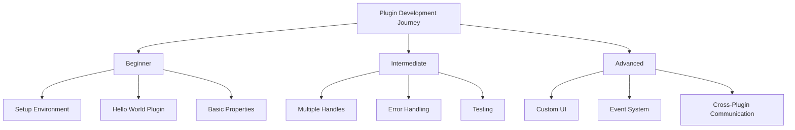
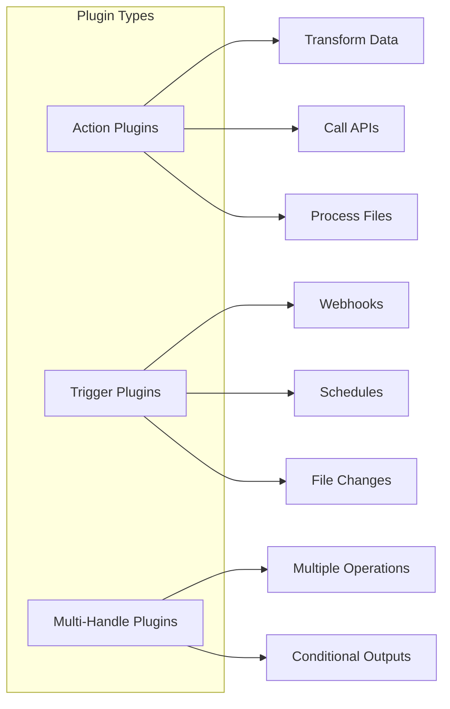
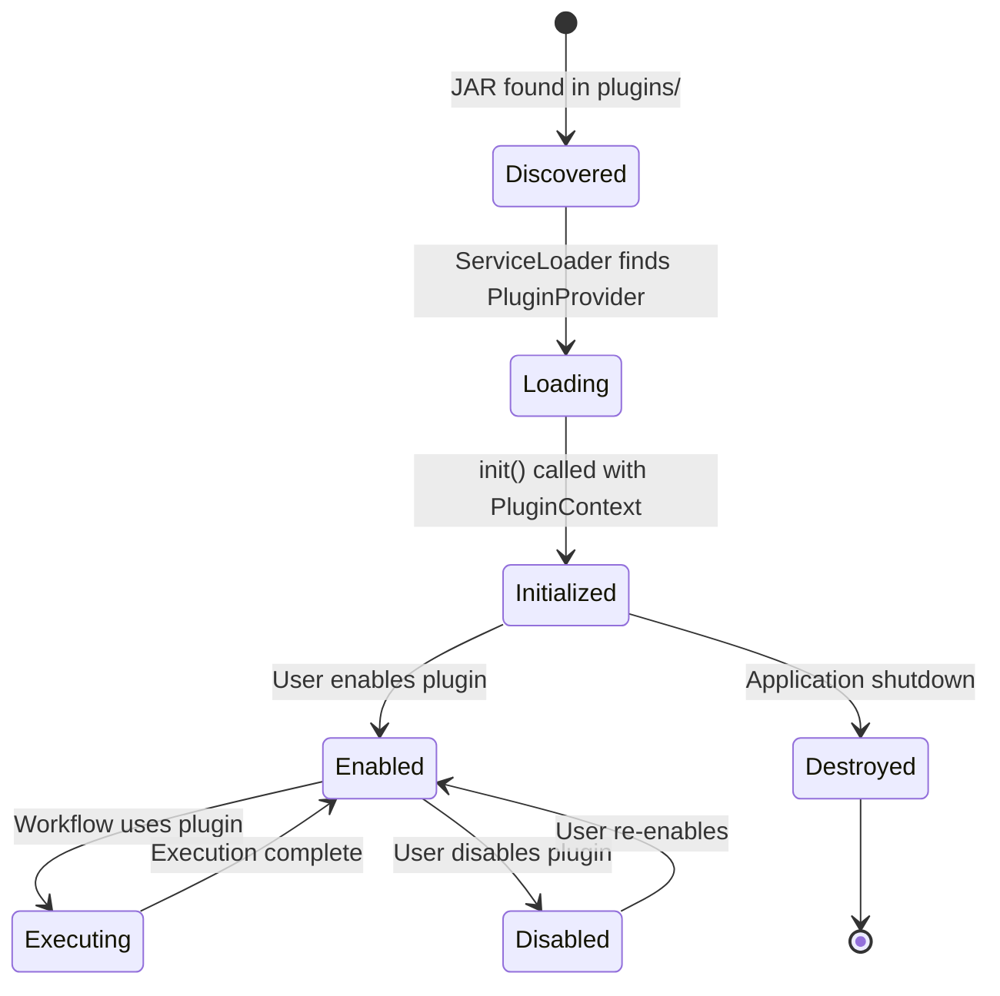

# NerveMind Plugin System Documentation

Welcome to the NerveMind plugin development documentation. This comprehensive guide will help you create powerful plugins for the NerveMind workflow automation platform, from beginner to advanced levels.

## Documentation Overview



## Quick Start

### Creating Your First Plugin (5 minutes)

```bash
# Using the CLI
nervemind plugin create my-first-plugin --template hello-world
cd my-first-plugin
./gradlew build
./gradlew install
```

### Manual Setup

1. Create a new Java project with Gradle
2. Add `plugin-api` dependency
3. Implement `PluginProvider` interface
4. Build and package as JAR
5. Drop in `plugins/` directory

## Documentation Structure

| Section | Level | Description |
|---------|-------|-------------|
| [Getting Started](getting-started.md) | 🟢 Beginner | Set up your development environment |
| [Plugin Architecture](architecture.md) | 🟡 Intermediate | Understand how plugins work internally |
| [Advanced Features](advanced-features.md) | 🔴 Advanced | Custom UI, menus, panels, and samples |
| [Best Practices](best-practices.md) | 🟡 Advanced | Tips for writing production-ready plugins |

## Plugin Types



### Action Plugins
Perform operations on data as it flows through a workflow.

**Use when:** You need to transform data, call APIs, process files, etc.

**Template:** `plugins/templates/hello-world/`

### Trigger Plugins
Start workflow execution based on events.

**Use when:** You need to respond to webhooks, schedules, file changes, etc.

**Template:** `plugins/templates/trigger/`

### Multi-Handle Plugins
Provide multiple related operations in a single plugin.

**Use when:** You need conditional outputs, multiple related actions, etc.

**Template:** `plugins/templates/advanced-multi/`

## Plugin Capabilities

### Core Features
- ✅ Custom input/output handles
- ✅ Configurable properties with type safety
- ✅ Execution context with logging
- ✅ Error handling and validation
- ✅ Lifecycle hooks (`init()`, `destroy()`)

### Advanced Features
- ✅ Cross-plugin communication via `PluginContext`
- ✅ Event subscriptions and publishing
- ✅ Plugin dependencies with version constraints
- ✅ Custom configuration UI
- ✅ Background services for triggers

## Example: Simple Action Plugin

```java
package com.example;

import ai.nervemind.plugin.api.*;
import java.util.List;
import java.util.Map;

public class HelloWorldPlugin implements PluginProvider {
    
    @Override
    public String getId() {
        return "com.example.helloworld";
    }
    
    @Override
    public String getName() {
        return "Hello World";
    }
    
    @Override
    public String getVersion() {
        return "1.0.0";
    }
    
    @Override
    public String getDescription() {
        return "Returns a personalized greeting message";
    }
    
    @Override
    public List<PluginHandle> getHandles() {
        return List.of(
            new PluginHandle(
                "hello",                    // Handle ID
                "Say Hello",                // Display name
                "Returns a greeting",       // Description
                NodeCategory.UTILITY,       // Category
                null,                       // Trigger type (null for actions)
                this::execute,              // Executor function
                () -> Map.of(               // JSON Schema
                    "type", "object",
                    "properties", Map.of(
                        "name", Map.of(
                            "type", "string",
                            "description", "Name to greet"
                        )
                    )
                ),
                () -> "Enter a name to greet"  // Help text
            )
        );
    }
    
    private Map<String, Object> execute(
            Map<String, Object> config,
            Map<String, Object> inputs) {
        String name = (String) config.getOrDefault("name", "World");
        return Map.of("message", "Hello, " + name + "!");
    }
}
```

## Plugin Lifecycle



## Learning Path

### 🟢 Beginner Path
1. [Set up your environment](getting-started.md#setting-up-your-environment)
2. [Create a Hello World plugin](getting-started.md#creating-your-first-plugin)
3. [Understand the basic structure](architecture.md#plugin-interface)
4. [Add configurable properties](guides/defining-properties.md)

### 🟡 Intermediate Path
1. [Create a trigger plugin](guides/creating-triggers.md)
2. [Handle errors gracefully](guides/handling-errors.md)
3. [Write unit tests](guides/testing-plugins.md)
4. [Use the testing framework](api/TestingFramework.md)

### 🔴 Advanced Path
1. [Create multi-handle plugins](advanced-features.md#connection-handles)
2. [Implement custom UI extensions](advanced-features.md#custom-ui-extensions)
3. [Add menu and panel contributions](advanced-features.md#menu-contributions)
4. [Contribute sample workflows](advanced-features.md#sample-workflow-contributions)

## Next Steps

1. **New to plugin development?** Start with [Getting Started](getting-started.md)
2. **Ready to build?** Follow the [Your First Plugin Guide](guides/creating-your-first-plugin.md)
3. **Need API details?** Check the [API Reference](api/PluginProvider.md)

## Support

- **Documentation:** Browse `docs/plugins/` for detailed guides
- **Examples:** Check `plugins/templates/` for sample code
- **Issues:** Report bugs on [GitHub Issues](https://github.com/nervemind/nervemind/issues)
- **Community:** Join our [Discord](https://discord.gg/nervemind)
- **Email:** plugins@nervemind.ai
