# Advanced Plugin Features

This guide covers advanced plugin capabilities for developers who need custom UI extensions, menu contributions, and other sophisticated features.

## Table of Contents

1. [Custom UI Extensions](#custom-ui-extensions)
2. [Menu Contributions](#menu-contributions)
3. [Side Panel Contributions](#side-panel-contributions)
4. [Sample Workflow Contributions](#sample-workflow-contributions)
5. [Connection Handles](#connection-handles)
6. [Help Text Documentation](#help-text-documentation)
7. [API Reference](#api-reference)

## Custom UI Extensions

### Custom Node View

Override `createNodeView()` to render your node differently on the canvas:

```java
@Override
public Object createNodeView(NodeViewContext context) {
    // Access node data
    String nodeId = context.getNodeId();
    Map<String, Object> settings = context.getSettings();
    boolean isSelected = context.isSelected();
    boolean isRunning = context.isRunning();
    
    // Create custom JavaFX content
    VBox content = new VBox(5);
    content.setAlignment(Pos.CENTER);
    
    // Custom icon/graphic
    Label icon = new Label("🚀");
    icon.setStyle("-fx-font-size: 24px;");
    
    // Status indicator
    Circle statusDot = new Circle(5);
    statusDot.setFill(isRunning ? Color.LIMEGREEN : Color.GRAY);
    
    // Progress indicator (if running)
    if (isRunning) {
        ProgressIndicator progress = new ProgressIndicator();
        progress.setPrefSize(30, 30);
        content.getChildren().add(progress);
    }
    
    content.getChildren().addAll(icon, statusDot);
    return content;
}
```

### NodeViewContext Interface


| Method | Returns | Description |
|--------|---------|-------------|
| `getNodeId()` | String | Unique node identifier |
| `getSettings()` | Map | Node configuration |
| `isSelected()` | boolean | Whether node is selected |
| `isRunning()` | boolean | Whether node is executing |
| `isError()` | boolean | Whether last execution failed |
| `getLastResult()` | Map | Output from last execution |

### Custom Property Editor

For specialized configuration UI, you can define custom property editors through the `PropertyDefinition`:

```java
@Override
public List<PropertyDefinition> getProperties() {
    return List.of(
        // Standard property with custom validation
        new PropertyDefinition(
            "colorPicker",
            "Color",
            PropertyType.STRING,
            "#FFFFFF",
            false,
            "Select a color",
            null,
            Map.of("uiWidget", "colorPicker")
        )
    );
}
```

## Menu Contributions

Add items to application menus or context menus:

```java
@Override
public List<MenuContribution> getMenuContributions() {
    return List.of(
        // Add to Tools menu
        new MenuContribution(
            MenuLocation.TOOLS,
            "My Plugin Action",
            "WRENCH",           // icon
            "Ctrl+Shift+M",     // shortcut
            () -> {
                // Action when clicked
                showMyDialog();
            }
        ),
        
        // Add to node context menu
        new MenuContribution(
            MenuLocation.NODE_CONTEXT,
            "Copy Node Config",
            "COPY",
            null,
            new ContextMenuAction() {
                @Override
                public void execute(ActionContext ctx) {
                    String nodeId = ctx.getNodeId();
                    // Copy node configuration to clipboard
                }
                
                @Override
                public boolean isVisible(ActionContext ctx) {
                    // Only show for specific node types
                    return "myNodeType".equals(ctx.getNodeType());
                }
            }
        )
    );
}
```

### Menu Locations


| Location | Description |
|----------|-------------|
| `FILE` | File menu |
| `EDIT` | Edit menu |
| `VIEW` | View menu |
| `WORKFLOW` | Workflow menu |
| `TOOLS` | Tools menu |
| `HELP` | Help menu |
| `NODE_CONTEXT` | Right-click on node |
| `CONNECTION_CONTEXT` | Right-click on connection |
| `CANVAS_CONTEXT` | Right-click on canvas |

## Side Panel Contributions

Add a custom panel to the sidebar:

```java
@Override
public Optional<SidePanelContribution> getSidePanel() {
    return Optional.of(new SidePanelContribution(
        "myPluginPanel",           // id
        "My Plugin",               // title
        "PUZZLE_PIECE",            // icon
        PanelPosition.RIGHT,       // position
        () -> {
            // Create panel content (JavaFX Node)
            VBox panel = new VBox(10);
            panel.setPadding(new Insets(10));
            
            Label title = new Label("Plugin Controls");
            Button actionBtn = new Button("Do Something");
            actionBtn.setOnAction(e -> doSomething());
            
            panel.getChildren().addAll(title, actionBtn);
            return panel;
        }
    ));
}
```

### Panel Positions

| Position | Description |
|----------|-------------|
| `LEFT` | Left sidebar (default) |
| `RIGHT` | Right sidebar |
| `BOTTOM` | Bottom panel |

## Sample Workflow Contributions

Contribute sample workflows that appear in the Samples Browser:

```java
// Note: Sample contribution requires implementing sample provider interface
public class MyPluginSamples implements SampleContribution {
    
    @Override
    public List<SampleDefinition> getSamples() {
        return List.of(
            new SampleDefinition(
                "my-sample-workflow",           // id
                "My Sample Workflow",           // name
                "Demonstrates how to use My Plugin", // description
                "Integration",                  // category
                SampleDifficulty.BEGINNER,      // difficulty
                List.of("http", "api", "demo"), // tags
                List.of("com.example.myplugin.my-action") // required nodes
            )
        );
    }
    
    @Override
    public String loadSampleJson(String sampleId) {
        if ("my-sample-workflow".equals(sampleId)) {
            return """
                {
                  "name": "My Sample Workflow",
                  "nodes": [...],
                  "connections": [...]
                }
                """;
        }
        return null;
    }
    
    @Override
    public Optional<String> loadSampleGuide(String sampleId) {
        if ("my-sample-workflow".equals(sampleId)) {
            return Optional.of("""
                ## Getting Started
                
                1. Configure the API Key in the first node
                2. Set your endpoint URL
                3. Run the workflow!
                
                ## Expected Output
                
                You should see the API response in the output panel.
                """);
        }
        return Optional.empty();
    }
}
```

### Sample Definition Structure


## Connection Handles

Handles define where connections attach to your node. By default, nodes have one input (left) and one output (right).

### Handle Positions

```mermaid
graph TB
    subgraph Node
        TOP["⬇ TOP"]
        LEFT["➡ LEFT"] 
        CENTER[Node Content]
        RIGHT["⬅ RIGHT"]
        BOTTOM["⬆ BOTTOM"]
    end
    
    TOP --> CENTER
    LEFT --> CENTER
    CENTER --> RIGHT
    CENTER --> BOTTOM
```



### Multi-Output Example

For nodes with multiple outputs (like a Switch node), define multiple handles:

```java
@Override
public List<PluginHandle> getHandles() {
    return List.of(
        // Main process handle
        new PluginHandle(
            "process",
            "Process Data",
            "Processes input data",
            NodeCategory.UTILITY,
            null,
            this::process,
            this::validateProcess,
            () -> "Process help",
            () -> processSchema()
        ),
        // Transform handle
        new PluginHandle(
            "transform",
            "Transform Data",
            "Transforms data format",
            NodeCategory.UTILITY,
            null,
            this::transform,
            this::validateTransform,
            () -> "Transform help",
            () -> transformSchema()
        )
    );
}
```

## Help Text Documentation

### Providing Help Text

The `getHelpText()` method returns Markdown-formatted documentation:

```java
@Override
public String getHelpText() {
    return """
        ## My Custom Node
        
        This node integrates with the Example API to fetch data.
        
        ### Parameters
        
        | Parameter | Type | Required | Description |
        |-----------|------|----------|-------------|
        | `apiKey` | String | Yes | Your API authentication key |
        | `endpoint` | String | No | Custom API endpoint URL |
        | `timeout` | Number | No | Request timeout in milliseconds |
        
        ### Output Data
        
        The node outputs a JSON object with:
        
        ```json
        {
          "status": "success",
          "data": { ... },
          "timestamp": "2026-02-04T12:00:00Z"
        }
        ```
        
        ### Examples
        
        **Basic Usage:**
        Connect a Manual Trigger → My Custom Node → Set Node
        
        **With Error Handling:**
        Use the error output handle to catch failures.
        
        ### Troubleshooting
        
        - **401 Unauthorized**: Check your API key
        - **Timeout**: Increase the timeout parameter
        """;
}
```

### Supported Markdown Formatting


### Subtitle for Categorization

```java
@Override
public String getSubtitle() {
    return "File";  // Shows as secondary text in node palette
}
```

## API Reference

### Core Interfaces

| Interface | Description |
|-----------|-------------|
| `PluginProvider` | Main plugin interface (implement this) |
| `PluginHandle` | Node type definition |
| `PluginContext` | Lifecycle context for init/destroy |
| `ExecutionContext` | Runtime context for execution |

### UI Extension Types

| Class | Description |
|-------|-------------|
| `MenuContribution` | Menu item definition |
| `MenuLocation` | Menu location enum |
| `SidePanelContribution` | Side panel definition |
| `PanelPosition` | Panel position enum |
| `NodeViewContext` | Context for custom node views |
| `ConnectionContext` | Context for connection events |

### Data Types

| Class | Description |
|-------|-------------|
| `PropertyDefinition` | Node property configuration |
| `PropertyType` | Property type enum |
| `SampleDefinition` | Sample workflow metadata |
| `SampleDifficulty` | Difficulty enum (BEGINNER, INTERMEDIATE, ADVANCED) |
| `NodeCategory` | Node category enum |

### Node Categories

| Category | Description | Icon |
|----------|-------------|------|
| `TRIGGER` | Workflow entry points | ⚡ |
| `ACTION` | Operations (HTTP, DB, etc.) | ▶️ |
| `FLOW_CONTROL` | If/Switch/Loop/Merge | 🔀 |
| `DATA` | Data transformation | 📊 |
| `AI` | AI/ML operations | 🤖 |
| `INTEGRATION` | External services | 🔌 |
| `UTILITY` | Helper utilities | 🔧 |

### Property Types

| Type | Description | UI Control |
|------|-------------|------------|
| `STRING` | Single-line text | TextField |
| `TEXT` | Multi-line text | TextArea |
| `NUMBER` | Numeric value | NumberField with spinner |
| `BOOLEAN` | True/false | CheckBox |
| `PATH` | File/directory path | PathPicker with browse |
| `SELECT` | Dropdown selection | ComboBox |
| `SECRET` | Masked input | PasswordField |
| `CODE` | Code/JSON editor | Syntax-highlighted editor |

### Property Factory Methods

```java
// String fields
PropertyDefinition.requiredString("name", "Display Name", "Help text")
PropertyDefinition.optionalString("name", "Display Name", "default", "Help text")

// Numbers
PropertyDefinition.requiredNumber("port", "Port Number", "Server port")
PropertyDefinition.optionalNumber("timeout", "Timeout (ms)", 30000, "Request timeout")

// Booleans
PropertyDefinition.optionalBoolean("enabled", "Enabled", true, "Enable this feature")

// Paths
PropertyDefinition.requiredPath("watchDir", "Watch Directory", "Directory to monitor")

// Dropdowns
PropertyDefinition.select("method", "HTTP Method", 
    List.of("GET", "POST", "PUT", "DELETE"), "GET", "Request method")

// Secrets (masked input)
PropertyDefinition.secret("apiKey", "API Key", "Your secret API key")

// Code/JSON
PropertyDefinition.code("script", "Script", "javascript", "// Your code here", "Custom script")
```

## Example Plugins

### File Watcher Plugin (Trigger)

A complete example of a trigger plugin that monitors directories:

**Location:** `plugins/file-watcher/`

```
file-watcher/
├── build.gradle
└── src/main/
    ├── java/ai/nervemind/plugin/filewatcher/
    │   ├── FileWatcherPlugin.java      # PluginProvider implementation
    │   └── FileWatcherExecutor.java    # Execution logic
    └── resources/META-INF/services/
        └── ai.nervemind.plugin.api.PluginProvider
```

**Key Features:**
- Monitors directory for file changes
- Configurable file patterns (glob)
- Event types: CREATE, MODIFY, DELETE
- Background service for continuous monitoring
- Comprehensive help text with Markdown tables

### Connection Label Plugin (UI Extension)

An example of a UI-only plugin that adds labels to connections:

**Location:** `plugins/connection-label/`

**Key Features:**
- Adds context menu items to connections
- Stores labels in workflow settings
- Demonstrates `ContextMenuAction` usage
- No node execution logic

## Next Steps

- [Best Practices](best-practices.md) - Production-ready plugin development
- [Architecture](architecture.md) - Deep dive into plugin internals
- [Templates](../../plugins/templates/) - Ready-to-use plugin templates
