# Plugin Architecture

This document explains how the NerveMind plugin system works under the hood, providing a deep dive for developers who want to understand the internals.

## Table of Contents

1. [Overview](#overview)
2. [Architecture Diagram](#architecture-diagram)
3. [Plugin Discovery](#plugin-discovery)
4. [Plugin Lifecycle](#plugin-lifecycle)
5. [Plugin Interface](#plugin-interface)
6. [Execution Model](#execution-model)
7. [Context System](#context-system)
8. [Dependency Management](#dependency-management)
9. [Event System](#event-system)
10. [Thread Safety](#thread-safety)

## Overview

The NerveMind plugin system is built on Java's ServiceLoader mechanism, allowing plugins to be discovered and loaded at runtime without requiring code changes to the core application.

### Key Design Principles

- **Loose Coupling:** Plugins are isolated from the core application
- **Hot-Loadable:** Plugins can be added without restarting
- **Type-Safe:** Strong typing for configuration and execution
- **Extensible:** Support for custom UI, events, and cross-plugin communication

## Architecture Diagram

### High-Level Architecture

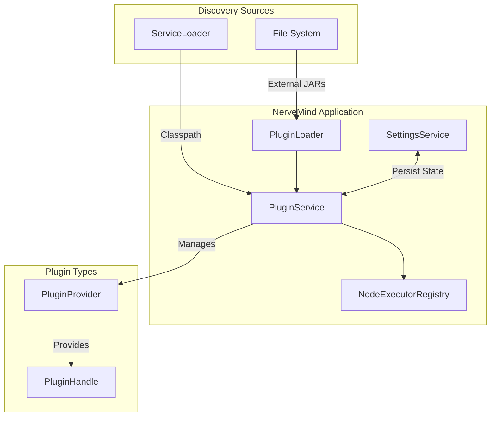

### Component Interaction

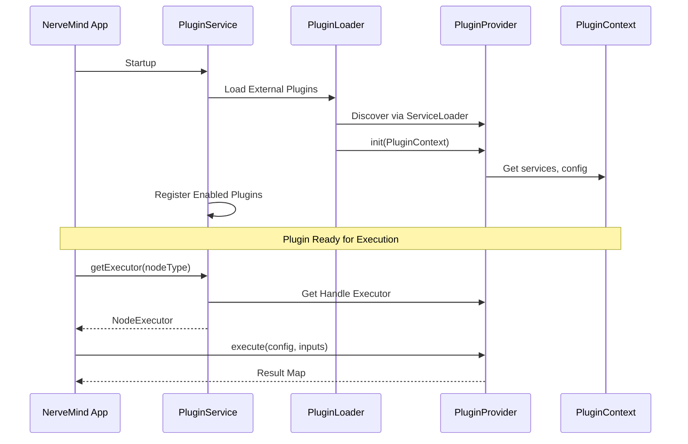

## Plugin Discovery

### Discovery Flow

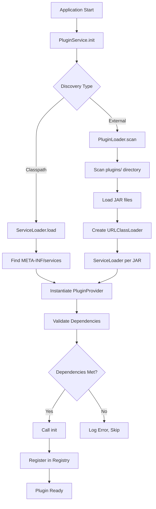

### 1. Classpath Discovery

Plugins bundled with the application are discovered using Java's ServiceLoader:

1. Application starts
2. `PluginService` scans classpath
3. Finds `META-INF/services/ai.nervemind.plugin.api.PluginProvider` files
4. Loads implementations via ServiceLoader
5. Registers plugins in the registry

**Service File Format:**
```
# META-INF/services/ai.nervemind.plugin.api.PluginProvider
com.example.myplugin.MyPlugin
com.example.another.OtherPlugin
```

### 2. External JAR Discovery

Plugins in the `plugins/` directory are discovered by `PluginLoader`:

1. Application starts
2. `PluginLoader` scans `plugins/` directory
3. Finds all `.jar` files
4. Creates isolated classloader for each JAR
5. Uses ServiceLoader to find implementations
6. Registers in the plugin registry

### 3. ServiceLoader Mechanism

```java
// Internal ServiceLoader usage
ServiceLoader<PluginProvider> loader = ServiceLoader.load(PluginProvider.class);
for (PluginProvider provider : loader) {
    discoveredPlugins.put(provider.getId(), provider);
}
```

## Plugin Lifecycle

### Lifecycle States

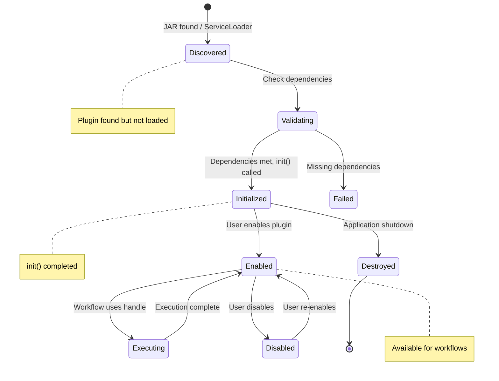

### Lifecycle Hooks

| Hook | When Called | Purpose |
|------|-------------|---------|
| `init(PluginContext)` | After discovery, before registration | Initialize resources, get services |
| `destroy()` | Application shutdown or plugin unload | Cleanup resources, save state |

### Implementation Example

```java
public class MyPlugin implements PluginProvider {
    private PluginContext context;
    private HttpClient httpClient;
    
    @Override
    public void init(PluginContext context) {
        this.context = context;
        
        // Get a service from the application
        this.httpClient = context.getService(HttpClient.class);
        
        // Load persistent configuration
        Properties config = context.getPersistentConfig();
        String apiKey = config.getProperty("apiKey");
        
        context.getLogger().info("MyPlugin initialized with API key: " + 
            (apiKey != null ? "***" : "not set"));
    }
    
    @Override
    public void destroy() {
        // Cleanup resources
        if (httpClient != null) {
            httpClient.close();
        }
        
        // Save state
        Properties config = context.getPersistentConfig();
        config.setProperty("lastShutdown", Instant.now().toString());
        context.savePersistentConfig(config);
        
        context.getLogger().info("MyPlugin destroyed");
    }
}
```

## Plugin Interface

### PluginProvider Interface

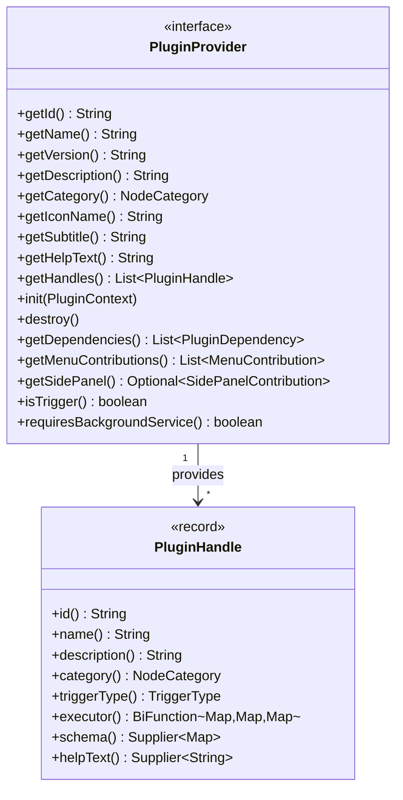

### Core Identity Methods

| Method | Return Type | Description | Required |
|--------|-------------|-------------|----------|
| `getId()` | String | Unique identifier (reverse domain notation) | Yes |
| `getName()` | String | Display name in UI | Yes |
| `getVersion()` | String | Semantic version | Yes |
| `getDescription()` | String | Brief description | Yes |
| `getCategory()` | NodeCategory | UI category for grouping | No (default: UTILITY) |
| `getIconName()` | String | Icon identifier | No |
| `getSubtitle()` | String | Subtitle in UI | No |
| `getHelpText()` | String | Help documentation | No |

### Handle Definition

Each `PluginHandle` represents a node type:

```java
public record PluginHandle(
    String id,                    // Handle ID (node type)
    String name,                  // Display name
    String description,           // Description
    NodeCategory category,        // Category for UI
    TriggerType triggerType,      // null for actions
    BiFunction<Map, Map, Map> executor,  // Execution function
    Supplier<Map> schema,         // JSON Schema for config
    Supplier<String> helpText     // Help text
) {}
```

### Handle Executor Function

The executor is a `BiFunction` that receives configuration and inputs:

```java
private Map<String, Object> execute(
        Map<String, Object> config,    // Node configuration
        Map<String, Object> inputs) {  // Inputs from previous nodes
    
    // Your logic here
    String value = (String) config.get("input");
    
    // Return result map
    return Map.of(
        "result", "Processed: " + value,
        "timestamp", System.currentTimeMillis()
    );
}
```

## Execution Model

### Execution Flow

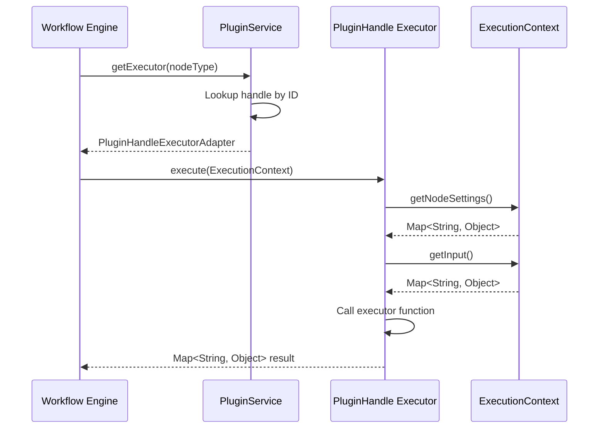

### Handle Resolution

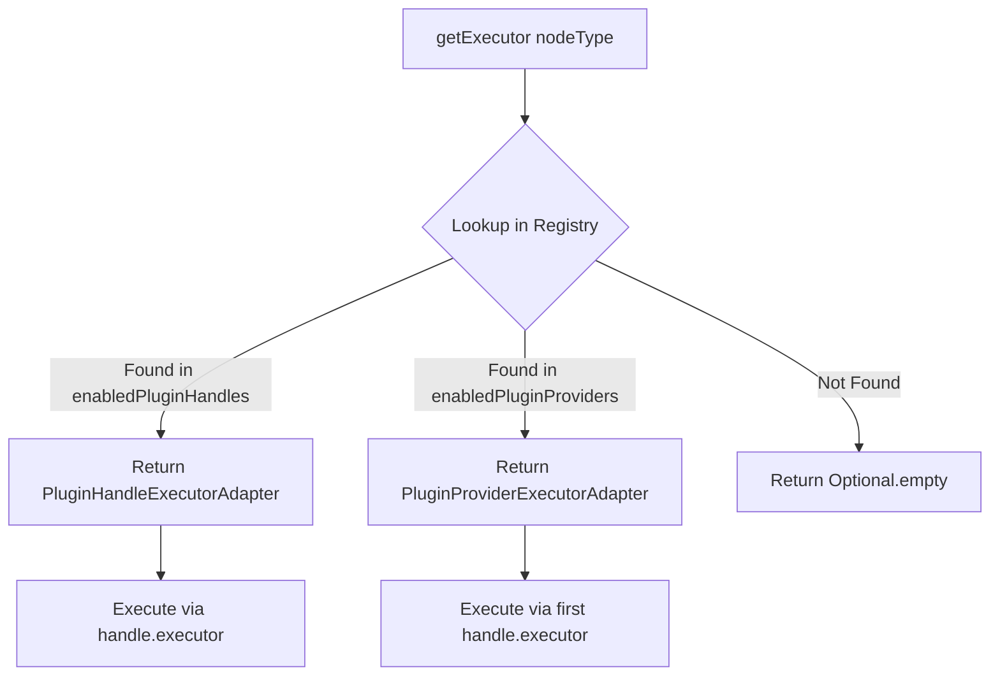

### Node Types

#### Triggers (Workflow Entry Points)

Triggers start workflow execution:

```java
public class WebhookTrigger implements PluginProvider {
    
    @Override
    public boolean isTrigger() {
        return true;
    }
    
    @Override
    public boolean requiresBackgroundService() {
        return true;  // Listens for HTTP requests
    }
    
    @Override
    public List<PluginHandle> getHandles() {
        return List.of(
            new PluginHandle(
                "webhook",
                "Webhook Trigger",
                "Starts workflow on HTTP request",
                NodeCategory.TRIGGER,
                TriggerType.WEBHOOK,
                this::execute,
                () -> Map.of("type", "object"),
                () -> "Configure webhook endpoint"
            )
        );
    }
    
    private Map<String, Object> execute(
            Map<String, Object> config,
            Map<String, Object> inputs) {
        // Called when webhook receives data
        return Map.of("payload", inputs);
    }
}
```

#### Actions (Data Processors)

Actions process data within workflows:

```java
public class HttpRequestAction implements PluginProvider {
    
    @Override
    public List<PluginHandle> getHandles() {
        return List.of(
            new PluginHandle(
                "http-request",
                "HTTP Request",
                "Makes an HTTP request",
                NodeCategory.INTEGRATION,
                null,  // Not a trigger
                this::execute,
                () -> Map.of(
                    "type", "object",
                    "properties", Map.of(
                        "url", Map.of("type", "string"),
                        "method", Map.of("type", "string", "default", "GET")
                    )
                ),
                () -> "Configure HTTP request"
            )
        );
    }
    
    private Map<String, Object> execute(
            Map<String, Object> config,
            Map<String, Object> inputs) {
        // Process data and return result
        return Map.of("result", "processed");
    }
}
```

## Context System

### PluginContext vs ExecutionContext

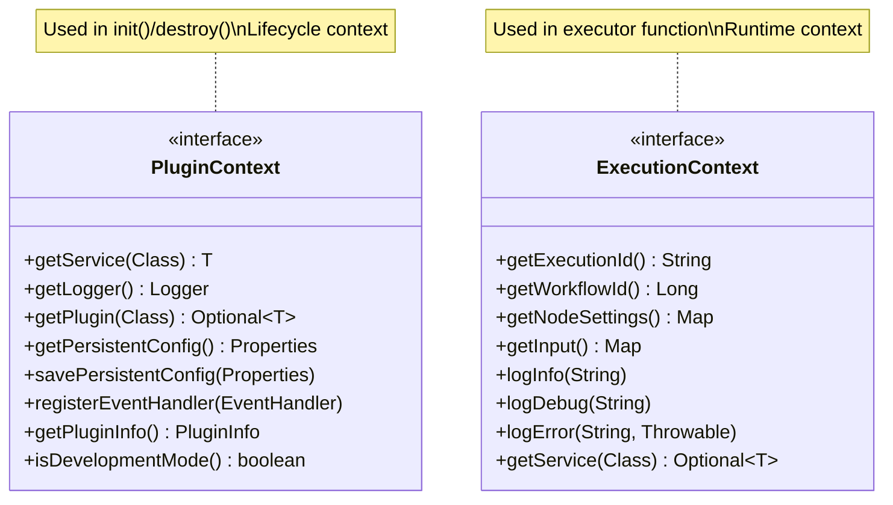

### PluginContext Usage

Passed to `init()` method for lifecycle management:

```java
public class MyPlugin implements PluginProvider {
    private CredentialService credentialService;
    private Logger logger;
    
    @Override
    public void init(PluginContext context) {
        // Get application services
        this.credentialService = context.getService(CredentialService.class);
        
        // Get logger (pre-configured with plugin ID)
        this.logger = context.getLogger();
        logger.info("Plugin initializing...");
        
        // Get persistent configuration
        Properties config = context.getPersistentConfig();
        String apiKey = config.getProperty("apiKey");
        
        // Access other plugins
        context.getPlugin(HttpClientPlugin.class)
            .ifPresent(http -> {
                // Use HTTP client plugin
            });
        
        // Register for events
        context.registerEventHandler(event -> {
            if (event instanceof WorkflowCompletedEvent e) {
                logger.info("Workflow completed: " + e.getWorkflowId());
            }
        });
    }
}
```

### ExecutionContext Usage

Available within the executor function:

```java
private Map<String, Object> execute(
        Map<String, Object> config,
        Map<String, Object> inputs) {
    
    // Access configuration
    String url = (String) config.get("url");
    
    // Access inputs from previous node
    Object data = inputs.get("data");
    
    // Return result
    return Map.of("result", "processed");
}
```

## Dependency Management

### Dependency Declaration

```java
@Override
public List<PluginDependency> getDependencies() {
    return List.of(
        PluginDependency.atLeast("ai.nervemind.plugin.http", "1.0.0"),
        PluginDependency.compatible("com.example.shared", "2.0.0")
    );
}
```

### Version Resolution

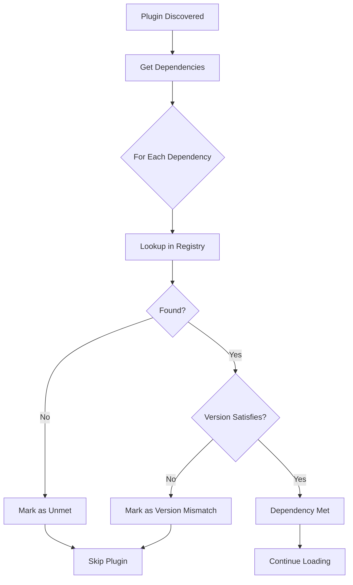

### Version Constraint Types

| Constraint | Syntax | Example | Meaning |
|------------|--------|---------|---------|
| Exact | `1.0.0` | `PluginDependency.exact("id", "1.0.0")` | Must be exactly 1.0.0 |
| At Least | `1.0.0+` | `PluginDependency.atLeast("id", "1.0.0")` | 1.0.0 or higher |
| Range | `1.0.0 - 2.0.0` | `PluginDependency.range("id", "1.0.0", "2.0.0")` | Between 1.0.0 and 2.0.0 |
| Compatible | `^1.0.0` | `PluginDependency.compatible("id", "1.0.0")` | Same major version |
| Patch Compatible | `~1.0.0` | `new PluginDependency("id", "~1.0.0")` | Same major.minor |

## Event System

### Event Flow

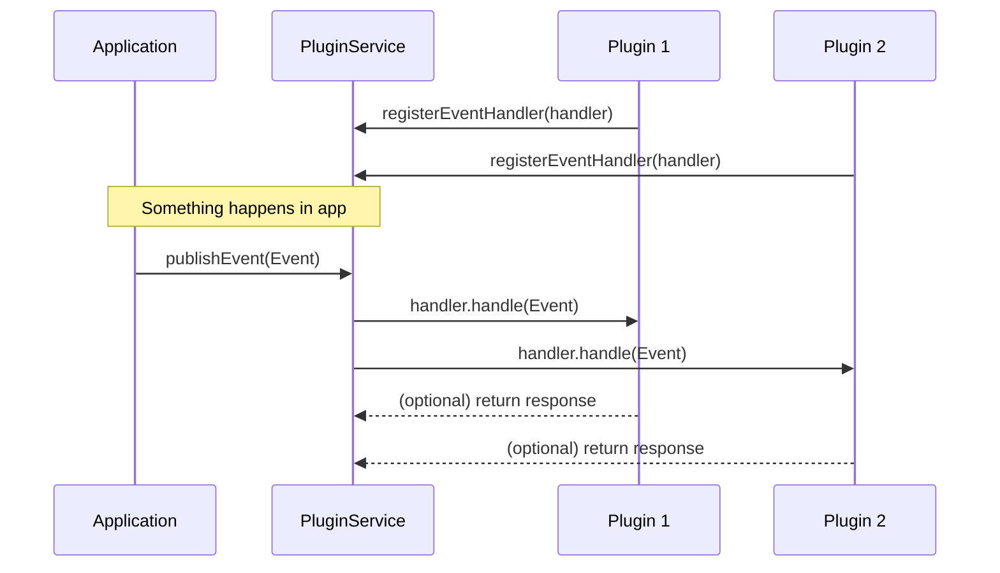

### Event Types

| Event Type | When Fired | Data Provided |
|------------|------------|---------------|
| `WorkflowStartedEvent` | Workflow execution begins | workflowId, triggerData |
| `WorkflowCompletedEvent` | Workflow finishes successfully | workflowId, outputs |
| `WorkflowFailedEvent` | Workflow fails | workflowId, error |
| `NodeExecutionEvent` | Node executes | nodeId, inputs, outputs |
| `PluginLoadedEvent` | Plugin loaded | pluginId |
| `PluginUnloadedEvent` | Plugin unloaded | pluginId |

### Event Handler Registration

```java
@Override
public void init(PluginContext context) {
    context.registerEventHandler(event -> {
        switch (event) {
            case WorkflowCompletedEvent e -> 
                handleWorkflowComplete(e.getWorkflowId());
            case WorkflowFailedEvent e -> 
                handleWorkflowError(e.getWorkflowId(), e.getError());
            default -> {}
        }
    });
}
```

## Thread Safety

### Concurrent Access

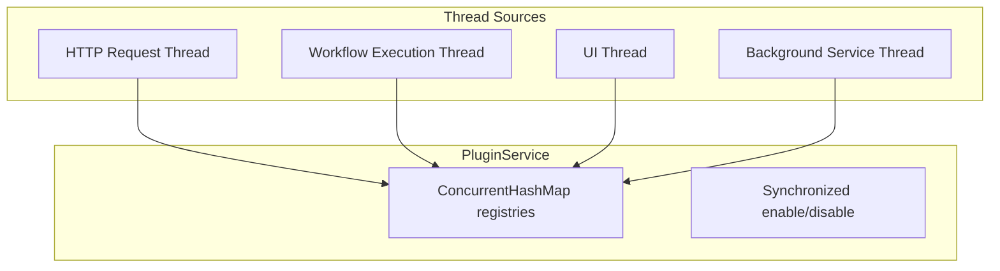

### Thread-Safe Patterns

The plugin system uses `ConcurrentHashMap` for all registries:

```java
// Thread-safe registry
private final Map<String, PluginProvider> enabledPluginProviders = 
    new ConcurrentHashMap<>();

// Thread-safe set
private final Set<String> enabledPluginIds = 
    ConcurrentHashMap.newKeySet();
```

### Plugin Implementation Guidelines

```java
public class MyPlugin implements PluginProvider {
    // Use thread-safe collections for shared state
    private final ConcurrentHashMap<String, Object> cache = 
        new ConcurrentHashMap<>();
    
    // Synchronize mutable state access
    private volatile boolean running = false;
    
    private Map<String, Object> execute(
            Map<String, Object> config,
            Map<String, Object> inputs) {
        // Avoid shared mutable state
        // Use local variables when possible
        
        String key = (String) config.get("key");
        
        // Thread-safe cache access
        return cache.computeIfAbsent(key, k -> 
            computeExpensiveResult(k));
    }
}
```

## Best Practices

### 1. Keep Executors Pure

```java
// Good: Pure function, no side effects
private Map<String, Object> execute(
        Map<String, Object> config,
        Map<String, Object> inputs) {
    String input = (String) inputs.get("data");
    return Map.of("result", transform(input));
}

// Avoid: Shared mutable state
private List<String> results = new ArrayList<>();  // Not thread-safe!
```

### 2. Use PluginContext for Initialization

```java
@Override
public void init(PluginContext context) {
    // Get services once at initialization
    this.httpClient = context.getService(HttpClient.class);
    this.logger = context.getLogger();
    
    // Load configuration
    Properties config = context.getPersistentConfig();
    this.apiKey = config.getProperty("apiKey");
}
```

### 3. Handle Errors Gracefully

```java
private Map<String, Object> execute(
        Map<String, Object> config,
        Map<String, Object> inputs) {
    try {
        String url = (String) config.get("url");
        if (url == null || url.isBlank()) {
            return Map.of(
                "success", false,
                "error", "URL is required"
            );
        }
        
        return doHttpRequest(url);
    } catch (Exception e) {
        logger.error("Request failed", e);
        return Map.of(
            "success", false,
            "error", e.getMessage()
        );
    }
}
```

### 4. Provide Clear Schemas

```java
@Override
public List<PluginHandle> getHandles() {
    return List.of(
        new PluginHandle(
            "process",
            "Process Data",
            "Transforms input data",
            NodeCategory.UTILITY,
            null,
            this::execute,
            () -> Map.of(
                "type", "object",
                "properties", Map.of(
                    "input", Map.of(
                        "type", "string",
                        "description", "Input data to process"
                    ),
                    "format", Map.of(
                        "type", "string",
                        "enum", List.of("json", "xml", "csv"),
                        "default", "json"
                    )
                ),
                "required", List.of("input")
            ),
            () -> "Provide input data and format"
        )
    );
}
```

## Next Steps

1. **API Reference:** [PluginProvider API](api/PluginProvider.md)
2. **Testing Guide:** [Testing Plugins](guides/testing-plugins.md)
3. **Examples:** [Sample Plugins](plugins/templates/)
4. **Best Practices:** [Best Practices Guide](best-practices.md)
