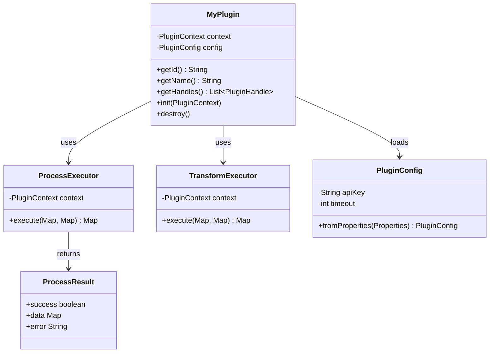
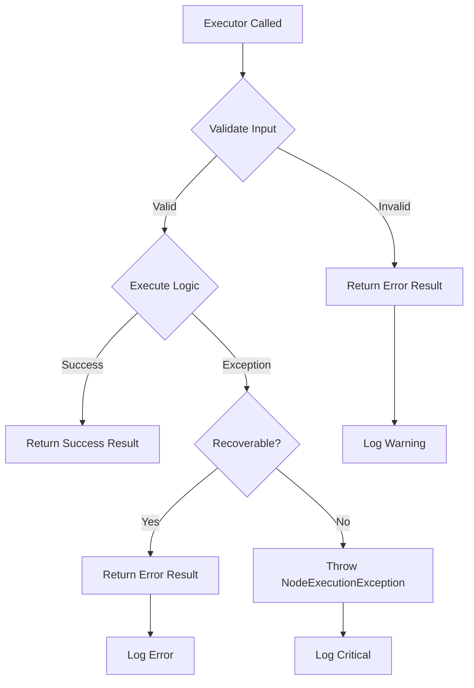
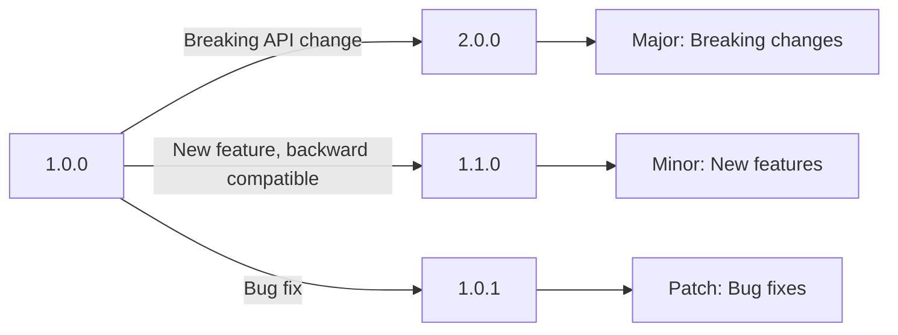

# Plugin Development Best Practices

This guide covers best practices for developing production-ready NerveMind plugins, from code organization to performance optimization.

## Table of Contents

1. [Code Organization](#code-organization)
2. [Error Handling](#error-handling)
3. [Performance](#performance)
4. [Testing](#testing)
5. [Security](#security)
6. [Configuration](#configuration)
7. [Logging](#logging)
8. [Versioning](#versioning)
9. [Documentation](#documentation)

## Code Organization

### Project Structure

```
my-plugin/
|-- build.gradle
|-- settings.gradle
|-- README.md
|-- CHANGELOG.md
|-- LICENSE
|-- src/
|   |-- main/
|   |   |-- java/
|   |   |   |-- com/
|   |   |       |-- example/
|   |   |           |-- MyPlugin.java           # Main entry point
|   |   |           |-- executor/               # Executor implementations
|   |   |           |   |-- ProcessExecutor.java
|   |   |           |   |-- TransformExecutor.java
|   |   |           |-- model/                  # Data models
|   |   |           |   |-- ProcessResult.java
|   |   |           |-- config/                 # Configuration classes
|   |   |           |   |-- PluginConfig.java
|   |   |           |-- util/                   # Utilities
|   |   |           |   |-- HttpUtils.java
|   |   |           |-- exception/              # Custom exceptions
|   |   |           |   |-- ProcessingException.java
|   |   |-- resources/
|   |       |-- META-INF/services/
|   |       |-- samples/                        # Sample workflows
|   |-- test/
|       |-- java/
|       |-- resources/
```

### Class Design



### Separation of Concerns

```java
// Good: Separate executor logic
public class MyPlugin implements PluginProvider {
    private ProcessExecutor processExecutor;
    private TransformExecutor transformExecutor;
    
    @Override
    public List<PluginHandle> getHandles() {
        return List.of(
            new PluginHandle("process", "Process", "...", 
                NodeCategory.UTILITY, null, processExecutor::execute, ...),
            new PluginHandle("transform", "Transform", "...",
                NodeCategory.UTILITY, null, transformExecutor::execute, ...)
        );
    }
}

// Avoid: All logic in one class
public class MyPlugin implements PluginProvider {
    private Map<String, Object> executeProcess(...) { /* 500 lines */ }
    private Map<String, Object> executeTransform(...) { /* 300 lines */ }
    private void validateInput(...) { /* 100 lines */ }
    // ... more methods
}
```

## Error Handling

### Error Handling Strategy



### Graceful Error Returns

```java
public class RobustPlugin implements PluginProvider {
    
    private Map<String, Object> execute(
            Map<String, Object> config,
            Map<String, Object> inputs) {
        
        // Validate required inputs
        String url = (String) config.get("url");
        if (url == null || url.isBlank()) {
            return Map.of(
                "success", false,
                "error", "URL is required",
                "errorType", "VALIDATION_ERROR"
            );
        }
        
        try {
            // Execute main logic
            HttpResponse response = httpClient.get(url);
            
            return Map.of(
                "success", true,
                "data", response.body(),
                "statusCode", response.statusCode()
            );
            
        } catch (ConnectException e) {
            // Recoverable: Network issue
            return Map.of(
                "success", false,
                "error", "Connection failed: " + e.getMessage(),
                "errorType", "NETWORK_ERROR",
                "retryable", true
            );
            
        } catch (IOException e) {
            // Log and return error
            context.getLogger().log(Level.WARNING, 
                "Request failed for URL: " + url, e);
            return Map.of(
                "success", false,
                "error", e.getMessage(),
                "errorType", "IO_ERROR"
            );
        }
    }
}
```

### Critical Errors

```java
private Map<String, Object> execute(
        Map<String, Object> config,
        Map<String, Object> inputs) {
    
    try {
        // Critical operation
        return performCriticalOperation(config);
        
    } catch (CriticalException e) {
        // Throw to halt workflow
        throw new NodeExecutionException(
            "Critical failure in " + getId() + ": " + e.getMessage(), e);
    }
}
```

## Performance

### Caching Strategies

```java
public class CachedPlugin implements PluginProvider {
    private final Cache<String, Object> cache = 
        Caffeine.newBuilder()
            .maximumSize(1000)
            .expireAfterWrite(Duration.ofMinutes(10))
            .build();
    
    private Map<String, Object> execute(
            Map<String, Object> config,
            Map<String, Object> inputs) {
        
        String cacheKey = generateCacheKey(config);
        
        // Check cache first
        Object cached = cache.getIfPresent(cacheKey);
        if (cached != null) {
            return Map.of("success", true, "data", cached, "cached", true);
        }
        
        // Compute and cache
        Object result = computeExpensiveResult(config);
        cache.put(cacheKey, result);
        
        return Map.of("success", true, "data", result, "cached", false);
    }
}
```

### Lazy Initialization

```java
public class LazyPlugin implements PluginProvider {
    private volatile HttpClient httpClient;
    private final Object lock = new Object();
    
    private HttpClient getHttpClient() {
        if (httpClient == null) {
            synchronized (lock) {
                if (httpClient == null) {
                    httpClient = createHttpClient();
                }
            }
        }
        return httpClient;
    }
    
    // Or use Supplier
    private final Supplier<HttpClient> httpClientSupplier = 
        Suppliers.memoize(this::createHttpClient);
}
```

### Resource Management

```java
public class ResourceAwarePlugin implements PluginProvider {
    private ExecutorService executorService;
    
    @Override
    public void init(PluginContext context) {
        // Create bounded thread pool
        executorService = Executors.newFixedThreadPool(
            Runtime.getRuntime().availableProcessors(),
            new ThreadFactoryBuilder()
                .setNameFormat(getId() + "-%d")
                .setDaemon(true)
                .build()
        );
    }
    
    @Override
    public void destroy() {
        if (executorService != null) {
            executorService.shutdown();
            try {
                if (!executorService.awaitTermination(30, TimeUnit.SECONDS)) {
                    executorService.shutdownNow();
                }
            } catch (InterruptedException e) {
                executorService.shutdownNow();
                Thread.currentThread().interrupt();
            }
        }
    }
}
```

## Testing

### Unit Testing

```java
@PluginTest(plugin = MyPlugin.class, autoInit = true, autoDestroy = true)
class MyPluginTest {
    
    private MyPlugin plugin;
    private MockPluginContext pluginContext;
    private MockExecutionContext executionContext;
    
    @BeforeEach
    void setUp() {
        executionContext = new MockExecutionContext()
            .withInput("url", "https://api.example.com/data");
    }
    
    @Test
    void shouldReturnSuccessForValidInput() {
        Map<String, Object> result = executeHandle("process", 
            Map.of("url", "https://api.example.com"));
        
        PluginAssertions.assertThat(result)
            .containsKey("success")
            .containsEntry("success", true);
    }
    
    @Test
    void shouldReturnErrorForMissingUrl() {
        Map<String, Object> result = executeHandle("process", Map.of());
        
        PluginAssertions.assertThat(result)
            .containsKey("error")
            .containsEntry("success", false);
    }
    
    @Test
    void shouldLogExecution() {
        executeHandle("process", Map.of("url", "https://test.com"));
        
        List<String> logs = pluginContext.getLogs();
        assertThat(logs).anyMatch(log -> log.contains("Processing"));
    }
    
    private Map<String, Object> executeHandle(String handleId, 
            Map<String, Object> config) {
        return plugin.getHandles().stream()
            .filter(h -> h.id().equals(handleId))
            .findFirst()
            .map(h -> h.executor().apply(config, executionContext.getInputs()))
            .orElseThrow();
    }
}
```

### Integration Testing

```java
class MyPluginIntegrationTest {
    
    private static NerveMindTestServer server;
    
    @BeforeAll
    static void startServer() {
        server = NerveMindTestServer.create()
            .withPlugin(MyPlugin.class)
            .start();
    }
    
    @AfterAll
    static void stopServer() {
        server.stop();
    }
    
    @Test
    void shouldExecuteInWorkflow() {
        Workflow workflow = TestDataFactory.createWorkflow()
            .withId("test-workflow")
            .addNode("process", "com.example.myplugin.process")
            .build();
        
        ExecutionResult result = server.execute(workflow, 
            Map.of("url", "https://api.example.com"));
        
        assertThat(result.getStatus()).isEqualTo(ExecutionStatus.COMPLETED);
        assertThat(result.getOutput()).containsKey("data");
    }
}
```

## Security

### Input Validation

```java
public class SecurePlugin implements PluginProvider {
    
    private static final Pattern SAFE_STRING = 
        Pattern.compile("^[a-zA-Z0-9_-]+$");
    private static final Set<String> ALLOWED_SCHEMES = 
        Set.of("https", "http");
    
    private Map<String, Object> execute(
            Map<String, Object> config,
            Map<String, Object> inputs) {
        
        // Validate URL
        String url = validateUrl((String) config.get("url"));
        
        // Validate string input
        String name = validateString((String) config.get("name"));
        
        // Safe to proceed
        return doWork(url, name);
    }
    
    private String validateUrl(String url) {
        if (url == null) {
            throw new IllegalArgumentException("URL is required");
        }
        
        try {
            URI uri = new URI(url);
            if (!ALLOWED_SCHEMES.contains(uri.getScheme())) {
                throw new IllegalArgumentException(
                    "Only HTTP/HTTPS URLs allowed");
            }
            return url;
        } catch (URISyntaxException e) {
            throw new IllegalArgumentException("Invalid URL: " + url);
        }
    }
    
    private String validateString(String input) {
        if (input != null && !SAFE_STRING.matcher(input).matches()) {
            throw new IllegalArgumentException(
                "Invalid characters in input");
        }
        return input;
    }
}
```

### Credential Handling

```java
public class SecureCredentialPlugin implements PluginProvider {
    private CredentialService credentialService;
    
    @Override
    public void init(PluginContext context) {
        this.credentialService = context.getService(CredentialService.class);
    }
    
    private Map<String, Object> execute(
            Map<String, Object> config,
            Map<String, Object> inputs) {
        
        // Get credential by ID (never log or return the value)
        String credentialId = (String) config.get("credentialId");
        Credential credential = credentialService.getCredential(credentialId);
        
        // Use credential securely
        HttpClient client = HttpClient.newBuilder()
            .authenticator(new Authenticator() {
                @Override
                protected PasswordAuthentication getPasswordAuthentication() {
                    return new PasswordAuthentication(
                        credential.getUsername(),
                        credential.getPassword().toCharArray()
                    );
                }
            })
            .build();
        
        // Never include credentials in output
        return Map.of("success", true, "data", fetchData(client));
    }
}
```

## Configuration

### Configuration Best Practices

```java
public class ConfigurablePlugin implements PluginProvider {
    private PluginConfig config;
    
    @Override
    public void init(PluginContext context) {
        // Load from persistent config with defaults
        Properties props = context.getPersistentConfig();
        this.config = PluginConfig.builder()
            .apiUrl(props.getProperty("apiUrl", "https://api.example.com"))
            .timeout(parseTimeout(props.getProperty("timeout", "30s")))
            .maxRetries(parseInt(props.getProperty("maxRetries", "3")))
            .debugMode(Boolean.parseBoolean(props.getProperty("debugMode", "false")))
            .build();
        
        // Validate configuration
        validateConfig(config);
    }
    
    private void validateConfig(PluginConfig config) {
        if (config.apiUrl() == null || config.apiUrl().isBlank()) {
            throw new IllegalStateException("apiUrl is required");
        }
        if (config.timeout().isNegative()) {
            throw new IllegalStateException("timeout must be positive");
        }
    }
    
    @Value  // Use a record or @Value class
    static class PluginConfig {
        String apiUrl;
        Duration timeout;
        int maxRetries;
        boolean debugMode;
    }
}
```

### Schema Definition

```java
@Override
public List<PluginHandle> getHandles() {
    return List.of(
        new PluginHandle(
            "process",
            "Process Data",
            "Processes data with configuration",
            NodeCategory.UTILITY,
            null,
            this::execute,
            () -> Map.of(
                "type", "object",
                "properties", Map.of(
                    "input", Map.of(
                        "type", "string",
                        "description", "Input data to process",
                        "minLength", 1,
                        "maxLength", 10000
                    ),
                    "format", Map.of(
                        "type", "string",
                        "enum", List.of("json", "xml", "csv"),
                        "default", "json",
                        "description", "Input format"
                    ),
                    "options", Map.of(
                        "type", "object",
                        "properties", Map.of(
                            "trim", Map.of(
                                "type", "boolean",
                                "default", true
                            ),
                            "validate", Map.of(
                                "type", "boolean",
                                "default", true
                            )
                        )
                    )
                ),
                "required", List.of("input")
            ),
            () -> "Provide input data and processing options"
        )
    );
}
```

## Logging

### Logging Best Practices

```java
public class LoggingPlugin implements PluginProvider {
    private Logger logger;
    
    @Override
    public void init(PluginContext context) {
        this.logger = context.getLogger();
    }
    
    private Map<String, Object> execute(
            Map<String, Object> config,
            Map<String, Object> inputs) {
        
        // Log at appropriate level
        logger.fine(() -> "Starting execution with config: " + 
            sanitizeForLogging(config));
        
        try {
            Object result = doWork(config, inputs);
            
            logger.info(() -> "Execution completed successfully");
            
            return Map.of("success", true, "data", result);
            
        } catch (Exception e) {
            // Log with context, not just the message
            logger.warning(() -> String.format(
                "Execution failed for %s: %s", 
                getId(), e.getMessage()));
            
            // Log stack trace at finer level
            logger.fine(() -> "Stack trace: " + 
                Arrays.toString(e.getStackTrace()));
            
            throw e;
        }
    }
    
    private String sanitizeForLogging(Map<String, Object> config) {
        // Never log sensitive data
        return config.entrySet().stream()
            .filter(e -> !e.getKey().contains("password") 
                      && !e.getKey().contains("secret")
                      && !e.getKey().contains("token"))
            .map(e -> e.getKey() + "=" + e.getValue())
            .collect(Collectors.joining(", "));
    }
}
```

## Versioning

### Semantic Versioning



### Version Compatibility

```java
public class VersionedPlugin implements PluginProvider {
    
    @Override
    public String getVersion() {
        return "2.1.0";
    }
    
    @Override
    public List<PluginDependency> getDependencies() {
        return List.of(
            // Require at least 1.5.0 of HTTP plugin
            PluginDependency.atLeast("ai.nervemind.plugin.http", "1.5.0"),
            
            // Require compatible version of utils
            PluginDependency.compatible("com.example.utils", "3.0.0")
        );
    }
}
```

### Migration Support

```java
public class MigratingPlugin implements PluginProvider {
    
    private Map<String, Object> execute(
            Map<String, Object> config,
            Map<String, Object> inputs) {
        
        // Detect old configuration format
        if (config.containsKey("oldFormat")) {
            config = migrateConfig(config);
        }
        
        // Proceed with current format
        return processWithCurrentFormat(config);
    }
    
    private Map<String, Object> migrateConfig(Map<String, Object> old) {
        context.getLogger().info("Migrating from old config format");
        
        Map<String, Object> migrated = new HashMap<>(old);
        
        // Rename keys
        migrated.put("newKey", old.get("oldKey"));
        migrated.remove("oldKey");
        
        // Transform values
        if (old.containsKey("legacyOption")) {
            migrated.put("options", Map.of(
                "enabled", old.get("legacyOption")
            ));
        }
        
        return migrated;
    }
}
```

## Documentation

### README Template

```markdown
# My Plugin

Brief description of what this plugin does.

## Features

- Feature 1
- Feature 2
- Feature 3

## Installation

1. Download the JAR from releases
2. Copy to your NerveMind `plugins/` directory
3. Restart NerveMind

## Configuration

| Property | Type | Required | Default | Description |
|----------|------|----------|---------|-------------|
| `url` | string | Yes | - | API endpoint URL |
| `timeout` | integer | No | 30 | Request timeout in seconds |

## Handles

### process

Processes input data.

**Inputs:**
- `data` (string): Input data to process

**Outputs:**
- `result` (string): Processed result
- `success` (boolean): Whether processing succeeded

## Examples

### Basic Usage

```json
{
  "type": "com.example.myplugin.process",
  "config": {
    "url": "https://api.example.com/process",
    "timeout": 60
  }
}
```

## Changelog

### 2.0.0
- Breaking: Changed output format
- Added: New transform handle

### 1.1.0
- Added: Retry support
- Fixed: Timeout handling

## License

MIT License
```

### Code Documentation

```java
/**
 * Processes HTTP requests with configurable retry logic.
 * 
 * <p>This plugin provides a robust HTTP client with automatic retries,
 * timeout handling, and response caching.</p>
 * 
 * <h2>Handles</h2>
 * <ul>
 *   <li>{@code get} - HTTP GET request</li>
 *   <li>{@code post} - HTTP POST request</li>
 *   <li>{@code put} - HTTP PUT request</li>
 * </ul>
 * 
 * <h2>Configuration</h2>
 * <pre>{@code
 * {
 *   "url": "https://api.example.com",
 *   "timeout": 30,
 *   "retries": 3
 * }
 * }</pre>
 * 
 * @author Your Name
 * @since 1.0.0
 * @see PluginProvider
 */
public class HttpPlugin implements PluginProvider {
    // ...
}
```

## Checklist

### Before Release

- [ ] All tests pass
- [ ] Code coverage > 80%
- [ ] Documentation is complete
- [ ] CHANGELOG.md is updated
- [ ] Version number is correct
- [ ] Dependencies are properly declared
- [ ] No sensitive data in code
- [ ] Error handling is comprehensive
- [ ] Logging is appropriate
- [ ] Performance is acceptable

### Production Ready

- [ ] Graceful error handling
- [ ] Input validation
- [ ] Resource cleanup in destroy()
- [ ] Thread-safe implementation
- [ ] Proper logging levels
- [ ] Configuration validation
- [ ] Timeout handling
- [ ] Memory management