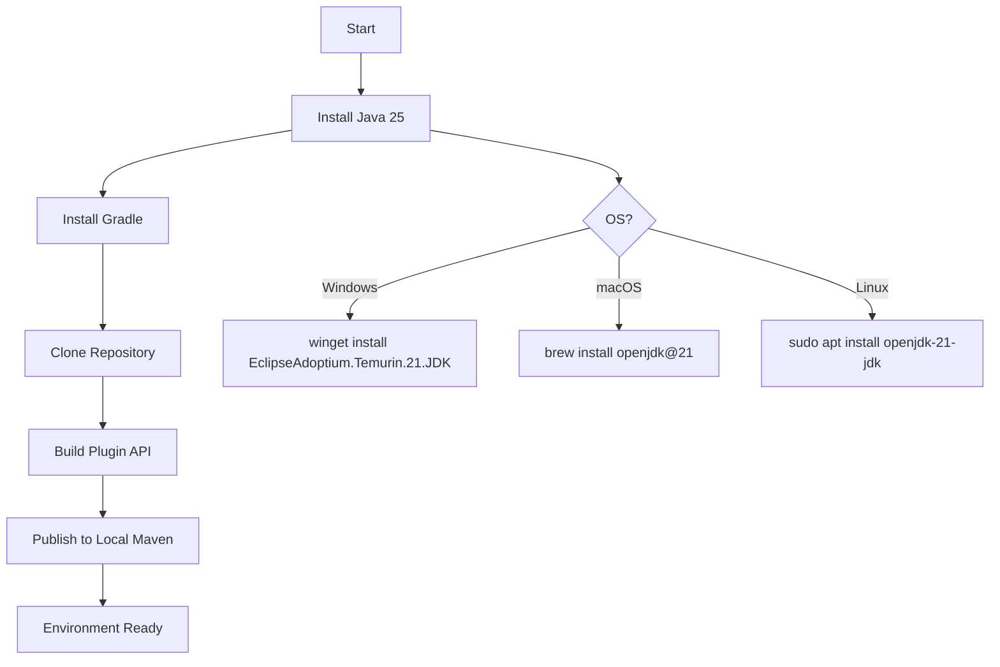
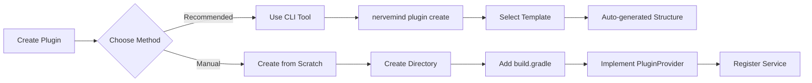
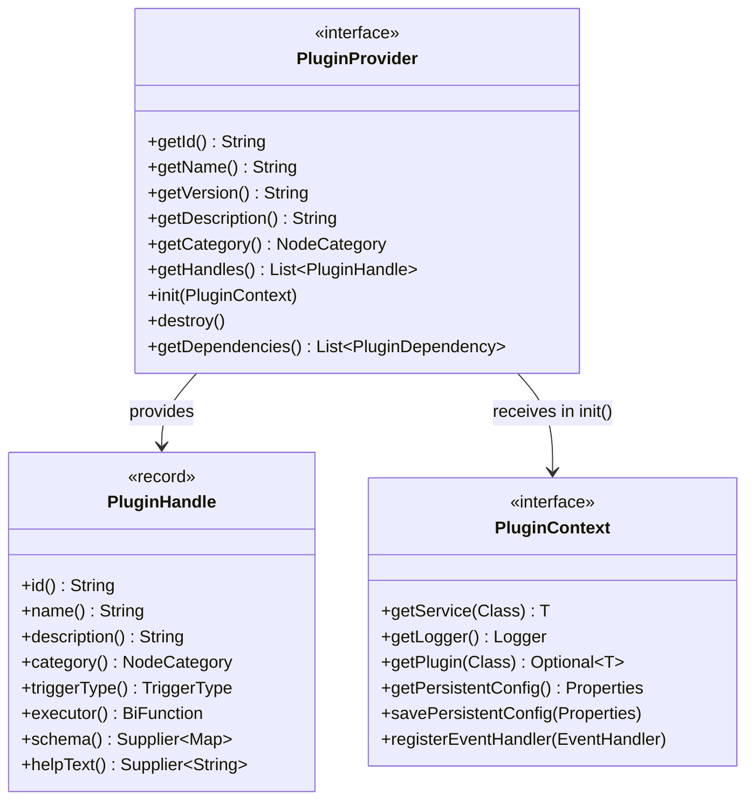
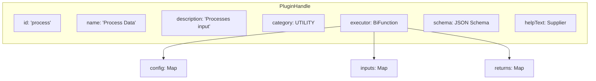
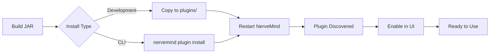
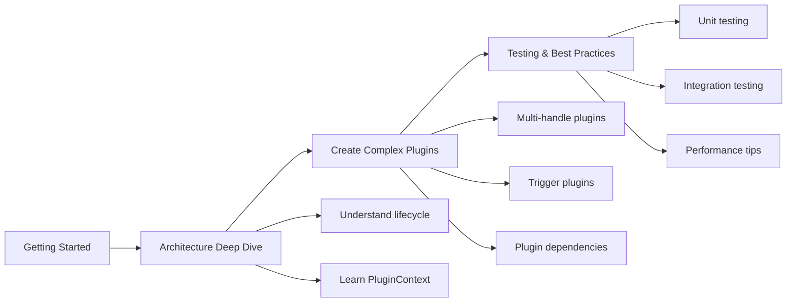

# Getting Started with NerveMind Plugin Development

This guide will help you set up your development environment and create your first plugin, progressing from beginner to advanced concepts.

## Table of Contents

1. [Prerequisites](#prerequisites)
2. [Setting Up Your Environment](#setting-up-your-environment)
3. [Creating Your First Plugin](#creating-your-first-plugin)
4. [Understanding Plugin Structure](#understanding-plugin-structure)
5. [Installing and Testing](#installing-and-testing)
6. [Common Issues](#common-issues)
7. [Next Steps](#next-steps)

## Prerequisites

### Required Software

| Tool | Version | Purpose | Verification |
|------|---------|---------|--------------|
| Java | 25+ | Plugin development | `java --version` |
| Gradle | 9.0+ | Build tool | `gradle --version` |
| Git | Any | Version control | `git --version` |

### Recommended IDEs

- **IntelliJ IDEA** - Best for Java development with Gradle support
- **VS Code** - Good with Java Extension Pack
- **Eclipse** - Alternative with Gradle support

## Setting Up Your Environment

### Environment Setup Flow



### 1. Install Java 25

**Windows:**
```powershell
# Using winget
winget install EclipseAdoptium.Temurin.25.JDK

# Or download from https://adoptium.net/
```

**macOS:**
```bash
brew install openjdk@25
```

**Linux:**
```bash
sudo apt install openjdk-25-jdk
```

### 2. Install Gradle

```bash
# Using SDKMAN (Linux/macOS)
sdk install gradle 9.0

# Or download from https://gradle.org/install/
```

### 3. Clone the Repository

```bash
git clone https://github.com/nervemind/nervemind.git
cd nervemind
```

### 4. Build the Plugin API

```bash
# Build plugin-api module
./gradlew :plugin-api:build

# Install to local Maven (for external plugins)
./gradlew :plugin-api:publishToMavenLocal
```

## Creating Your First Plugin

### Plugin Creation Options



### Option A: Using the CLI (Recommended)

```bash
# Create from template
nervemind plugin create my-first-plugin --template hello-world
cd my-first-plugin
./gradlew build
```

### Option B: Manual Setup

#### 1. Create Project Structure

```
my-plugin/
|-- build.gradle
|-- settings.gradle
|-- src/
|   |-- main/
|   |   |-- java/
|   |   |   |-- com/
|   |   |       |-- example/
|   |   |           |-- MyPlugin.java
|   |   |-- resources/
|   |       |-- META-INF/
|   |           |-- services/
|   |               |-- ai.nervemind.plugin.api.PluginProvider
|   |-- test/
|       |-- java/
|           |-- com/
|               |-- example/
|                   |-- MyPluginTest.java
```

#### 2. build.gradle

```groovy
plugins {
    id 'java-library'
}

group = 'com.example'
version = '1.0.0'

repositories {
    mavenCentral()
    mavenLocal()  // For local plugin-api
}

dependencies {
    implementation 'ai.nervemind:plugin-api:1.0.0'
    
    // Testing
    testImplementation 'org.junit.jupiter:junit-jupiter:5.10.0'
    testImplementation 'org.assertj:assertj-core:3.25.0'
    testImplementation 'ai.nervemind:plugin-testing:1.0.0'
}

java {
    sourceCompatibility = JavaVersion.VERSION_25
    targetCompatibility = JavaVersion.VERSION_25
}

jar {
    manifest {
        attributes(
            'Plugin-Id': 'com.example.myplugin',
            'Plugin-Name': 'My Plugin',
            'Plugin-Version': version,
            'Plugin-Description': 'A sample plugin',
            'Plugin-Provider': 'com.example'
        )
    }
}
```

#### 3. Implement the Plugin

```java
// src/main/java/com/example/MyPlugin.java
package com.example;

import ai.nervemind.plugin.api.*;
import ai.nervemind.common.enums.NodeCategory;
import java.util.List;
import java.util.Map;

/**
 * A simple plugin that demonstrates the basic structure.
 */
public class MyPlugin implements PluginProvider {
    
    private PluginContext context;
    
    @Override
    public String getId() {
        return "com.example.myplugin";
    }
    
    @Override
    public String getName() {
        return "My Plugin";
    }
    
    @Override
    public String getVersion() {
        return "1.0.0";
    }
    
    @Override
    public String getDescription() {
        return "A sample plugin that demonstrates the basics";
    }
    
    @Override
    public NodeCategory getCategory() {
        return NodeCategory.UTILITY;
    }
    
    @Override
    public List<PluginHandle> getHandles() {
        return List.of(
            new PluginHandle(
                "process",                  // Handle ID
                "Process Data",             // Display name
                "Processes input data",     // Description
                NodeCategory.UTILITY,       // Category
                null,                       // Trigger type (null for actions)
                this::execute,              // Executor function
                () -> Map.of(               // JSON Schema for configuration
                    "type", "object",
                    "properties", Map.of(
                        "input", Map.of(
                            "type", "string",
                            "description", "Input value to process"
                        )
                    ),
                    "required", List.of("input")
                ),
                () -> "Enter a value to process"  // Help text
            )
        );
    }
    
    @Override
    public void init(PluginContext context) {
        this.context = context;
        context.getLogger().info("MyPlugin initialized");
    }
    
    @Override
    public void destroy() {
        context.getLogger().info("MyPlugin destroyed");
    }
    
    /**
     * Executor function for the 'process' handle.
     */
    private Map<String, Object> execute(
            Map<String, Object> config,
            Map<String, Object> inputs) {
        
        String input = (String) config.getOrDefault("input", "default");
        
        context.getLogger().info("Processing input: " + input);
        
        return Map.of(
            "result", "Processed: " + input,
            "original", input,
            "timestamp", System.currentTimeMillis()
        );
    }
}
```

#### 4. Register the Plugin

Create `src/main/resources/META-INF/services/ai.nervemind.plugin.api.PluginProvider`:

```
com.example.MyPlugin
```

#### 5. Build and Test

```bash
./gradlew build

# Output JAR: build/libs/my-plugin-1.0.0.jar
```

## Understanding Plugin Structure

### Plugin Architecture Overview



### Key Components

| Component | Purpose | Required |
|-----------|---------|----------|
| `getId()` | Unique plugin identifier | Yes |
| `getName()` | Display name in UI | Yes |
| `getVersion()` | Semantic version | Yes |
| `getDescription()` | Plugin description | Yes |
| `getHandles()` | Node types provided | Yes |
| `getCategory()` | UI category | No (default: UTILITY) |
| `init()` | Lifecycle initialization | No |
| `destroy()` | Lifecycle cleanup | No |
| `getDependencies()` | Plugin dependencies | No |

### Handle Structure

Each `PluginHandle` represents a node type in the workflow editor:



## Installing and Testing

### Installation Flow



### Development Installation

Copy the JAR to your NerveMind plugins directory:

```bash
# Default location (relative to NerveMind installation)
cp build/libs/my-plugin-1.0.0.jar /path/to/nervemind/plugins/

# Or use the CLI
nervemind plugin install build/libs/my-plugin-1.0.0.jar
```

### Testing in Development

Start NerveMind in development mode:

```bash
./gradlew bootRun
```

Your plugin will appear in the node palette under the category you specified.

### Writing Unit Tests

```java
// src/test/java/com/example/MyPluginTest.java
package com.example;

import ai.nervemind.plugin.testing.*;
import ai.nervemind.plugin.testing.junit5.PluginTest;
import org.junit.jupiter.api.*;
import java.util.Map;
import static org.assertj.core.api.Assertions.*;

@PluginTest(plugin = MyPlugin.class, autoInit = true, autoDestroy = true)
class MyPluginTest {
    
    private MyPlugin plugin;
    private MockPluginContext pluginContext;
    private MockExecutionContext executionContext;
    
    @BeforeEach
    void setUp() {
        executionContext = new MockExecutionContext()
            .withInput("input", "test value");
    }
    
    @Test
    void shouldReturnProcessedResult() {
        Map<String, Object> result = plugin.getHandles().get(0)
            .executor()
            .apply(Map.of("input", "Hello"), executionContext.getInputs());
        
        assertThat(result)
            .containsKey("result")
            .containsKey("original")
            .containsKey("timestamp");
        
        assertThat(result.get("result")).isEqualTo("Processed: Hello");
    }
    
    @Test
    void shouldHaveCorrectId() {
        assertThat(plugin.getId()).isEqualTo("com.example.myplugin");
    }
    
    @Test
    void shouldHaveAtLeastOneHandle() {
        assertThat(plugin.getHandles()).isNotEmpty();
    }
}
```

## Common Issues

### Troubleshooting Guide

```mermaid
flowchart TD
    A[Plugin Not Working] --> B{Symptom?}
    
    B -->|Not in Palette| C[Check Service Registration]
    B -->|Class Not Found| D[Check Dependencies]
    B -->|Version Mismatch| E[Check API Version]
    B -->|Init Failed| F[Check Logs]
    
    C --> C1[Verify META-INF/services file]
    C --> C2[Check class name matches]
    
    D --> D1[Add plugin-api dependency]
    D --> D2[Use fat JAR for simple plugins]
    
    E --> E1[Match plugin-api version]
    E --> E2[Check manifest attributes]
    
    F --> F1[Run with --trace flag]
    F --> F2[Check init() exceptions]
```

### JAR Not Loading

**Problem:** Plugin doesn't appear in the palette

**Solution:**
1. Check JAR contains `META-INF/services/` file
2. Verify service file contains correct class name
3. Check logs for loading errors:
```bash
./gradlew bootRun --trace | grep -i plugin
```

### Class Not Found

**Problem:** `ClassNotFoundException` at runtime

**Solution:**
1. Ensure `plugin-api` is in dependencies
2. Check JAR includes all dependencies (use fat JAR for simple plugins)

### Version Mismatch

**Problem:** Plugin incompatible with NerveMind version

**Solution:**
1. Check `nervemindVersion` in plugin manifest
2. Use matching `plugin-api` version

### Init Failed

**Problem:** Plugin discovered but not initialized

**Solution:**
1. Check `init()` method for exceptions
2. Verify `PluginContext` is used correctly
3. Check logs for initialization errors

## Project Structure Best Practices

```
my-plugin/
|-- build.gradle              # Build configuration
|-- settings.gradle           # Project settings
|-- README.md                 # Plugin documentation
|-- CHANGELOG.md              # Version history
|-- src/
|   |-- main/
|   |   |-- java/
|   |   |   |-- com/
|   |   |       |-- example/
|   |   |           |-- MyPlugin.java          # Main plugin class
|   |   |           |-- executor/              # Executor implementations
|   |   |           |-- config/                # Configuration classes
|   |   |           |-- model/                 # Data models
|   |   |           |-- util/                  # Utilities
|   |   |-- resources/
|   |       |-- META-INF/services/             # Service registration
|   |       |-- samples/                       # Sample workflows
|   |       |-- icons/                         # Custom icons (optional)
|   |-- test/
|       |-- java/
|       |   |-- com/
|       |       |-- example/
|       |           |-- MyPluginTest.java      # Unit tests
|       |           |-- integration/           # Integration tests
|       |-- resources/
|           |-- test-workflows/                # Test workflow files
|-- .gitignore
```

## Next Steps

### Learning Path



1. **Understand the Architecture:** [Plugin Architecture](architecture.md)
2. **Build More Complex Plugins:** [Creating Your First Plugin Guide](guides/creating-your-first-plugin.md)
3. **Explore the API:** [API Reference](api/PluginProvider.md)
4. **Learn Testing:** [Testing Plugins Guide](guides/testing-plugins.md)

## Getting Help

- **Documentation:** Browse `docs/plugins/` for detailed guides
- **Examples:** Check `plugins/templates/` for sample code
- **Testing Framework:** See `plugins/testing/` for test utilities
- **Issues:** Report bugs on [GitHub Issues](https://github.com/nervemind/nervemind/issues)
- **Community:** Join our [Discord](https://discord.gg/nervemind)
- **Email:** plugins@nervemind.ai
